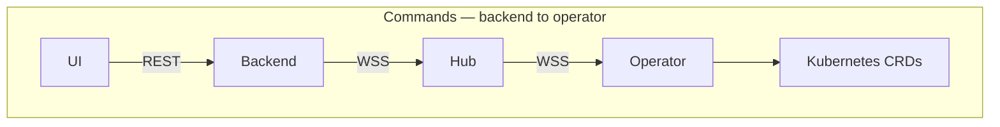
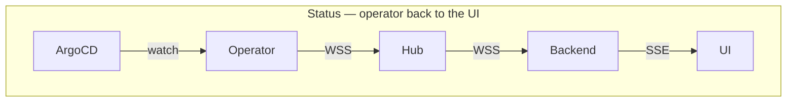
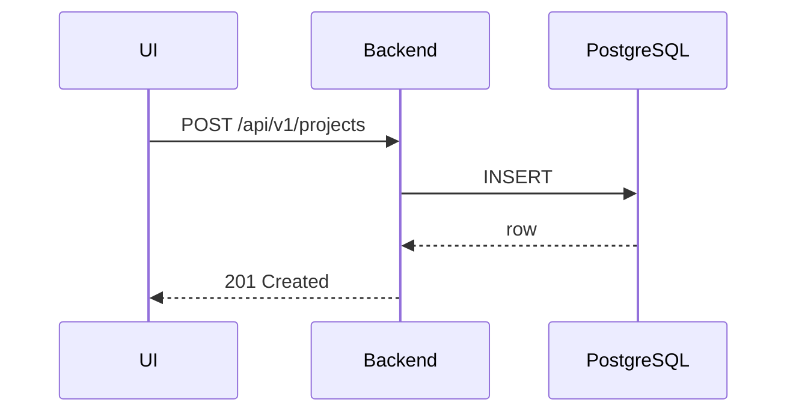
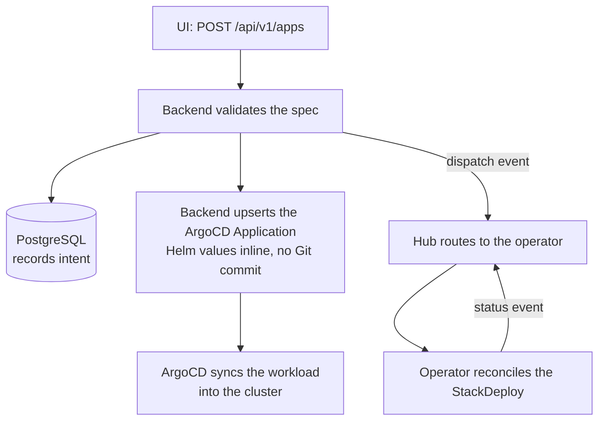
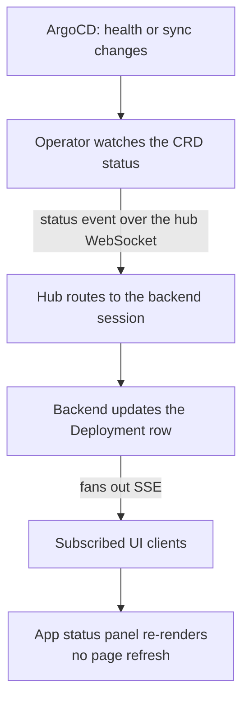

import { Callout } from 'nextra/components'

# Architecture Overview

kubenest is a distributed system with five cooperating components. Each component has a single, well-bounded responsibility, and the boundaries between them are deliberately strict. This page explains what each component does, how they communicate, and why the system is designed the way it is.

Understanding the architecture pays off quickly: it tells you where to look when a deployment stalls, why certain operations are async, and what "the backend never holds your kubeconfig" actually means in practice.

## The five components

### kubenest-backend

The backend is the control plane. It is a FastAPI application that owns every user-facing resource: organizations, users, clusters, projects, apps, stack templates, addon instances, and deployment history. All persistent state lives in PostgreSQL. Redis handles job queues, rate-limit counters, and short-lived cache entries (including chart inspection results).

The backend is designed to be **stateless with respect to Kubernetes**: it reads no kubeconfig, and
cluster operations are dispatched as signed JSON events to the hub and acknowledged asynchronously.
This is what makes the backend horizontally scalable — you can run multiple replicas behind a load
balancer without any shared in-process state.

<Callout type="warning">
**Today there are exceptions, and they matter if you are evaluating the trust boundary.** Cluster
registration persists a cluster-admin bearer token on the cluster record
(`app/models/cluster.py:96-102`), and several backend paths use it to call the tenant cluster's
Kubernetes API directly rather than routing through the hub — StackDeploy CRUD
(`app/services/stack_template.py:125-166`, `:339-352`), ArgoCD cluster registration
(`app/services/argocd.py:31-67`), component Secret endpoints, and addon CR mutations.

So the boundary described here is the architecture's direction and the target the remaining work is
converging on, not a description of every path in the current build. The conversion is tracked as
`kn-cjqw`, with `kn-p61d`, `kn-37n5`, `kn-qh3g`, `kn-owei` and `kn-i6qg` as the specific paths. If
you are assessing kubenest on this property, assess it against those.
</Callout>

### kubenest-hub

The hub is a Go WebSocket message broker. Its sole job is routing events between the backend and the operators running on each cluster. The backend connects to the hub as a persistent WebSocket client (identified by a `client_type: "backend"` claim in its JWT). Each operator also connects as a persistent client (authenticated by a cluster-scoped JWT). The hub maintains a connection registry in Redis so that multiple hub replicas can be deployed without routing failures.

The hub understands two event directions: **command events** flow backend → operator (deploy, patch, delete, redeploy); **status events** flow operator → backend (phase transitions, health checks, drift reports, log lines). The hub does not inspect or transform event payloads — it validates the sender's identity and routes the message to the correct recipient session.

### kubenest-operator

The operator is a Go controller-runtime application that runs inside each registered Kubernetes cluster. It implements five Kubernetes controllers:

- **StackDeploy controller** — watches `StackDeploy` CRDs (the cluster-side representation of an App) and drives the full deploy/patch/delete reconcile loop.
- **Workload controller** — tracks individual workload components within a StackDeploy: watches the ArgoCD Application's health, reports the cluster's ingress IP, and collects exports once a component is running. It does not render manifests or create the Application — the backend does both. See [GitOps](/architecture/gitops).
- **Addon controller** — same as Workload but for Helm-chart backing services; also handles export discovery after a successful install.
- **BuildRequest controller** — manages image build jobs (Kaniko or Cloud Native Buildpacks) for Dockerfile and buildpack deployment modes.
- **Project controller** — ensures the Kubernetes namespace exists and has the correct resource quotas and RBAC bindings before any app is deployed into it.

There is exactly one operator instance per cluster. The operator has local Kubernetes API access and uses that access exclusively — it never routes Kubernetes calls through the hub or the backend.

### kubenest-ui

The web console is a Next.js application. It communicates with the backend over REST for all CRUD operations (creating apps, listing clusters, reading deployment history). Real-time status — phase changes, ArgoCD sync progress, log streams — arrives via a Server-Sent Events subscription to the backend's `/api/v1/events/stream` endpoint. The UI never connects directly to the hub or to the operator; it sees only what the backend surfaces.

### kubenest-contracts

The contracts repository is not a running service — it is the shared source of truth for the JSON Schema definitions of every event that flows through the system. Command events and status events are validated against these schemas at the hub boundary: the hub rejects any malformed event before routing it. This guarantees that the operator never receives a structurally invalid command, and the backend never receives a structurally invalid status update.

---

## System topology

The data flow for the two main directions:

---

## Three core design principles

### 1. Zero-trust cluster access

The backend never holds a kubeconfig or cluster credentials. Every Kubernetes operation originates inside the target cluster, initiated by the operator in response to a validated event. A compromised backend cannot issue arbitrary Kubernetes API calls — the worst it can do is send malformed events, which the hub rejects at the schema-validation boundary.

This means the operator's own session requires no inbound firewall rule. The operator dials the hub outbound over WebSocket and holds the connection open, so it survives NAT and a restrictive corporate firewall as long as outbound HTTPS/WSS is allowed.

It does not yet make the whole deployment path outbound-only. While the direct backend paths described in the warning above remain, the control plane connects to the cluster's Kubernetes API server with the credentials the operator advertises, so that endpoint must be reachable from the control plane. `kn-cjqw` is what closes that gap.

### 2. ArgoCD reconciles everything; Git backs the addons

Nothing in kubenest applies Kubernetes resources with `kubectl apply`. ArgoCD does the applying, in
both paths. Where the two paths differ is where the desired state lives, and the difference is worth
knowing before you go looking for a commit that was never made.

**Addons are backed by Git.** The addon controller writes the chart and values to a per-cluster
GitOps repository under `clusters/{id}/addons/`, then points an ArgoCD Application at that
directory. An addon therefore has a human-readable representation in Git that you can inspect, diff
and revert independently of kubenest, and ArgoCD keeps serving it if kubenest is offline.

**Workloads are not.** The backend creates the ArgoCD Application itself, with the Helm values
inline in the Application spec against a chart repository. No workload manifest is committed, and
there is no workload directory in the GitOps repo. A workload's change history lives in the
backend's deployment records rather than in Git.

[GitOps](/architecture/gitops) has the full comparison, including what this costs you.

### 3. Event-driven asynchrony for all cluster operations

Cluster operations are long-running and unreliable — network partitions, slow image pulls, failing readiness probes. kubenest models all of them as asynchronous events rather than synchronous RPC. When you POST an App create request, the backend records the intent and immediately returns a `Pending` response. The operator reconciles on its own schedule and emits status events as it makes progress. The UI reflects those events in real time through the SSE stream.

This architecture eliminates HTTP timeouts from the critical path and makes the system resilient to transient connectivity failures between the backend and the hub, or between the hub and the operator.

---

## Request flow patterns

### Synchronous operations

Some operations complete entirely within the backend and return a result immediately. These are pure metadata operations that do not touch Kubernetes.

Examples: creating a project record, listing clusters, reading deployment history, fetching a stack template.

### Asynchronous cluster operations

Operations that change Kubernetes state are asynchronous. The backend dispatches a command event and immediately returns; the operator reconciles and streams status back.

### Status update loop

The operator runs a continuous reconcile loop. Whenever ArgoCD reports a sync or health change, the operator emits a status event that propagates all the way to the UI:

---

## Security architecture

### User authentication

Users authenticate with a username/password POST to `/api/v1/login`. The backend issues two tokens:

- **Access token** — a short-lived JWT (30-minute expiry) sent in the response body. Clients include it in the `Authorization: Bearer` header on every request.
- **Refresh token** — a 7-day JWT stored in an `HttpOnly`, `Secure`, `SameSite=Strict` cookie. Clients call `POST /api/v1/refresh` to get a new access token when the current one expires. Because the refresh token is in an HttpOnly cookie, JavaScript cannot read it, mitigating XSS-based token theft.

Access tokens are validated on every request by the backend's FastAPI dependency injection layer. There is no token introspection call to an external service — the backend validates the signature locally using the shared secret.

### Operator authentication

When a cluster is registered, the backend mints a **cluster JWT** — a long-lived token scoped to that cluster's UUID. This token is embedded in the Kubernetes Secret created by the operator Helm chart. The operator presents it to the hub in the `Authorization: Bearer` header when establishing its WebSocket connection.

The hub validates the cluster JWT (signature + `cluster_id` claim) and associates the authenticated session with that cluster ID. Subsequent events from that session are authoritative for that cluster — the backend trusts hub-routed status events without re-validating the operator's identity on each message.

<Callout type="warning">
The cluster JWT is long-lived and has significant privilege. Treat it like an SSH private key: store it in a Kubernetes Secret (the Helm chart does this automatically), restrict access to that Secret via RBAC, and rotate it immediately if you believe it was compromised. Rotation is done via the backend API — see [Cluster Registration](/guides/cluster-registration).
</Callout>

### Backend-to-hub authentication

The backend authenticates to the hub using a JWT with a `client_type: "backend"` claim. This is distinct from cluster JWTs and from user access tokens. The hub uses the `client_type` claim to apply different routing rules: messages from the backend session are forwarded to operator sessions, and vice versa.

### Network boundaries

| Connection | Protocol | Authentication |
|-----------|----------|----------------|
| UI → Backend | HTTPS REST / SSE | User access token (Bearer) |
| Backend → Hub | WSS (persistent) | Backend JWT (`client_type: backend`) |
| Operator → Hub | WSS (persistent) | Cluster JWT |
| Operator → Kubernetes API | In-cluster HTTP | ServiceAccount token (RBAC-scoped) |
| Operator → Git | HTTPS | Personal access token (read/write on GitOps repo only) |
| ArgoCD → Git | HTTPS | Same GitOps PAT |
| ArgoCD → Kubernetes API | In-cluster | ArgoCD ServiceAccount |

---

## Multi-tenancy model

kubenest enforces isolation at four levels, each reinforcing the others.

**Organization level (backend).** Every database row carrying user data has an `org_id` foreign key. All API queries include `WHERE org_id = <current_org>` — organization A cannot read organization B's data regardless of how the query is constructed. Backend middleware enforces this before any route handler runs.

**Cluster level (routing).** A cluster's operator session in the hub is keyed by `cluster_id`. The backend can only dispatch events to clusters that belong to the authenticated user's organization. The hub enforces this routing — you cannot send a command event to a cluster you do not own by constructing a crafted WebSocket message, because the hub validates the sender's `org_id` claim against the target cluster's registration.

**Project level (Kubernetes).** Each project maps to a Kubernetes namespace. The operator creates the namespace with a standard set of RBAC bindings before deploying any application into it. Workloads in project A's namespace cannot access Kubernetes Secrets in project B's namespace, even on the same cluster.

**Namespace boundary (operator).** The operator's Project controller enforces namespace boundaries on all reconcile operations. A StackDeploy that specifies a target namespace outside its registered project is rejected by the operator with a validation error that propagates back through the hub to the backend.

---

See also:
- [GitOps and Drift Detection](/architecture/gitops) — how the GitOps layer works in detail
- [Cluster Registration](/guides/cluster-registration) — the mechanics of connecting a cluster to the hub
- [Apps and Components](/concepts/apps) — the StackDeploy CRD and reconcile lifecycle
