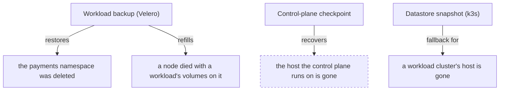

import { Callout, Steps } from 'nextra/components'

# Backup and restore

**A backup that has never been restored is not a backup.** It is a file, and an assumption.

Everyone ships backup. Almost nobody ships evidence that restore works. This page says what
KubeNest keeps off a cluster, when a backup may be restored, what happens between the decision to
restore and a namespace running again, what a bucket you hand out access to really exposes, and how
a host that is gone comes back.

## Three things are kept, for three different losses

They are captured differently, kept differently, and needed in different disasters. Confusing them
is how people find out they only had half a backup.

| | **Workload backup** | **Control-plane checkpoint** | **Datastore snapshot** |
|---|---|---|---|
| Holds | Kubernetes objects and persistent volume data | The control plane's own database: every organisation, member, role, window, alert route, inventory and token floor | The cluster's embedded etcd: every workload definition, Secret and ConfigMap of one cluster |
| Taken by | Velero | the control-plane chart's checkpoint Job | k3s |
| Answers | "someone deleted the `payments` namespace", "a node died with a workload's volumes on it" | "the host the control plane runs on is gone" | "a workload cluster's host is gone and you want its Kubernetes objects back" |
| Where it lives | your bucket, under the cluster's prefix | your bucket, under `control-plane/` | your bucket, under the cluster's prefix |
| Kept | daily, 14 kept | nightly, 14 days; a security-triggered checkpoint keeps its own shorter history | hourly, 24 kept |

The first two are what the product relies on. The datastore snapshot is the documented fallback for
rebuilding a **workload** cluster whose host is gone; it is not the control plane's recovery path,
because the control plane's recovery unit is its database rather than a copy of a host.



## Coverage, eligibility and the age of the data

When a backup starts, the expected set of namespaces and claims it has to cover is written down
once, with the UID of each one. Every later judgement is made against that set, which is what stops
a backup that copied no volume at all from looking complete: a claim in the expected set that has no
copy record is **missing**, not "nothing to copy".

A backup is **eligible** for a namespace when all four of these hold:

- it reached the `Completed` phase;
- its expected coverage is known — a backup whose expected set was never recorded cannot be shown to
  cover anything;
- no expected volume of that namespace is missing or failed;
- its storage location reads `Available`, because a backup whose location is not available is not
  proven to be in the bucket.

A failed or interrupted backup stays visible and never replaces a good recovery point. The `backup`
group of the health report names the newest terminal backup, the newest **eligible** one, and the
missing and failed volumes that make a backup ineligible.

Bundle 1.1's operator writes no expected-coverage records — they arrived with operator chart
`2.7.0-rc.1`, which bundle 1.2 pins — so on a 1.1 cluster coverage reads **unknown**, and the command
says so rather than assuming the volumes are there.

**The data's age is conservative.** For an uncoordinated file copy, the age is measured from the
moment the backup's capture **started**, never from the moment it finished, because a backup that
ran for hours may hold files copied near its beginning. The command compares that age against the
bundle's recovery-point policy: 26 hours on bundle 1.2, against the daily schedule. Where a bundle
declares no such policy, the command falls back to the bundle's `health.backup.max-backup-age`
(48 hours on 1.1) and names which key it read. A backup older than the policy is refused unless you
pass `--accept-data-age`, and the refusal still prints the plan so you can see the age and the
alternative rather than only the word "no".

With `--latest`, the command picks the newest **eligible** backup and names every newer backup it
passed over, with the reason for each. With `--from NAME`, it uses exactly that backup or refuses
with the specific missing piece.

## Restoring a namespace

<Callout type="warning">
**Not supported by the current release.** `kubenest backup restore` is in the command tree of the
**Bundle 1.2, on promotion** candidate, and this section describes how it behaves. Until that bundle
is promoted and downloadable, the released CLI does not have it.

Restore one namespace into the live cluster:

```bash filename="terminal"
KUBENEST_BACKUP_ACCESS_KEY_ID=… KUBENEST_BACKUP_SECRET_ACCESS_KEY=… \
kubenest backup restore --cluster prod-1 --namespace payments --latest --replace \
  --confirm \
  --server 10.0.1.10 --ssh-user ubuntu \
  --bundle-manifest bundles/platform-1.1.yaml
```

</Callout>

In practice the reconcilers have usually recreated a deleted namespace with empty claims before
anyone runs a restore, and Velero skips objects that already exist, so `--replace` is the ordinary
case. Restoring over a namespace that exists without it is refused. An absent namespace needs no
`--replace`.

### The plan the command prints

Nothing is changed until the plan is printed and confirmed. `--confirm` accepts it without a prompt —
an interactive run asks for the word `yes`, and anything else refuses. The plan states:

- the backup and when it completed;
- the **conservative data age** and the capture start it was measured from;
- the recovery-point policy it was judged against, and whether `--accept-data-age` accepted it;
- coverage and the consistency method;
- the storage location and whether it is available;
- the namespace's current UID, or that the namespace has to be recreated;
- every newer backup `--latest` passed over;
- each claim being restored, by UID;
- the workloads that will be stopped, and each CronJob with its schedule and suspend value;
- what will be discarded, which is what the namespace holds now;
- the mode: a namespace restore, or a volume restore.

The namespace UID and every claim UID are re-read immediately before the destructive step. If any of
them changed since the plan was built, the restore stops. Kubernetes timestamps are never treated as
proof that a volume holds no newer data.

Then the command takes a **safety backup** of the namespace as it stands: a normal Velero backup
labelled as a safety backup and kept for 7 days. If the safety backup does not settle as `Completed`,
the restore has not started and nothing has been destroyed.

### The pause, and the acknowledgement it waits for

A restore pauses the project's reconcilers first, because a controller that recreates the namespace
while it is being restored turns one incident into two. The hold is the annotation
`kubenest.io/reconcile-paused` on the project's `Project` resource in `kubenest-system` — not in the
project's own namespace — so it survives the namespace's deletion. The operator then turns automated
sync off and does not recreate the namespace, and it acknowledges the hold with a `ReconcilePaused`
condition. The restore waits for that acknowledgement before its first destructive step.

The acknowledgement exists only in operator chart `2.7.0-rc.1` and later, which is the chart bundle
1.2 pins. Against an older operator the command refuses **at once and before anything is changed**:
the version is read from the operator's own chart label, and no older operator will ever write that
condition. The refusal names the operator version found, the version needed, and `kubenest platform
upgrade` as the path.

As soon as the pause is written the command also suspends the namespace's CronJobs and any Job still
running. Every CronJob the restore itself creates comes back **suspended** — a Velero resource
modifier sets `spec.suspend` as the object is created and records the value the backup held — so no
CronJob can fire between the restore and activation.

### Jobs, and the pods a Job created

Jobs are excluded from a namespace restore, because a Job that ran when the backup was taken would
run again. The pods a Job created are excluded with them: they carry the label
`batch.kubernetes.io/job-name`. `--include-jobs` restores Jobs deliberately, and they run at
activation.

The pods the backup holds a volume copy for come back **renamed out of their ReplicaSet's selector**,
so a ReplicaSet sitting at 0 replicas cannot adopt a restored pod and delete it before its volume is
filled. That is what lets a backup taken in the middle of a rollout restore instead of hanging.
Activation deletes those pods and the workload's own controller creates the ones that take the claims
over.

### After the data is back: activation, resume, abort, take over

<Callout type="warning">
**Not supported by the current release.** These are follow-on commands of `kubenest backup restore`,
which arrives with **Bundle 1.2, on promotion**.

```bash filename="terminal"
kubenest backup restore --activate <operation-id> --cluster prod-1 \
  --server 10.0.1.10 --ssh-user ubuntu \
  --bundle-manifest bundles/platform-1.1.yaml
kubenest backup restore --resume <operation-id> --cluster prod-1 \
  --server 10.0.1.10 --ssh-user ubuntu \
  --bundle-manifest bundles/platform-1.1.yaml
kubenest backup restore --abort <operation-id> --cluster prod-1 \
  --server 10.0.1.10 --ssh-user ubuntu \
  --bundle-manifest bundles/platform-1.1.yaml
kubenest backup restore --take-over <operation-id> --confirm --cluster prod-1 \
  --server 10.0.1.10 --ssh-user ubuntu \
  --bundle-manifest bundles/platform-1.1.yaml
```

</Callout>

A restore whose data is back ends in the state **`restored — awaiting activation`**. That is a state
and not a finished restore: the project stays paused, durably and visibly, and nothing scheduled or
one-shot runs. What follows is a set of separate decisions, and they are the same verb:

- `--activate <operation-id>` is the decision to let the namespace run again. It takes the operation
  lock, checks the held project and the restored identities, shows which scheduled and one-shot work
  will start, unsuspends each CronJob to the value the backup held, and lifts the pause. If the
  restored configuration differs from the current desired state, it asks which one wins rather than
  letting reconciliation decide: `--keep-desired` keeps the current desired state, `--keep-restored`
  keeps what came out of the backup. Those two flags belong to activation and are refused anywhere
  else.
- `--resume <operation-id>` continues an interrupted restore. It never activates anything: a laptop
  that died mid-run is finished from any other machine, because the operation record lives in the
  cluster.
- `--abort <operation-id>` gives up. The namespace it deleted stays deleted and the project stays
  paused, because a half-restored namespace running again is the failure mode this command exists to
  avoid.
- `--take-over <operation-id> --confirm` is for a run that died without recording its stop, so its
  record still says the executor is running and `--resume` refuses it. An operator who can see that
  the previous executor and its outstanding actions have stopped says so, and that assertion is
  written into the record. It then reconciles exactly as `--resume` does.

The operation record is the lock: a second operator is refused while a restore is running.

## Restoring a workload's stranded volumes

When a worker node dies, a workload's local volumes are gone and its pods cannot start. Restoring the
whole namespace would destroy the volumes of the same workload that are still fine on live nodes, so
this mode restores only the claims you name, in place.

<Callout type="warning">
**Not supported by the current release.** The volume mode of `kubenest backup restore` arrives with
**Bundle 1.2, on promotion**.

```bash filename="terminal"
KUBENEST_BACKUP_ACCESS_KEY_ID=… KUBENEST_BACKUP_SECRET_ACCESS_KEY=… \
kubenest backup restore --cluster prod-1 --namespace payments --pvc data-0 --pvc data-1 \
  --latest \
  --server 10.0.1.10 --ssh-user ubuntu \
  --bundle-manifest bundles/platform-1.1.yaml
```

</Callout>

`--pvc` is repeatable, and the claims of one workload are restored together: refilling one claim
while another of the same pod stays stranded leaves the pod unable to start. The command records each
claim's UID and the workloads that mount it, scales those workloads to zero, deletes the stranded
claims, and runs a Velero restore narrowed to this namespace, the named claims and the pods that
mount them — so Velero provisions each volume fresh on a live node and never reuses the lost node's
persistent volume or its node affinity. It then verifies the data, ownership and permissions, and
waits for every `PodVolumeRestore` of the named claims to be `Completed` before the workloads may
start again.

**Every volume of the same workload that you did not name keeps its current contents, byte for byte.**
That is the invariant this mode exists for, and it is why the restore's resource modifier removes the
unnamed volumes, their container mounts and Velero's own restore-wait mount from the restored pod:
Velero restores the data of every volume a restored pod mounts, even when the claim object itself is
skipped as already existing.

The cost is a Velero restore that ends `PartiallyFailed` with exactly one error per removed volume,
reading "volume not found in pod". That is expected here and the command accepts it. Any error for a
named volume, or any other failure reason, is not accepted.

Two refusals keep this mode from waiting forever:

- **A volume restore whose pod is gone.** The command watches the pods its outstanding volume
  restores target. One poll that does not find the pod is not evidence, because Velero creates the
  pod and its volume restore together; a second poll in a row is, and so is a pod still present but
  already adopted by a ReplicaSet whose desired count is zero, which will delete it on its next
  reconcile. In either case the run stops with a refusal naming the pod, the ReplicaSet and the
  reason, rather than waiting out Velero's own four-hour timeout, which holds Velero's only restore
  worker the whole time.
- **A restore drill already in flight.** Velero runs one restore at a time, so a volume restore that
  started behind the operator's drill would queue behind it. The command refuses while a drill's
  Velero restore is in progress and names it.

## Consistency, stated honestly

**An uncoordinated file copy of a running database gives no consistency guarantee.** Its files are
copied at different moments, so the copy can hold a transaction log without the pages it describes.
KubeNest does not pretend otherwise, and every backup records which of three methods it used:

- **uncoordinated copy** — the default. Each volume is copied file by file while the application runs,
  with no guarantee about the moment of the copy.
- **a quiescing hook you supply** — Velero runs your command before it copies, and the backup is
  recorded as "hook ran", never as "consistent". A hook that exits zero means the command ran and
  said nothing about whether your application was actually quiesced at that point.
- **an application-native dump** — the workload writes its own consistent dump and the backup copies
  that. No one can tell a dump from a freeze by reading a command line, so you declare it: put the
  label `kubenest.io/consistency-method: native-dump` on the backup, or on the schedule's template, and
  that is how the method is recorded.

To quiesce a workload before each backup, annotate the pod with Velero's own pod hook annotations:

```yaml filename="quiesce-postgres.yaml"
apiVersion: v1
kind: Pod
metadata:
  name: payments-db-0
  annotations:
    pre.hook.backup.velero.io/command: '["/bin/sh", "-c", "pg_dump -U payments -Fc payments > /var/backups/quiesce.dump"]'
    pre.hook.backup.velero.io/container: postgres
    pre.hook.backup.velero.io/timeout: 5m
```

The command runs in the container named in `pre.hook.backup.velero.io/container`, and the backup waits
up to the timeout for it. The backup's result records `hook ran` for that volume; only a
customer-supplied dump that the application itself wrote consistently can be called consistent, and
nothing on this page claims a copy made under a hook is consistent.

KubeNest adds no database-specific controller, and does not batch hooks across a workload for you.

## The weekly restore drill

The cluster restores what it has, on a schedule, without anyone asking.

<Steps>

### Pick a backup

The drill restores the newest completed backup whose scope covers the platform's proof namespace. A
namespace-scoped backup — a safety backup taken before a restore, for instance — is not one of those,
because it cannot prove anything about the proof set. A drill does not start while a node is
`NotReady`: a drill that holds Velero's only restore worker while an operator needs to restore is
worse than a late drill.

### Restore the proof set into a scratch namespace

The proof set is a real long-running Pod, a ConfigMap and a dynamically provisioned PVC, kept in
`kubenest-restore-drill-source`, so every normal backup exercises the same node-agent/Kopia path as a
customer PVC.

### Compare, then tear down

The restored objects and the restored PVC's bytes are compared, and every `PodVolumeRestore` for the
set has to be `Completed`. The Restore and the scratch namespace are removed whatever the outcome, so
a failing drill does not accumulate debris on a weekly schedule. The result records pass or fail, the
backup name, the timestamps and the end-to-end duration.

### Run it by hand

```bash filename="terminal"
kubenest backup drill --cluster prod-1 \
  --server 10.0.1.10 --ssh-user ubuntu \
  --bundle-manifest bundles/platform-1.1.yaml
```

The manual run uses the same path the schedule does. A drill that passes on a manual re-run points at
something transient; one that fails on a fresh backup points at the pipeline rather than at one old
backup.

### Read the result

```
Restore drill — prod-1
  Status      PASSED
  Ran         2026-08-13 02:14 IST
  Backup      daily-20260813-0200
  Objects     3 restored, 3 matched
  PVC data    1 restored, 1 matched
  Duration    4m 11s
```

`Objects` and `PVC data` must show as many matched as restored. A restore that completes with fewer
matched than restored is a **failure**, even though nothing errored: it means the data came back
different, which is what a drill exists to catch. Exceeding `limits.timeouts.restore-drill` (2 hours)
is recorded as a failure with reason `timeout`, which is a different problem from data that came back
wrong.

</Steps>

### What a drill covers

The proof set proves the mechanism. **It does not prove your data.** A drill answers: the backup was
written, object storage still holds it, and the restore path puts it back through the same
node-agent/Kopia path a customer PVC takes. It does not prove that a namespace of yours can be
restored, and this page does not claim it does.

A failed drill means you currently have no proven backup. It is an alert, and the upgrade pre-flight
refuses to run while the last drill did not pass.

<Callout type="warning">
**Not supported by the current release.** A running drill's Velero restore, the refused restore
behind it, and the node guard above arrive with the operator chart that **Bundle 1.2, on promotion**
pins.

A known limit, and an open decision. A drill whose volume restore is stuck on a node that has died
holds Velero's only restore worker until Velero's server restarts. Deleting the drill's restore does
not free the worker: the object stays `InProgress` with a deletion timestamp, and its
`PodVolumeRestore` stays held by a finaliser the dead node's agent never removes. The one action
measured to free the worker is a restart of the Velero server, and that fails every other restore and
backup in flight. Until the decision lands, a volume restore that meets a stuck drill is refused
rather than queued, and the effect is stated here rather than left to discovery.
</Callout>

### The control plane's checkpoints prove themselves

Each checkpoint proves its own dump restores before it is sealed: the Job dumps the database, loads
that dump into a scratch PostgreSQL in the same pod, compares the row counts, and only on a match
encrypts the dump to the fleet recipient, uploads it, reads the ciphertext back and marks the
checkpoint eligible. A dump that does not restore uploads nothing, marks nothing eligible and
publishes a failed drill.

What that no longer proves is that the **fleet private key** opens the stored ciphertext, because no
host holds that key. Opening a checkpoint with the fleet key is `kubenest recovery-kit check`'s job
and part of a real recovery.

## What the bucket exposes, and how to scope a credential

Your bucket is a secret-bearing store, and the honest inventory of what is in it is short.

- **Volume data** is protected by a per-cluster Velero repository password, a random value generated
  at install and carried in the cluster kit. The password is not Velero's built-in one: it is
  installed before Velero creates its repository, so a rebuilt cluster opens the existing repository
  instead of initialising a new one over it.
- **Secret values in the datastore** — and therefore in every snapshot — are sealed by a key in k3s's
  bootstrap data, under the cluster token. Bundle 1.2 installs every server with
  `--secrets-encryption`, which is what puts that key there. The protection is tied to the cluster
  token: whoever holds the token and the snapshot can read those Secrets.
- **Velero's resource archives hold workload Secrets in plaintext.** Velero has no client-side
  encryption for resources, so any Secret a backup captured is readable in the bucket by anyone who
  can read the object. This is the reason **read access to a cluster's backups is treated like
  cluster-admin on that cluster**, and why a bucket is not a place to hand a whole team
  `s3:GetObject`.

Credentials come from the environment — `KUBENEST_BACKUP_ACCESS_KEY_ID` and
`KUBENEST_BACKUP_SECRET_ACCESS_KEY`, falling back to the `AWS_` pair — and never from a flag, so they
cannot land in shell history or in a transcript pasted into a support ticket.

The CLI cannot create storage credentials, so the policy is yours to write. Scope one credential to
one cluster's own prefix (`control-plane` is a separate principal, below), with three statements: the
object actions under the prefix, `ListBucket` for keys under the prefix, and `ListBucket` with no
prefix at all. The third one is not optional: k3s's datastore snapshots check that the bucket exists
before every upload, and S3 authorises that as `ListBucket` without a prefix.

The prefix is the boundary the policy is written against. Velero's workload backups live under
`<prefix>/workload/` and the cluster's k3s datastore snapshots under `<prefix>/datastore/`, so one
credential scoped to `<bucket>/<prefix>/*` reaches this cluster's own backups and not another's. The
control plane's checkpoints are outside that prefix altogether: they sit at the bucket root under
`control-plane/`.

```json filename="cluster-prefix-policy.json"
{
  "Version": "2012-10-17",
  "Statement": [
    {"Effect": "Allow",
     "Action": ["s3:GetObject", "s3:PutObject", "s3:DeleteObject",
                "s3:AbortMultipartUpload", "s3:ListMultipartUploadParts"],
     "Resource": ["arn:aws:s3:::your-bucket/prod-1/*"]},
    {"Effect": "Allow",
     "Action": ["s3:ListBucket"],
     "Resource": ["arn:aws:s3:::your-bucket"],
     "Condition": {"StringLike": {"s3:prefix": ["prod-1/*", "prod-1/"]}}},
    {"Effect": "Allow",
     "Action": ["s3:ListBucket"],
     "Resource": ["arn:aws:s3:::your-bucket"],
     "Condition": {"Null": {"s3:prefix": "true"}}},
    {"Effect": "Allow",
     "Action": ["s3:GetBucketLocation", "s3:GetBucketVersioning", "s3:GetEncryptionConfiguration"],
     "Resource": ["arn:aws:s3:::your-bucket"]}
  ]
}
```

Statement three has a cost worth stating plainly: it lets the credential list object **names** across
the whole bucket, including other clusters' backups and the control plane's checkpoints, but not read
their contents. That reach is inseparable from the `ListBucket` grant k3s needs. **Keep one bucket per
client organisation**, so the names a credential can see are that organisation's own.

`kubenest backup set-target` checks this. It must succeed on the cluster's own prefix and fail to list
or read the control-plane prefix and a sibling cluster's prefix, and it warns, by name, when it can
list other prefixes' names. MinIO rejects `StringLikeIfExists`, so the prefix statement uses
`StringLike` and the no-prefix statement uses `Null`.

```bash filename="terminal"
KUBENEST_BACKUP_ACCESS_KEY_ID=… KUBENEST_BACKUP_SECRET_ACCESS_KEY=… \
kubenest backup set-target --cluster prod-1 \
  --endpoint s3.ap-south-1.amazonaws.com \
  --bucket kubenest-backups-prod-1 \
  --region ap-south-1 \
  --prefix prod-1 \
  --server 10.0.1.10 --ssh-user ubuntu \
  --bundle-manifest bundles/platform-1.1.yaml
```

For the three-server tier, repeat `--server` for every control-plane node. `set-target` restarts only
the servers whose k3s configuration changed, one at a time, waits for each to return Ready, and
refuses success until an on-demand datastore snapshot has reached the bucket. It also writes the
daily workload schedule from the bundle manifest and creates the storage location Velero uses. Until
a target is set the cluster reports `backup: unconfigured`, which is loud and never blocks the rest of
the install.

Until the cluster record resolves a cluster name to an address, every `kubenest backup` command also
takes `--server` — repeat it for each control-plane node — and `--bundle-manifest`, which is why the
examples on this page carry both. Schedules, retention and deadlines come from the bundle manifest
rather than from defaults inside the binary.

To take one backup outside the schedule and wait for it:

```bash filename="terminal"
kubenest backup now --cluster prod-1 \
  --server 10.0.1.10 --ssh-user ubuntu \
  --bundle-manifest bundles/platform-1.1.yaml
```

<Callout type="warning">
**Not supported by the current release.** Taking a checkpoint on demand arrives with **Bundle 1.2,
on promotion**. It creates a Job from the chart's checkpoint CronJob and waits until the checkpoint it
produced is eligible, so a Job that finished without a new eligible checkpoint is reported as the
interrupted run it is rather than as a backup.

```bash filename="terminal"
kubenest backup now --control-plane \
  --server 10.0.1.10 --ssh-user ubuntu \
  --bundle-manifest bundles/platform-1.1.yaml
```

</Callout>

The management cluster's own credential is a **separate principal**: the control plane's checkpoints
live at the bucket root under `control-plane/`, they are read by
`KUBENEST_CONTROL_PLANE_CHECKPOINT_ACCESS_KEY_ID` and
`KUBENEST_CONTROL_PLANE_CHECKPOINT_SECRET_ACCESS_KEY` (`KUBENEST_CHECKPOINT_*` is accepted too), and
that principal should reach `control-plane/*` and nothing else. A cluster's principal reaches only
that cluster's prefix, and neither can do the other's reading.

## The fleet recovery key and the two kits

A recovery kit is the small set of secrets that nothing can re-derive once the machine that installed
the cluster is gone: a cluster's Velero repository password and its k3s join token, or the control
plane's credential encryption key, agent signing secret and certificate authority.

**The fleet recovery key** is one `age` identity, generated at the control-plane install and
**printed exactly once**. It is never written to a host, a log or the install record. Every kit and
every checkpoint is encrypted to its public half, which the control plane keeps and hands to every
later install, so a later install can seal without ever asking for the private key. Keep at least two
independent offline copies and prove that one of them opens a kit. It is the single point of **loss**
— without it no kit can be opened, and no host has a copy — and the single point of **compromise**,
because everything encrypted to it is open to whoever holds it.

Nothing else in the platform holds this material off its host, which is why losing the installing
machine used to make a cluster unrecoverable even though every byte of its data was in the bucket.

**Two kits, two scopes.** The scope is an authority boundary, not a label:

- a **cluster kit** carries that cluster's Velero repository password and k3s join token, and nothing
  that opens another cluster;
- the **control-plane kit** carries `ENCRYPTION_KEY`, which reads stored configuration,
  `AGENT_JWT_SECRET`, so agents that were not revoked reconnect by themselves after a recovery, and
  the control plane's certificate authority, so a restored control plane keeps the identity CLIs and
  agents already trust. A cluster kit never contains any of it.

Who may handle which follows the same boundary: an **organisation admin** may record, read and export
a workload cluster's kit, and only the **instance administrator** may handle the management cluster's
kit or the control-plane kit. The control plane's own part in all of this is to remember which kit
exists, when it was written and a SHA-256 fingerprint of each key it carries. It never holds a key or
any part of a kit's plaintext, so it cannot re-create a kit it never fully held: re-exporting one
needs the copy you kept and the fleet key, which stay with you and never with the control plane. Both
export routes refuse in the same class that may record a kit, so a refusal is never a way to learn
from outside that class that a kit exists.

**Verification, stated honestly.** The first control-plane install still holds the freshly generated
fleet identity, so it decrypts both the local and the uploaded copy before continuing. Every later
install holds only the public half: it uploads the kit, fetches the ciphertext, and checks its digest
against the local file. It does not claim to have decrypted anything and it never asks for the private
key. Proof that a kit can be opened comes from `kubenest recovery-kit check`, run with the fleet key on
a machine that has the key.

<Callout type="warning">
**Not supported by the current release.** `kubenest recovery-kit check` arrives with **Bundle 1.2,
on promotion**.

Check a cluster's kit and its recovery set, with no control plane and no cluster involved:

```bash filename="terminal"
kubenest recovery-kit check --cluster 01a02362-f8a3-7dd6-aa07-2f10ed7a5c17 \
  --organisation 0f3d… --instance 9c11… \
  --fleet-key-file ~/fleet-key.txt
```

Check the control-plane kit. A control-plane kit belongs to the **instance**, not to an organisation,
so it takes `--instance` and refuses `--organisation`:

```bash filename="terminal"
kubenest recovery-kit check --kind control-plane --instance 5cc7141e… \
  --fleet-key-file ~/fleet-key.txt \
  --target 's3://kubenest-backups/control-plane?endpoint=…&region=…'
```

</Callout>

The check reports four things separately, because they are four different afternoons: whether the
kit's upload is intact, whether it decrypts with the key you supply, whether its fingerprints match,
and whether the recovery set is complete and belongs to this instance, organisation and cluster. A kit
or a set that belongs to another cluster is refused before anything else is reported, and the refusal
names the instance, organisation and cluster it does belong to. It says plainly what it does not do:
these checks prove the artifact is present, readable and about the right cluster, and **only a
completed restore proves a restore works**.

**What you must keep separately**, because no copy of it exists on any host: the fleet recovery key,
the instance id the control-plane install prints beside it, SSH access to the hosts, the S3
credentials, control of DNS for the control-plane domain, and the ability to power the hosts off at
their provider. Every kit and recovery set is bound to the instance id, so a recovery run from a
machine other than the one that installed the control plane needs it as `--instance-id`.

## Recovering a lost single-server host

This is the procedure when a single-server **workload** cluster's host is gone: the cluster comes back
on a fresh machine under the same immutable identity.

<Callout type="warning">
**Not supported by the current release.** A recovery install, and the flags it takes, arrive with
**Bundle 1.2, on promotion**.

```bash filename="terminal"
KUBENEST_BACKUP_ACCESS_KEY_ID=… KUBENEST_BACKUP_SECRET_ACCESS_KEY=… \
kubenest platform install \
  --bundle 1.1 \
  --name prod-2 \
  --cluster 01a0d868-… \
  --instance-id 9c11… \
  --restore-from latest \
  --recovery-kit s3 \
  --backup-target 's3://kubenest-backups/prod-2?endpoint=…&region=…' \
  --fleet-key-file ~/fleet-key.txt \
  --old-host-fenced \
  --ha single-server \
  --server 10.0.2.10 --ssh-user ubuntu \
  --storage-device /dev/nvme1n1
```

</Callout>

<Steps>

### Prove the artifact before touching anything

`--cluster` names the cluster's **immutable id**. A display name never authorises adoption: the record
is read by the id, and the name it carries is used in messages and nothing else. The recovery set for
that cluster is selected and checked — the same four questions `kubenest recovery-kit check` asks —
and a set that belongs to another cluster, or an incomplete one, is refused before anything is
changed. Run the check itself first if you want the answers before typing the install command.

The recovery starts from the newest completed backup the recovery set records. Today only
`kubenest backup now` records a backup in the set: the nightly schedule's backups can be restored
into a running cluster with `kubenest backup restore`, but they are not recovery points for this
procedure. Take a `kubenest backup now` after any change you could not afford to lose, and before
planned work on the host.

### Take recovery ownership, and fence the old host

The recovery takes ownership in the bucket before its first destructive action, so two operators
cannot rebuild the same cluster at once. `--old-host-fenced` is your recorded confirmation that the
machine being replaced is powered off or unreachable. It is not a formality: two clusters under one
identity is a worse problem than a delayed recovery.

### Install in recovery mode

The bundle is installed with **reconciliation held for every project before the operator starts or the
cluster registers**, while health reporting stays on. Nothing restored or reconciled runs a Job, a
CronJob or an application container before its own data is back.

### Register a new incarnation

A **new physical incarnation** is registered under the cluster's id, and the old incarnation's
credentials are retired: the revocation floor is raised, so the token on the disk that is gone is
refused from that moment. Unrevoked agents of the same cluster are unaffected, because the identity is
the cluster's rather than the host's.

### Open the existing repository, and restore

The backup repository the recovery set names is **opened with the kit's password, never initialised
over**. A wrong or missing repository password is reported as a wrong kit rather than retried, and the
evidence that it was right is a `PodVolumeRestore` that completed. Then every project namespace the
recovery set's backup covers is restored with the workload restore path, which lets Velero provision
fresh volumes on the new host and fill them. The platform's own namespaces, such as `cert-manager`
and `openebs`, come back from the install itself and are never restored over it.

### Verify, and activate

The data, ownership and permissions are checked, the new machine is recorded in the inventory, and the
projects recovery mode held are activated. Nothing was replayed from the dead host's datastore, so no
PersistentVolume or Node object that refers to the dead machine needs editing.

</Steps>

**A workload backup does not cover everything.** It holds namespaced objects and the volume data of
the namespaces it covers, and it deliberately excludes the platform's own namespaces (`velero`,
`kubenest-system`, `kube-system`, `kube-public` and `kube-node-lease`), because backing up a backup
controller's own transient work makes healthy customer backups fail. Cluster-scoped objects — custom
resource definitions, cluster roles and role bindings, storage classes, the namespaces themselves —
are not in it. Some of them come back from the platform install and the bundle (the CRDs and
controllers the bundle installs, and the storage classes the storage stage creates); anything you
added yourself is yours to re-apply. The datastore snapshot holds those objects, which is why it
remains the documented fallback for this procedure: restoring it under the kit's k3s token brings the
cluster's own objects back, and every workload namespace and local volume is then rebound with the
working restore. It is a longer path with a service interruption, and it replays the whole
Kubernetes state, so use it only when you need objects the workload backup cannot hold.

```bash filename="terminal"
KUBENEST_BACKUP_ACCESS_KEY_ID=… KUBENEST_BACKUP_SECRET_ACCESS_KEY=… \
kubenest platform restore --cluster prod-2 --confirm \
  --snapshot on-demand-prod-2-1787299200 \
  --endpoint s3.ap-south-1.amazonaws.com \
  --bucket kubenest-backups-prod-2 \
  --region ap-south-1 \
  --server 10.0.2.10 --ssh-user ubuntu \
  --bundle-manifest bundles/platform-1.1.yaml
```

Repeat `--server` for every control-plane server when the cluster has more than one, with the server
to restore first. The command stops them all, runs k3s's cluster reset against the snapshot on the
first, removes the temporary credential file, and waits for that server to become Ready; each peer's
stale database is moved aside before that peer starts and rejoins. Persistent volume data is
deliberately untouched, which is why the workload restore follows it.

## Recovering the all-in-one host, and moving a control plane

This is the procedure when the host that runs the control plane is gone. The control plane comes back
from its newest eligible checkpoint, on a fresh host, under the same domain.

<Callout type="warning">
**Not supported by the current release.** The all-in-one recovery arrives with **Bundle 1.2, on
promotion**.

```bash filename="terminal"
KUBENEST_BACKUP_ACCESS_KEY_ID=… KUBENEST_BACKUP_SECRET_ACCESS_KEY=… \
KUBENEST_CONTROL_PLANE_CHECKPOINT_ACCESS_KEY_ID=… KUBENEST_CONTROL_PLANE_CHECKPOINT_SECRET_ACCESS_KEY=… \
KUBENEST_ADMIN_PASSWORD=… \
kubenest platform install \
  --control-plane \
  --bundle 1.1 \
  --name prod-1 \
  --instance-id 5cc7141e… \
  --restore-from latest \
  --recovery-kit s3 \
  --backup-target 's3://kubenest-backups/prod-1?endpoint=…&region=…' \
  --fleet-key-file ~/fleet-key.txt \
  --old-host-fenced \
  --ha single-server \
  --server 10.0.1.10 --ssh-user ubuntu \
  --storage-device /dev/nvme1n1
```

</Callout>

Three things here are worth reading twice. `--backup-target` is the **management cluster's own**
target, the one the dead host was installed with: the recovery set, the kit and the management
cluster's own backup all live under that prefix. The checkpoint principal is a different pair of
credentials, because the checkpoints live at the bucket root under `control-plane/`. The
administrator's password is required and is not the one this install generates: the administrator
accounts are in the restored database, and a freshly generated password opens nothing.

<Steps>

### Take ownership and fence the old host

The same ownership and fencing steps as any recovery. `--old-host-fenced` is the recorded assertion
that the dead machine cannot come back.

### Install a fresh management cluster in recovery mode

A new cluster is installed under the same domain with reconciliation held for every project before the
operator starts. The control-plane chart is applied with the **kit's certificate authority** and key
material, so an existing CLI and every agent verify the new host with the CA they already hold, with
no trust rollover. The backend is held at zero replicas: started on an empty database it would build
its own schema, seed a new administrator and a new default organisation, and the restore that followed
would fail at its first table.

### Load the checkpoint and start the backend

The newest eligible checkpoint is loaded into the held database with `pg_restore`, and the migration
Job runs only if the chart is newer than the checkpoint. A checkpoint from a newer control plane or a
different PostgreSQL major is refused, naming what is needed. Then the backend starts, and it is
serving with the identities it had.

**Console sessions issued before the recovery are refused.** The restored control plane generates a
new user signing key, and the old one is gone with the host, so every console session signed before
the loss stops working. Agents are unaffected: their key travels in the control-plane kit, and an
agent whose token was never revoked reconnects by itself once DNS points at the new host.

**CLI tokens come back with the database.** A `kubenest login` token is an opaque token whose hash is
stored in the control plane's database, so every token that existed at the checkpoint works again
after the recovery, and a token revoked after the checkpoint is valid again. If you revoked a token
after the checkpoint, or believe one was exposed with the host, list the tokens with
`GET /api/v1/user/me/cli-tokens` and revoke each one again with
`DELETE /api/v1/user/me/cli-tokens/{id}`.

### Compare what came back with what the fleet reports

The restored desired state is treated as **provisional**. Before any outbound reconciliation resumes,
its inventories, bundle records and windows are compared with what the surviving clusters report, and
the differences are shown for a decision rather than pushed at a cluster that has moved on since the
checkpoint. The command reports the checkpoint's time and the security changes it may have missed. A
change that happened after the checkpoint — a revoked agent token, in particular — is reported as
possibly lost, and the remedy for a token you believe has leaked is to rotate it again:

```bash filename="terminal"
kubenest cluster rotate-token --cluster prod-2 \
  --server 10.0.2.10 --ssh-user ubuntu
```

A cluster registered after the checkpoint appears as unknown, and is registered again.

### Restore the management cluster's own workloads

The management cluster's project namespaces are restored from its own backup, and activated. As in
a single-server recovery, the backup is the newest one the recovery set records, which today means
the newest `kubenest backup now`. The recovery does this only when the backup records coverage of
those namespaces. Where it does not — a
bundle 1.1 fleet, whose operator writes no coverage records — the recovery restores the control plane,
prints a **NOT RESTORED** block naming the backup, the reason, and the restore command to run by hand
once you have accepted the data's age, and exits successfully. The control plane is recovered and
serving, and those workloads stay held until you restore them deliberately.

</Steps>

**Resuming a recovery.** Run the identical command again. The install journal records every completed
stage, the chosen artifacts and the generated secrets, so a second run skips what is done and adopts
what the first run created instead of writing new values into a database that already exists.

**Moving a control plane.** The same procedure, pointed at a dedicated host or a dedicated management
cluster, moves a control plane off an all-in-one quickstart host. The old cluster keeps its own
identity and inventory as a workload cluster.

## Measured times, and what they are worth

These numbers come from the candidate's own hardware runs. Each carries the conditions the run
recorded; a number without its conditions is not evidence, and none of these is a service commitment.

| What was measured | Result | Conditions the run recorded |
|---|---|---|
| A control-plane install with a backup target (16 stages) | 8m12s | one host, the all-in-one install, bundle 1.1 |
| One on-demand workload backup | 55s | 346 items |
| A restore drill: objects and PVC bytes | 33s clean, 1m44s for the full drill | one cluster, its proof set |
| A checkpoint becoming eligible after it was taken | 9–15s | the checkpoint Job's own dump and restore stages |
| The first all-in-one recovery on real hosts (S11) | No end-to-end time. The run was split across several attempts, with code fixes between them, so its wall-clock time measures the fixing, not the recovery. The final pass, resumed from the journal, skipped fifteen completed stages and finished in 1m27s | four lab hosts: the old all-in-one host running the control plane and a workload, one added two-node cluster, and the fresh host; bundle 1.1; Hetzner `cpx32` hosts in `fsn1`, each with a separate data volume |

Two conditions were not recorded for the recovery run and are therefore not quoted: the exact data
volume restored and the network bandwidth of the hosts. An uninterrupted recovery has not been timed
yet, so this page quotes no recovery time. Measure your own: the fleet size, the database size and
the bucket's distance from the host all move it.

**Only a completed restore proves restoration.** A checkpoint that has never been opened, a kit that
has never been checked with the fleet key, and a drill that has never passed are all hopes. The
numbers above describe what happened on those runs; they are not a guarantee for a different cluster,
a different size or a different bucket.
