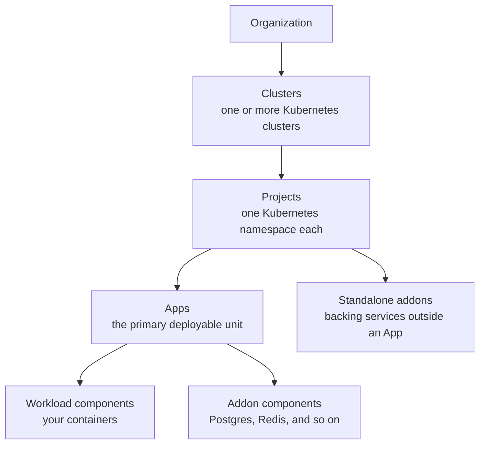

import { Callout } from 'nextra/components'

# Concepts

Five objects, one hierarchy. Learn these and the rest of the product follows.



Each level answers a different question: *who owns it* (organization), *where it runs* (cluster),
*what scope it belongs to* (project), *what it does* (app and its components).

## Organizations

The tenant boundary: members, clusters, cloud credentials, settings. Most teams have exactly one.

Three roles — `admin`, `member`, `viewer` — bind at organization, cluster or project scope.
Destructive operations require `admin`: deleting a project or a cluster, and changing a cluster's
node count.

## Clusters

A Kubernetes cluster KubeNest deploys to. One operator runs on each, and it dials **out** to the
hub over a WebSocket — no inbound firewall rule, no VPN, no exposed API server.

A cluster arrives one of three ways: KubeNest installs the whole platform onto machines you supply
([Install](/install)), you connect a cluster you already run
([Connect a cluster](/connect-cluster)), or KubeNest provisions the machines for you on a cloud
provider.

States a cluster moves through:

| State | Meaning |
|-------|---------|
| `pending` | The record exists; the operator has not connected yet |
| `provisioning` | The cloud provider is building the machines |
| `awaiting_operator` | Infrastructure is ready, waiting for the operator's first connect |
| `installing` | A platform install is in progress, reporting stage by stage |
| `connected` | Heartbeats are arriving |
| `install_failed` / `error` | An install or a provisioning job failed, and says which stage |

The operator reconnects on its own with capped exponential backoff. A cluster that goes quiet is
not marked disconnected — fleet health marks its checks unknown and raises a critical alert once
the missed-report window passes, which is the difference between "we lost the connection" and "we
stopped knowing anything about you".

**Many clusters, one control plane.** The usual splits are one cluster per environment, one per
region, or one per workload shape — small nodes for stateless services, storage-optimised nodes for
data. Components can target a specific cluster, so a single App can straddle them.

## Projects

A project is a Kubernetes namespace with KubeNest metadata on it. Everything you deploy —
Apps, standalone addons, registry credentials, component secrets — lives inside one.

One project, one namespace. You cannot split a project across namespaces or share a namespace
between projects. A project is `Pending` until the operator confirms the namespace exists, then
`Ready`.

## Apps

An App is the unit you create and operate: a bundle of components deployed and managed together.
On the cluster it becomes a `StackDeploy` custom resource, which the operator reconciles.

Components come in two kinds:

- **Workload components** are your containers — image, replicas, port, ingress. They can also be
  built from a Git repository or rendered from a Helm chart.
- **Addon components** are backing services — Postgres, Redis, Kafka — packaged as charts.

Five words that get confused with each other:

| Term | What it is |
|---|---|
| **App** | The unit you create and operate, through `/api/v1/apps` |
| **StackDeploy** | The custom resource an App becomes on the cluster |
| **Workload component** | One containerised service inside an App |
| **Addon component** | A backing service inside an App, publishing exports |
| **Standalone addon** | An addon outside any App, through `/api/v1/addon-instances` |

### Wiring components together

A component publishes **exports** — a Postgres addon publishes its host, port, user, database and
connection string. Another component consumes one with an `exportRef`, and the operator resolves it
at deploy time into the consuming container's environment:

```json
{
  "name": "DATABASE_URL",
  "export_ref": { "component": "db", "export": "dsn" }
}
```

No secret passes through the control plane to get there. The value is resolved on the cluster, from
the Secret the addon created. See [Addons](/addons) for the full export mechanism.

### App lifecycle

```
Pending → Deploying → Running
```

An App can be **paused** — replicas scaled to zero, spec retained — and resumed to its previous
shape. Every change is a **deployment**, recorded with who made it and what changed, and any
recorded deployment can be **rolled back** to.

## Addons

Backing services as pinned Helm charts, from a catalog of `AddonDefinition`s. An addon can live
inside an App as a component, or stand alone in a project with its own lifecycle so that several
Apps can share one database.

Addons carry revision history independently of the Apps that use them: upgrade the chart version or
change its values, and roll back to any previous revision.

## Stack Templates

A reusable blueprint of one or more components with parameter slots — the shape of an App without
the specifics. Create one from a running App, from any public Helm chart, or from exported JSON,
then deploy it into a project by filling in its parameters.

Templates carry `project`, `cluster` or `global` scope.

---

Next: [Deploying apps](/deploying) · [Addons and templates](/addons)
