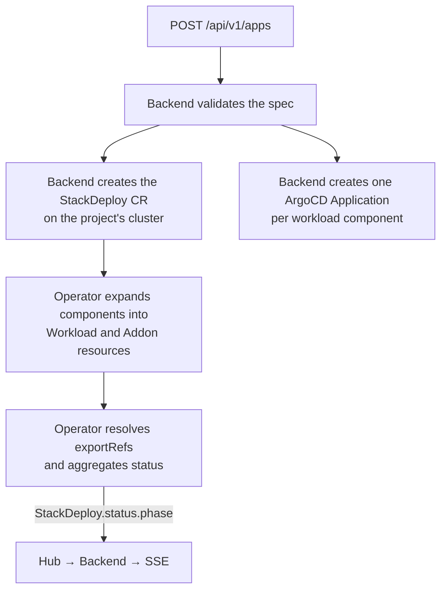
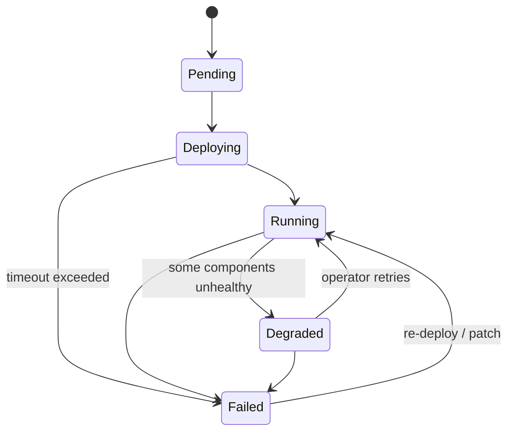

import { Callout, Steps, Tabs } from 'nextra/components'

# Apps, StackDeploys, and Components

An App is the central concept in kubenest. Almost everything you do — deploy, scale, pause, roll back, capture as a template — operates on Apps. This page explains what an App actually is under the hood, how its components relate to each other, and what happens over the App's lifetime.

## What is an App?

From a user's perspective, an App is a named, deployable bundle: a web service and its database, a worker and its queue, a set of microservices. You define the App by listing its components in a JSON body and posting it to `/api/v1/apps`. kubenest takes care of everything else.

Under the hood, an App maps to a **StackDeploy** — a Kubernetes custom resource on the project's cluster. The backend creates that resource directly, and creates an ArgoCD Application for each workload component carrying its rendered Helm values. The operator's StackDeploy controller then expands the components into `Workload` and `Addon` resources, resolves `exportRef` wiring between them in dependency order, and aggregates their status back onto the StackDeploy.



### Five terms, one object model

- **App** — the user-facing unit: what you create, patch, scale, and roll back through `/api/v1/apps`.
- **StackDeploy** — the custom resource an App becomes. The operator only understands StackDeploys; the backend translates API calls into operations on this resource. A StackDeploy carries either inline components (an App) or a `stackRef` pointing at a deployed Stack Template.
- **Workload component** — one containerized service inside an App: an image, a replica count, a port, environment variables, optionally ingress. A workload component cannot exist outside an App.
- **Addon component** — a backing service inside an App (Postgres, Redis), installed from a Helm chart. After install it publishes **exports** — values like `dsn`, `host` and `port` — that workload components in the same App consume via `exportRef`.
- **Standalone addon** — an addon instance created through `/api/v1/addon-instances` with a lifecycle outside any App. The current App conversion path cannot deploy an inline `export_ref.addon_instance_id`; see the limitation below.

The [worked example below](#a-worked-example-web-worker-and-postgres) shows the first four in a single spec; [Addons](/concepts/addons) covers the standalone form.

<Callout type="info">
The `/api/v1/workloads` endpoint was removed in favor of `/api/v1/apps`. If you have older automation that uses the workloads endpoint, migrate it to the apps endpoint. The operator now requires that every deployable unit belongs to an App.
</Callout>

## Components

An App's components are defined in the `components` array of the create request. Each component has a `name`, a `type` (`workload` or `addon`), and a type-specific spec.

### Workload components

A Workload component runs a containerized application. Its `workload_spec` defines the image, replica count, port, environment variables, ingress, and optionally a custom command.

The schema names three deployment modes, but only pre-built images are wired end to end through the App API today:

| Mode | When to use | Required field |
|------|-------------|---------------|
| `image` | Deploy a pre-built image from a registry | `image: "nginx:1.25-alpine"` |
| `dockerfile` | Present in the schema, but the App flow does not create the required `BuildRequest` | Do not use through `/apps` |
| `buildpack` | Present in the schema, but the App flow does not create the required `BuildRequest` | Do not use through `/apps` |

The backend schema also requires `image` or `chart` even when `build_mode` is `dockerfile` or `buildpack`, and the operator's Workload controller does not create a BuildRequest. Supplying only Git fields therefore returns `422`; adding an image avoids validation but does not start a source build.

### Addon components

An Addon component is a backing service packaged as a Helm chart. Its `addon_spec` references a chart repository, chart name, and chart version. The operator installs this chart into the project's namespace and, after a successful install, publishes a set of **exports** — key-value pairs like connection strings, hostnames, and references to Kubernetes Secrets — that downstream Workload components can consume.

## Export wiring with exportRef

The most powerful feature of multi-component Apps is the `exportRef` mechanism. Instead of hardcoding a database URL, you declare that an environment variable should be populated from another component's export:

```json filename="exportRef example"
{
  "name": "DATABASE_URL",
  "export_ref": {
    "component": "postgres",
    "export_key": "dsn"
  }
}
```

The `component` field refers to another component in the **same App** by name. The `export_key` identifies which output to use. The operator resolves this reference at reconcile time: it waits for the `postgres` addon to publish its exports, then injects the `dsn` value into the referring workload's environment.

This mechanism lets you define the wiring for a multi-tier application in one API call. Export values become available after the producing component deploys. PostgreSQL password-bearing DSNs currently need the workaround described in the worked example below.

<Callout type="warning">
Do not put `addon_instance_id` in an App create body's `export_ref` today. The request schema accepts it, but the CRD converter reads a `component` key and the create fails instead of producing a usable StackDeploy. The attach-addon endpoint also injects a component-name `exportRef` without adding that component to the App, so a StackDeploy without an existing same-name addon component fails operator validation. Standalone-addon sharing is not a working App wiring path in the current source.
</Callout>

<Callout type="warning">
An `exportRef` that uses `component` must refer to a name that exists within the same App. A reference to a nonexistent component name will cause the operator to set the App's phase to `Failed` with an explanatory message. The API validates component names at create time, but cross-component references are only resolved at reconcile time.
</Callout>

## App lifecycle states

An App moves through a defined set of phases. Read the current phase with `GET /api/v1/apps/{namespace}/{name}?project_id=<UUID>`; phase changes are also broadcast as SSE events.



| Phase | Meaning |
|-------|---------|
| `Pending` | Backend has recorded the App; operator has not yet begun reconciling |
| `Deploying` | Operator is reconciling; ArgoCD sync in progress |
| `Running` | All components are healthy; ArgoCD reports Synced + Healthy |
| `Degraded` | One or more components are unhealthy but the App is still partially operational |
| `Failed` | Deployment failed; `message` field contains the error |

## A worked example: web, worker, and Postgres

One App: a `web` tier serving HTTP, a `worker` consuming the same database, and a `postgres`
addon component that both of them wire to. This is the whole object model in one spec.

### The App you post

```json filename="POST /api/v1/apps"
{
  "name": "shop",
  "project_id": "b2c3d4e5-0002-0000-0000-000000000000",
  "components": [
    {
      "name": "postgres",
      "type": "addon",
      "addon_spec": {
        "type": "postgres",
        "chart": {
          "repo": "https://charts.bitnami.com/bitnami",
          "name": "postgresql",
          "version": "13.4.4"
        },
        "values": {
          "auth": { "database": "shop", "username": "shop" }
        }
      }
    },
    {
      "name": "web",
      "type": "workload",
      "depends_on": ["postgres"],
      "workload_spec": {
        "image": "myorg/shop-web:v1.4.0",
        "replicas": 2,
        "port": 8000,
        "env": [
          {
            "name": "DATABASE_URL",
            "export_ref": { "component": "postgres", "export_key": "dsn" }
          }
        ],
        "ingress": { "enabled": true, "host": "shop.example.com", "path": "/" }
      }
    },
    {
      "name": "worker",
      "type": "workload",
      "depends_on": ["postgres"],
      "workload_spec": {
        "image": "myorg/shop-worker:v1.4.0",
        "replicas": 1,
        "env": [
          {
            "name": "DATABASE_URL",
            "export_ref": { "component": "postgres", "export_key": "dsn" }
          }
        ]
      }
    }
  ],
  "timeout": "15m"
}
```

The addon's `type` is `postgres` — that exact string is what selects the operator's PostgreSQL
export extractor. `depends_on` makes the operator provision `postgres` before either workload;
without it all three components reconcile concurrently.

### The StackDeploy it becomes

The backend converts that body into a `StackDeploy` on the project's cluster. Field names go
camelCase, and each `export_ref` becomes a `valueFrom.exportRef`:

```yaml filename="what lands on the cluster (abridged)"
apiVersion: apps.kubenest.io/v1
kind: StackDeploy
metadata:
  name: shop
  namespace: my-project
spec:
  stackRef:              # synthesized for inline apps; a template deploy points at a real template
    name: inline-shop
    version: inline
  timeout: 15m
  components:
    - name: postgres
      type: addon
      addonSpec:
        type: postgres
        chart: { repo: "https://charts.bitnami.com/bitnami", name: postgresql, version: 13.4.4 }
        values: { auth: { database: shop, username: shop } }
    - name: web
      type: workload
      dependsOn: [postgres]
      workloadSpec:
        image: myorg/shop-web:v1.4.0
        replicas: 2
        port: 8000
        env:
          - name: DATABASE_URL
            valueFrom:
              exportRef: { component: postgres, key: dsn }
        # ingress elided
    # worker elided — same shape as web, without the ingress
```

### How DATABASE_URL gets its value

1. The operator expands the components: `postgres` becomes an `Addon` resource, `web` and
   `worker` become `Workload` resources in the same namespace.
2. The addon's chart installs, and the operator extracts its exports. For type `postgres` these
   include `dsn`, `host`, `port`, `user` and `database`, plus `passwordRef.name` and
   `passwordRef.key` naming the Kubernetes Secret that holds the password.
3. The StackDeploy controller resolves each `valueFrom.exportRef` against those exports, in
   dependency order, and copies the export string onto the Workload's env. A reference that
   cannot resolve yet — the addon is still deploying — is kept pending and retried on the next
   reconcile.

<Callout type="warning">
The current PostgreSQL `dsn` and `DATABASE_URL` exports contain a literal `${postgres-password}`
placeholder. The export resolver copies that string verbatim; it does not read and substitute the
Secret value. Use the plain `host`, `port`, `user`, and `database` exports and mount or read the
password from the Secret named by `passwordRef` until `kn-kgu5` is fixed.
</Callout>

## Pause and resume

Pausing an App is a clean way to stop paying for compute without destroying the deployment state. When you pause:

1. The backend resolves the intended replica count for every Workload component from deployment history, falling back to the current StackDeploy spec.
2. It stores those counts in a StackDeploy annotation and in the pause history entry.
3. It patches all Workload components' replicas to `0`.
4. The backend records a `pause` deployment-history entry. There is no separate paused phase; the App continues to report the phase produced by reconciliation.

When you resume:

1. The backend reads the snapshot.
2. It restores each Workload component's replica count to the pre-pause value.
3. The App re-enters the normal `Deploying` → `Running` flow.

```bash filename="pause and resume"
# Pause
curl -X POST -H "Authorization: Bearer $TOKEN" \
  "https://api.your-domain.com/api/v1/apps/my-project/my-api/pause?project_id=$PROJECT_ID"

# Resume
curl -X POST -H "Authorization: Bearer $TOKEN" \
  "https://api.your-domain.com/api/v1/apps/my-project/my-api/resume?project_id=$PROJECT_ID"
```

Addon components are not affected by pause — the database keeps running. Only Workload components have their replicas zeroed.

## Deployment history and rollback

App create, patch, scale, pause, resume, redeploy, rollback, attach-addon, and detach-addon operations record `Deployment` rows in the backend database. App deletion does not record one. You can list an App's deployment history:

```bash filename="deployment history"
curl -H "Authorization: Bearer $TOKEN" \
  "https://api.your-domain.com/api/v1/apps/my-project/my-api/deployments?project_id=$PROJECT_ID" | jq .
```

To roll back to a prior state, POST the deployment ID to the rollback endpoint:

```bash filename="rollback"
curl -X POST -H "Authorization: Bearer $TOKEN" \
  -H "Content-Type: application/json" \
  -d '{"deployment_id": "d4e5f6g7-..."}' \
  "https://api.your-domain.com/api/v1/apps/my-project/my-api/rollback?project_id=$PROJECT_ID"
```

The backend replays the prior deployment's component spec through the same reconcile path — it is not a Helm rollback, but a kubenest re-deployment to the prior configuration.

## Scaling individual components

To scale a single Workload component without touching anything else:

```bash filename="scale component"
curl -X POST -H "Authorization: Bearer $TOKEN" \
  -H "Content-Type: application/json" \
  -d '{"component_name": "api", "replicas": 4}' \
  "https://api.your-domain.com/api/v1/apps/my-project/my-api/scale?project_id=$PROJECT_ID"
```

## GitOps drift detection

If someone modifies a resource directly (bypassing kubenest), the operator detects the drift and surfaces it on the App's status. The `sync` field on `GET /api/v1/apps/{namespace}/{name}?project_id=<UUID>` shows the desired versus observed state and whether the drift is safe-to-reconcile (`recoverable`) or conflicts with a pending API write (`blocked_sync`).

---

See also:
- [Stack Templates](/concepts/stack-templates) — how to capture a running App as a reusable template
- [Addons](/concepts/addons) — the addon catalog, exports, and standalone addon instances
- [Projects](/concepts/projects) — the namespace that Apps live in
