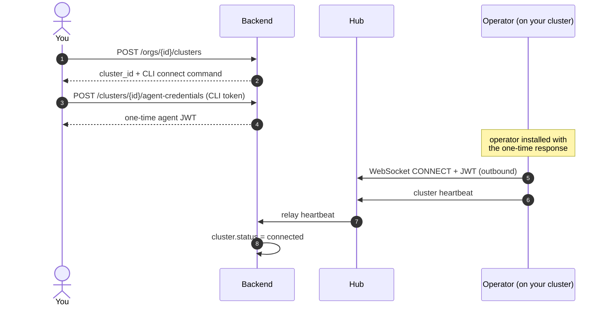
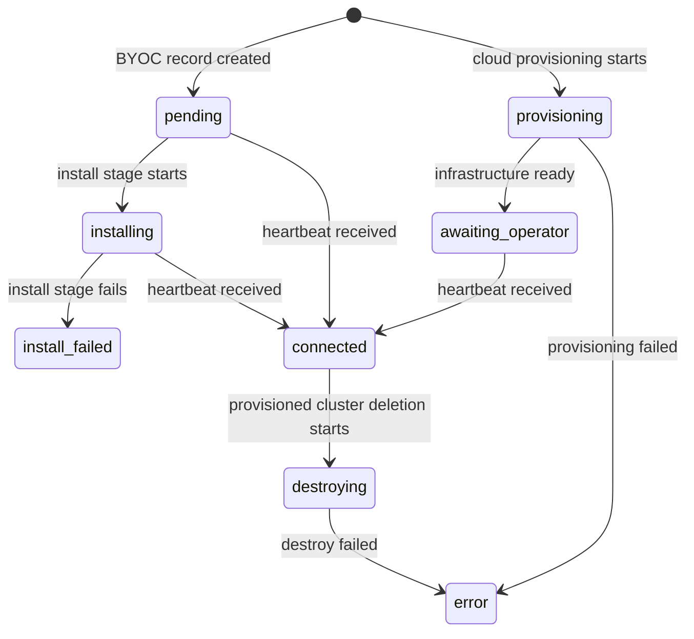

import { Callout, Steps } from 'nextra/components'

# Clusters

A Cluster in kubenest represents a Kubernetes cluster that the operator has been installed on and that the backend can route deployments to. kubenest is designed to manage many clusters simultaneously from a single control plane — each cluster runs its own operator instance, and the hub multiplexes their connections over WebSocket.

## How cluster registration works

Registration separates the public cluster record from install-time credentials. Creating the record reserves a UUID and returns a secret-free CLI command. The CLI then calls the agent-credentials endpoint, which returns a versioned cluster JWT only in that response for the operator to use when authenticating with the hub. Calling the endpoint again rotates the credential.



The operator-to-hub session is outbound-only: the operator initiates the WebSocket, authenticates with the JWT, and reconnects in the background. That does not make the whole deployment path outbound-only. The operator advertises the Kubernetes API server URL and a service-account token; the backend and control-plane ArgoCD use those credentials to connect to the cluster API for StackDeploy creation and reconciliation. The advertised API endpoint therefore has to be reachable from the control plane.

## Connection state machine

A cluster record transitions through the following states:



| State | Meaning |
|-------|---------|
| `pending` | Cluster record created. For a manually registered (BYO) cluster this is the state it sits in until the operator connects |
| `provisioning` | Cloud provider is creating the VM or managed cluster |
| `awaiting_operator` | Infrastructure ready; waiting for operator first connect. Only cloud-provisioned clusters enter this state — it is set by the provisioning job when it finishes |
| `installing` | The CLI has reported an in-progress platform install stage |
| `install_failed` | The CLI reported a failed install stage; this state remains sticky across heartbeats |
| `connected` | The backend received a heartbeat or connected status update. This is not a live-session check |
| `destroying` | A Terraform destroy job is running for a provisioned cluster |
| `error` | Provisioning or destroy failed |

The operator implements automatic reconnection with capped exponential backoff. The backend does not change `cluster.status` to `disconnected` when a session disappears. Fleet-health silence detection instead marks the last health checks unknown and raises a critical alert after the configured missed-report window.

<Callout type="warning">
Do not treat a failed backend-to-hub send as a durable queue. For example, project creation keeps the database record when its `project_create` event cannot be sent, but the backend has no replay path for that event. Confirm connectivity before issuing hub-dependent operations and retry the operation after reconnecting when the route permits it.
</Callout>

## Multi-cluster topology

You can register any number of clusters with a single kubenest control plane. Common topologies include:

**Environment-per-cluster.** Separate clusters for development, staging, and production. Each has its own operator and ArgoCD target. Addon state is separated under `clusters/{cluster-id}/addons/` in the configured Git repository; a dedicated branch per cluster is not automatic. Projects and apps are created independently on each cluster.

**Region-per-cluster.** Multiple clusters across geographic regions. The backend aggregates metrics and status from all of them into a single dashboard view.

**Workload-type-per-cluster.** A cluster tuned for stateless web workloads (many small nodes) alongside a cluster tuned for stateful data workloads (large storage-optimized nodes). Use per-component `clusterID` targeting to place components on the right cluster.

## Per-component cluster targeting

By default, all components of an App deploy to the cluster associated with the App's project. For cross-cluster deployments — a web tier on one cluster, a data processing component on another — set `cluster_id` on the component:

```json filename="cross-cluster component"
{
  "name": "data-processor",
  "type": "workload",
  "cluster_id": "f6g7h8i9-...",
  "workload_spec": {
    "image": "myorg/data-processor:latest",
    "replicas": 4,
    "port": 9000
  }
}
```

For a workload component, the backend creates a control-plane ArgoCD Application whose destination is the target cluster. The primary cluster's StackDeploy controller skips the non-local child and derives its status from the relayed ArgoCD status.

Cross-cluster `exportRef` is only partially wired. The primary operator can resolve exports from a remote producer into a local workload after that remote resource exists. A workload targeted at a non-primary cluster has no child Workload CR for export resolution, and the backend renders its `export_ref` as an empty inline Helm value. Initial App creation also does not create a non-primary addon component; the direct remote-addon creation path currently exists only when adding a component through PATCH. Do not use either shape as a working deployment path.

<Callout type="warning">
Before creating a cross-cluster App, both cluster IDs must be accessible to the caller and every non-primary target must have completed API registration. A missing API URL or service-account token returns `422 missing_cluster_registration`; the backend does not accept the App and leave that component pending.
</Callout>

## Cluster metrics

The backend aggregates CPU and memory capacity and utilization from each connected cluster, updated as the operator sends heartbeat events:

```bash filename="cluster metrics"
curl -H "Authorization: Bearer $TOKEN" \
  https://api.your-domain.com/api/v1/clusters/$CLUSTER_ID | jq '{
    cpu_total: .cpu_total,
    cpu_used: .cpu_used,
    mem_total: .mem_total,
    mem_used: .mem_used,
    node_count: .node_count
  }'
```

These are aggregate cluster-level figures, not per-workload measurements. Per-workload time series come from the App metrics endpoint, which sends Prometheus queries to the operator through the hub:

```bash filename="app metrics"
curl -H "Authorization: Bearer $TOKEN" \
  "https://api.your-domain.com/api/v1/apps/my-project/my-app/metrics?project_id=$PROJECT_ID&range=1h"
```

## Cloud-provisioned clusters

In addition to manually registered (BYOC) clusters, kubenest can provision clusters on supported cloud providers by creating VMs and installing Kubernetes automatically. Provisioned clusters go through the `provisioning` state and require a `CloudCredential` record with provider credentials.

Provisioned clusters support scaling:

```bash filename="scale cluster"
curl -X POST \
  -H "Authorization: Bearer $TOKEN" \
  -H "Content-Type: application/json" \
  -d '{"desired_node_count": 5}' \
  https://api.your-domain.com/api/v1/clusters/$CLUSTER_ID/scale
```

BYOC (bring-your-own-cluster) registrations are not affected by the scale endpoint — node management for those clusters is handled outside kubenest.

## Deleting a cluster

`DELETE /api/v1/clusters/{id}` requires the org `admin` role, and it refuses with `409` while any project still exists on the cluster. The error names the blocking projects. Delete them first; there is no force or cascade parameter, because project deletion is always available and a force flag would only restore the hazard the guard removes.

The guard runs before the provisioned/BYOC branch below, so a refused delete never leaves a destroy job behind.

What happens to the cluster itself depends on how it was created:

- **Cloud-provisioned clusters** get a destroy job: the backend runs Terraform destroy and the VMs are terminated. This deletes the infrastructure, not just the record.
- **BYOC registrations** have only their record deleted. Nothing on the cluster is touched. If the CLI installed the platform, remove it separately with the CLI; it preserves persistent data unless `--destroy-data` is supplied:

  ```bash
  kubenest platform uninstall --name <cluster-name> --confirm
  ```

---

See also:
- [Installation](/getting-started/installation) — how to install the operator on a cluster
- [Projects](/concepts/projects) — the projects and namespaces that live within a cluster
- [Apps](/concepts/apps) — per-component cluster targeting with `cluster_id`
