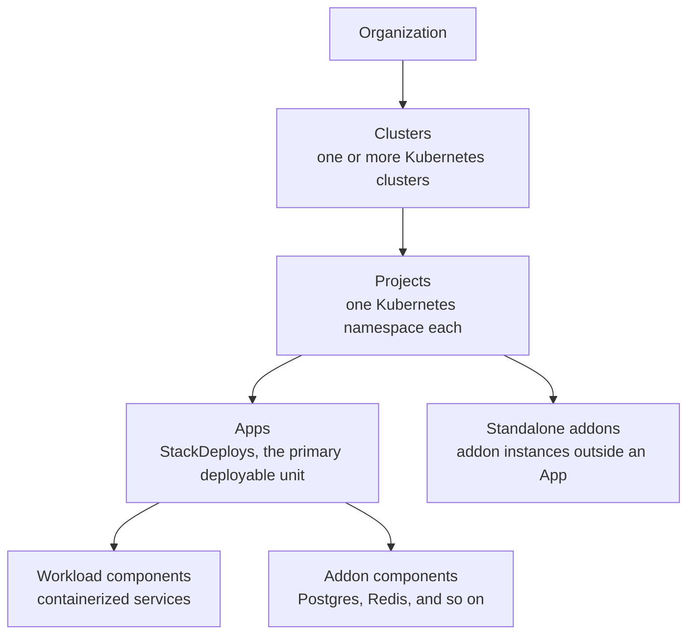

import { Cards, Callout } from 'nextra/components'

# Core Concepts

kubenest organizes everything around a hierarchy of five objects. Understanding how they relate to each other is the fastest way to understand the system as a whole.

Each level in this hierarchy answers a different question: *who owns it* (organization), *where it runs* (cluster), *what scope it belongs to* (project), and *what it does* (app and its components).

<Callout type="info">
A project belongs to exactly one cluster; an app belongs to exactly one project. Cross-cluster placement is possible at the component level (a single App can have components targeting different clusters), but the App itself is always anchored to the project's primary cluster.
</Callout>

## The objects at a glance

**Organization** is the top-level tenant. Users, billing, and global settings live here. Most teams have one organization; the object exists primarily for multi-tenancy in hosted deployments.

**Clusters** are the Kubernetes clusters you have registered with kubenest. Each cluster runs one operator instance, which connects outbound to the hub. A cluster can host any number of projects. See [Clusters](/concepts/clusters).

**Projects** map one-to-one to Kubernetes namespaces. Every app, addon, and secret inside a project shares that namespace. A project is a namespace boundary — today it is not an enforced permission or capacity boundary, which [Projects](/concepts/projects) states plainly.

**Apps** are kubenest's primary deployable unit. An App is a `StackDeploy` Kubernetes custom resource under the hood — a bundle of one or more components deployed and managed together. Components can be containerized workloads or addon services; they can reference each other's outputs via the `exportRef` wiring mechanism. See [Apps](/concepts/apps).

**Addons** are backing services: PostgreSQL, Redis, Kafka, and anything else packaged as a Helm chart. An Addon can live as a component inside an App (deployed together) or as a standalone instance shared across multiple apps. See [Addons](/concepts/addons).

Five of the words above get confused with each other, so here they are side by side:

| Term | What it is |
|---|---|
| **App** | The unit you create and operate, through `/api/v1/apps` |
| **StackDeploy** | The custom resource an App becomes on the cluster; what the operator reconciles |
| **Workload component** | One containerized service inside an App — image, replicas, port, ingress |
| **Addon component** | A backing service inside an App — Postgres, Redis — publishing exports |
| **Standalone addon** | An addon instance outside any App, shared across Apps, through `/api/v1/addon-instances` |

The [worked example](/concepts/apps#a-worked-example-web-worker-and-postgres) on the Apps page shows the first four in a single spec.

**Stack Templates** are reusable multi-component blueprints with parameter slots. They let you capture a working App and share it — within a project, across a cluster, or in the community registry. See [Stack Templates](/concepts/stack-templates).

---

## Explore each concept

<Cards>
  <Cards.Card title="Apps" href="/concepts/apps" description="The primary deployable unit. Components, deployment modes, exportRef wiring, lifecycle states, pause/resume, and rollback." />
  <Cards.Card title="Stack Templates" href="/concepts/stack-templates" description="Reusable blueprints with parameter slots. From-app capture, from-chart wrapping, community registry." />
  <Cards.Card title="Projects" href="/concepts/projects" description="One namespace per project, lifecycle, project secrets — and what is not enforced today." />
  <Cards.Card title="Clusters" href="/concepts/clusters" description="Cluster registration, connection states, multi-cluster topology, per-component targeting." />
  <Cards.Card title="Addons" href="/concepts/addons" description="Backing services as Helm charts. AddonDefinition catalog, exports, revision history, rollback." />
</Cards>
