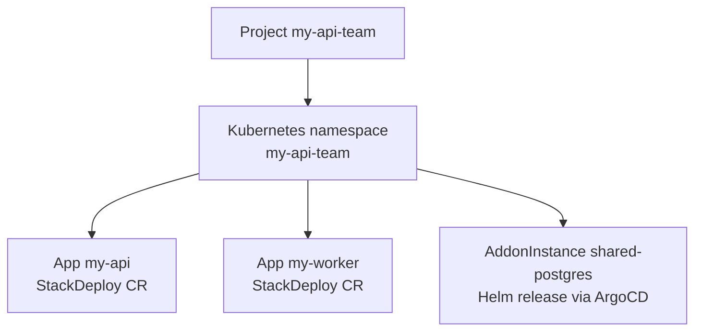

import { Callout } from 'nextra/components'

# Projects

A Project is the unit of grouping in kubenest. Every App, Addon, and Secret you deploy lives inside a project. From Kubernetes' perspective, a project is a namespace — all resources belonging to the project share that namespace.

A project is not a capacity boundary or an enforced permission boundary today. kubenest does not manage `ResourceQuota` objects, and the role bindings the API stores are not consulted when requests are authorized. Both gaps are described plainly below — do not design an isolation or access policy around a project until they are closed.

## Projects and namespaces

When you create a project, the backend sends a message to the operator (via the hub) instructing it to create the corresponding Kubernetes namespace. The namespace name matches the project name — slugified to conform to DNS label rules — and carries labels that tie it to the kubenest project ID.



One project, one namespace. You cannot split a project across namespaces, and you cannot put two projects into the same namespace.

<Callout type="warning">
A namespace separates names, not capacity. kubenest does not create a `ResourceQuota` in the namespace, so nothing stops one project's workloads from consuming the whole cluster. See [Resource quotas](#resource-quotas) below.
</Callout>

## Project lifecycle

Projects move through two phases:

| Phase | Meaning |
|-------|---------|
| `pending` | Backend has created the project record; operator has not yet confirmed namespace creation |
| `ready` | Operator has created the namespace and the project is available for deployments |

The transition from `pending` to `ready` is fast — typically under a second when the cluster is connected. If a cluster is disconnected at the time of project creation, the project stays `pending` until the operator reconnects and processes the backlog.

## Resource quotas

kubenest does not manage ResourceQuota today: a project is a namespace boundary, not a capacity boundary. The operator's project reconcile creates the namespace and syncs the registry pull secret into it — it writes no quota object, and nothing enforces one.

The API does not accept one either. Project creation rejects unknown fields, so a request body carrying `resource_quota` returns 422.

If you need a quota, create the `ResourceQuota` in the project's namespace with `kubectl` and manage it yourself.

## RBAC and role bindings

The API stores role bindings with three roles — `admin`, `member`, and `viewer` — at three scopes: organization, cluster, and project. Today these are membership records, not an enforced permission model. Authorization on cluster and project routes checks organization membership only: any member of the organization passes, whatever their role.

That includes destructive operations. A `viewer` credential can delete a project, and can delete a cluster — which, for a cluster kubenest provisioned, starts the destruction of its infrastructure. Do not design an access policy around these roles, and do not hand out credentials on the assumption that `viewer` is read-only.

The role checks that exist today:

| Operation | Required |
|------|-------------|
| Organization settings and organization member management | The org `admin` role |
| Everything else, including project and cluster deletion | Organization membership, any role |

Project- and cluster-scoped bindings are managed through the RBAC endpoints:

```bash filename="add a project role binding"
curl -X POST \
  -H "Authorization: Bearer $TOKEN" \
  -H "Content-Type: application/json" \
  -d '{
    "subject_type": "user",
    "subject_id": "42",
    "role": "member"
  }' \
  https://api.your-domain.com/api/v1/projects/b2c3d4e5-.../rbac
```

The binding is stored and can be listed, updated, and deleted — and no endpoint consults it when authorizing a request. The operator also creates no Kubernetes `RoleBinding` objects in the namespace, so direct access to the cluster's API server is outside this role model entirely.

## Secrets at the project level

Secrets that should be available across multiple apps in a project — database passwords, API keys, registry pull secrets — can be stored at the project level:

```bash filename="create project secret"
curl -X POST \
  -H "Authorization: Bearer $TOKEN" \
  -H "Content-Type: application/json" \
  -d '{
    "key": "STRIPE_SECRET_KEY",
    "value": "sk_live_..."
  }' \
  https://api.your-domain.com/api/v1/projects/b2c3d4e5-.../secrets
```

Project secrets are stored encrypted in the backend database and injected into the namespace as Kubernetes Secrets during reconciliation. Workload components can reference them by key in their environment variable configuration.

## Listing and managing projects

```bash filename="list projects"
curl -H "Authorization: Bearer $TOKEN" \
  "https://api.your-domain.com/api/v1/projects?cluster_id=$CLUSTER_ID" | jq .

# Get a specific project
curl -H "Authorization: Bearer $TOKEN" \
  https://api.your-domain.com/api/v1/projects/$PROJECT_ID | jq .

# Delete a project (removes the control-plane record only — see below)
curl -X DELETE -H "Authorization: Bearer $TOKEN" \
  https://api.your-domain.com/api/v1/projects/$PROJECT_ID
```

<Callout type="warning">
Deleting a project removes the record from the control plane and nothing else. No event is sent to the cluster: the namespace and everything in it — apps, addons, secrets, volumes — keeps running, and so does the Project resource the operator created. The record deletion itself is irreversible.
</Callout>

The cluster-side cleanup is manual. Delete the Project resource first — while it exists, the operator re-creates the namespace on its next reconcile — then delete the namespace:

```bash filename="manual cleanup on the cluster"
# The Project resource lives in kubenest-system; the namespace it manages
# carries the label kubenest.io/project.
kubectl get projects -n kubenest-system
kubectl get namespaces -l kubenest.io/project

kubectl delete project <project-name> -n kubenest-system
kubectl delete namespace <project-namespace>
```

Deleting the namespace removes the workloads and PersistentVolumeClaims in it. Whether the underlying PersistentVolumes and their data survive depends on the StorageClass reclaim policy. Back up anything you need before deleting.

---

See also:
- [Clusters](/concepts/clusters) — the cluster a project is deployed on
- [Apps](/concepts/apps) — the deployable units that live within a project
- [Addons](/concepts/addons) — standalone backing services scoped to a project
