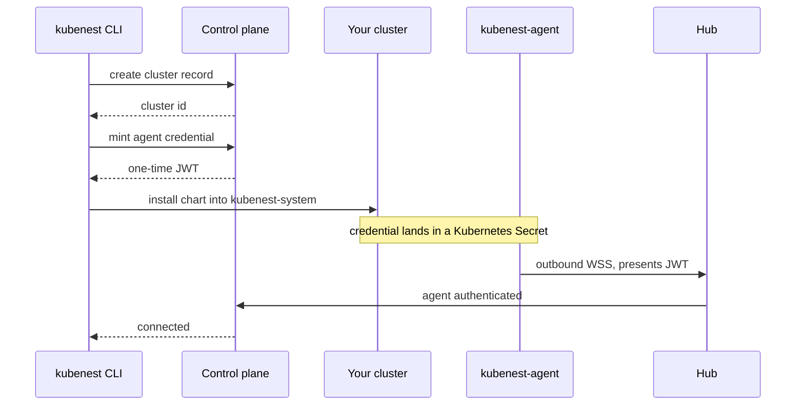

import { Callout } from 'nextra/components'

# Connect a cluster

For a Kubernetes cluster that already exists — EKS, GKE, AKS, kubeadm, a local k3s. KubeNest needs
no access to your cloud provider and no inbound route to your API server: an agent runs in the
cluster and dials out.

<Callout type="info">
**This gets you the app layer, not the platform.** Deploying, addons, templates, projects and the
fleet view all work. The bundle does not: your cluster keeps whatever ingress, storage, certificate
and backup components it already has, so there is no single version number over them, no gated
upgrade and no restore drill. Those are what [installing the platform](/install) gives you, and
they are the reason to run KubeNest at all — see [Day 2](/day-2).
</Callout>

## Connect it

```bash filename="terminal"
kubenest cluster connect prod-cluster
```

The CLI creates the cluster record, mints a one-time agent credential, installs the agent into the
cluster your current kubectl context points at, and waits for it to report in.

```ansi filename="output"
context      arn:aws:eks:us-east-1:…:cluster/prod        ok
record       prod-cluster created                        ok
credentials  minted, one-time                            ok
agent        kubenest-agent 2.3.5 → kubenest-system      ok   24s
connect      websocket established                       ok    2s

cluster prod-cluster connected
```

What those five lines actually do — note that every arrow crossing into your cluster is one your
side opened:



Nothing in that sequence opens a port on your cluster or hands KubeNest a kubeconfig. The agent
dials out; the control plane never dials in. See [Architecture](/architecture) for what rides that
connection afterwards.

Use a different context, or a different kubeconfig, with the usual flags:

```bash filename="terminal"
kubenest cluster connect prod-cluster --context staging --kubeconfig ~/.kube/other
```

Confirm whenever you like:

```bash filename="terminal"
kubenest cluster list
```

```ansi filename="output"
prod-cluster   connected   3 nodes   eks           app layer only
demo           connected   1 node    Platform 1.0  single-server
```

## Installing the agent yourself

If your policy is that nothing installs into the cluster except through your own pipeline, take the
manifests instead of letting the CLI apply them:

```bash filename="terminal"
kubenest cluster connect prod-cluster --render > kubenest-agent.yaml
```

That prints the same resources the CLI would have applied, with the credential already in place, and
does not touch the cluster. Apply it however you normally apply things. The cluster connects when
the agent starts.

The underlying chart is public, if you would rather drive Helm directly:

```bash filename="terminal"
helm upgrade --install agent oci://ghcr.io/kubenesthq/charts/kubenest-operator-2 \
  --version 2.3.5 \
  --namespace kubenest-system --create-namespace \
  --values kubenest-agent-values.yaml --wait
```

`kubenest cluster credentials prod-cluster` writes the values file. It returns the credential once
and never again; running it again rotates, and the previous credential stops being accepted.

<Callout type="warning">
**That values file is a credential.** It holds the agent JWT and, where GitOps is configured, a
per-cluster repository key. Keep it mode `0600`, do not commit it, and delete it once the agent is
running — the chart stores both in Kubernetes Secrets, so from that point reading them is a
cluster-administrator privilege.
</Callout>

## Letting KubeNest provision the machines

KubeNest can also create the infrastructure and then install the platform on it, rather than
connecting to something you built:

```bash filename="terminal"
kubenest cloud credential add aws-prod --provider aws --region us-east-1
kubenest cluster provision staging --credential aws-prod --nodes 3
```

The cluster moves `provisioning` → `awaiting_operator` → `connected`, and can be resized later with
`kubenest cluster scale staging --nodes 5`.

<Callout type="info">
Provisioning runs on **AWS EC2**. Credentials for other providers are stored but creating a cluster
against them is refused.
</Callout>

## Disconnecting

```bash filename="terminal"
kubenest cluster disconnect prod-cluster
```

Requires the org `admin` role, and refuses while any project still exists on the cluster, naming
what blocks it. Delete the projects first — there is no cascade, because project deletion is always
available and a force flag would only put the hazard back.

For a cluster you brought, only the record and the agent go; nothing else on the cluster is touched.
For one KubeNest provisioned, the infrastructure is destroyed.

## Troubleshooting

**Stuck at `connect`.** The agent cannot reach the hub. `kubenest cluster logs prod-cluster` shows
the agent's own view; the usual cause is egress filtering on 443.

**`401` from the hub.** The credential does not match the record, normally because the cluster was
reconnected and an older values file was reused. Re-run `kubenest cluster credentials` and apply the
new one.

**Agent pod `ImagePullBackOff`.** The cluster cannot reach `ghcr.io`. Mirror the chart and image
into your own registry and set `--image-repository`.

---

Next: [Deploying apps](/deploying) · [Install the platform](/install) · [Day 2](/day-2)
