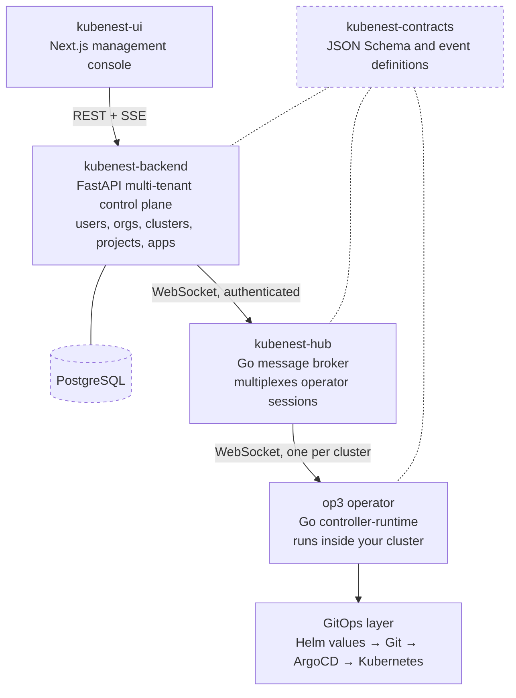

import { Cards, Steps } from 'nextra/components'

# kubenest

**Kubernetes on the servers you already own, with the maintenance handled.**

Standing a cluster up is the easy day. What costs you is everything after: the upgrade nobody wants
to run, the backup nobody has restored, the certificate that expires while the person who set it up
is on holiday, the kernel patch that never gets applied.

kubenest is a **tested, versioned platform bundle** — Kubernetes plus the ingress, storage,
certificate, backup and patching components that every cluster needs anyway — installed as one
thing, upgraded as one thing, and carrying one version number for the whole set.

---

## Start here

<Cards>
  <Cards.Card title="Install the platform" href="/platform/install" description="Preflight, the thirteen install stages, and what to verify afterwards." />
  <Cards.Card title="What is in the bundle" href="/platform/bundle" description="The components, the manifest, and what a version number actually pins." />
  <Cards.Card title="Upgrades" href="/platform/upgrades" description="The gates, the ordering, what rolls back — and what does not." />
  <Cards.Card title="Backup and restore" href="/platform/backup-restore" description="Two kinds of backup, and the drill that proves a restore works." />
</Cards>

---

## What you actually get

**One version number for the whole platform.** Not eight component upgrades you sequence yourself
and hope about. `Platform 1.4 → 1.5` is a single tested transition, and what changed between any
two versions is in the [bundle manifest](/platform/bundle).

**Upgrades that check before they run.** Every upgrade scans your live workloads for Kubernetes
APIs removed in the target version and refuses to start if it finds any — because an upgrade that
cleanly upgrades the cluster and silently breaks your application has actively harmed you. The
[ordering](/platform/upgrades#the-order-of-operations) puts the irreversible step last, so most
failures happen while retreating is still cheap.

**Backups that have been restored.** A backup nobody has restored is not a backup. Scheduled
[restore drills](/platform/backup-restore#the-restore-drill) restore into a scratch namespace,
verify objects *and* volume data match, tear it down, and record the result. A failed drill is an
alert, and it blocks the next upgrade.

**The machines get patched too.** Ubuntu security updates apply automatically; reboots are
[coordinated](/platform/os-patching) one node at a time inside a window you choose. Unpatched
kernels are not a Kubernetes problem, which is exactly why they get left.

**Someone notices before you do.** Fleet telemetry reports cluster health, bundle version, and
backup configuration state continuously — so a cluster that has never taken a backup is visible
rather than silent.

**Deploying apps, when you want it.** Apps are the unit of deployment rather than individual
Pods — a web tier, a worker and a PostgreSQL addon deployed together, connection strings wired
between them automatically. GitOps underneath, so there is an audit trail and a rollback.
See [apps and components](/concepts/apps).

---

## The honest comparison

Some of these are good products, and for some teams they are the right answer. Here is where each
one stops.

| Instead of kubenest | Where it stops |
|---|---|
| **EKS, GKE, AKS** | They run the coordination layer in the middle — genuinely hard, and a small part. Everything your applications actually touch is still yours to choose, connect and maintain, on their hardware in their region |
| **Rancher** | A good control panel, and looking at your clusters was never the hard part. It does not decide which networking, storage, certificate or backup tools you run, or promise they survive the next upgrade together. Its automated maintenance features are a paid tier |
| **Omni or Talos** | Well-built, and they require their own operating system on your machines. If you run Ubuntu today, that is a migration project before you see any benefit |
| **Headlamp, k9s, Lens** | Free, light, good at what they do — a view onto a cluster, with no fleet view and no day-2 automation |
| **Hiring a platform engineer** | You should, past a certain size. It costs more, takes months to recruit and months more to become useful, and the knowledge leaves when they do |
| **Carrying on as you are** | Works, right up until a certificate expires on a holiday or an upgrade needs a maintenance window nobody wants to own |

The assembly problem is the product. Every cluster needs ingress, certificates, storage, backup,
upgrade orchestration and OS patch handling — and somebody has to pick each one, wire them
together, and own whether they still work after the next upgrade.

---

## How it works

kubenest spans five cooperating repositories, each with a distinct responsibility. The boundary
between them explains why the system behaves the way it does.

The dotted contract is shared by all three services: a change to an event shape lands there first.

That design has one consequence worth stating plainly: **the backend never holds a kubeconfig or
cluster credentials.** Every cluster operation flows through the hub to the operator, which runs
inside the cluster and has local Kubernetes API access. A compromised backend cannot issue
arbitrary kubectl commands — the operator acts only on signed, schema-validated events.

The operator dials **out** to the hub, so no node needs a public address and no inbound firewall
rule is required.

---

## Deploying onto it

Once the platform is installed, the cluster is an ordinary conformant Kubernetes cluster with a
tested set of components on it. Deploy to it however you already deploy to Kubernetes — or use the
app layer.

<Steps>
### Register a cluster

Install the kubenest Helm chart. The operator connects outbound to the hub over WebSocket using a
cluster-scoped JWT, and the backend marks the cluster `connected` when the first heartbeat arrives.

### Create a project

A project is a Kubernetes namespace — the isolation boundary for the apps and addons belonging to a
team or environment, with optional resource quotas and RBAC bindings.

### Deploy an app

POST a spec to `/api/v1/apps`. The backend writes a `StackDeploy` CRD to the cluster via the hub,
the operator reconciles it, and status streams back over SSE.
</Steps>

---

## Next steps

- [Install the platform](/platform/install) — preflight, the install stages, and the acceptance checks
- [What is in the bundle](/platform/bundle) — components, the manifest, and what a version pins
- [HA tiers](/platform/ha) — single-server versus three-node, and how to choose
- [Apps and components](/concepts/apps) — the app layer: deployment modes, export wiring, pause and resume
