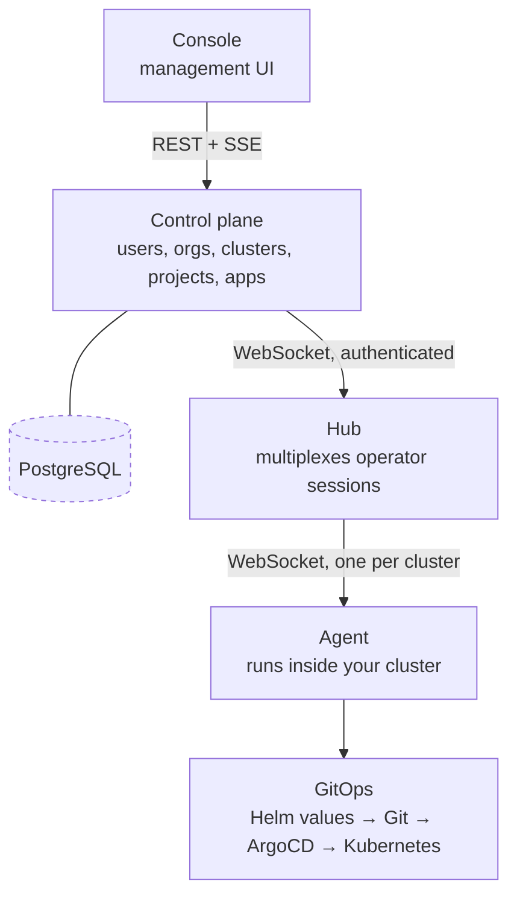

import { Cards } from 'nextra/components'

# KubeNest

**Kubernetes on the servers you already own, with the maintenance handled.**

Standing a cluster up is the easy day. What costs you is everything after: the upgrade nobody wants
to run, the backup nobody has restored, the certificate that expires while the person who set it up
is on holiday, the kernel patch that never gets applied.

KubeNest is a **tested, versioned platform bundle** — Kubernetes plus the ingress, storage,
certificate, backup and patching components every cluster needs anyway — installed as one thing,
upgraded as one thing, carrying one version number for the whole set.

<Cards>
  <Cards.Card title="Quickstart" href="/quickstart" description="One host to a running app, in about fifteen minutes." />
  <Cards.Card title="Prerequisites" href="/prerequisites" description="What you need, for a test cluster and for production." />
  <Cards.Card title="Install the platform" href="/install" description="Every flag, the thirteen stages, and what to verify." />
  <Cards.Card title="What is in the bundle" href="/bundle" description="The components, and what a version number pins." />
</Cards>

## What you actually get

**One version number for the whole platform.** Not eight component upgrades you sequence yourself
and hope about. `Platform 0.9 → 1.0` is a single tested transition, and what changed between any two
versions is in the [bundle manifest](/bundle).

**Upgrades that check before they run.** Every upgrade scans your workloads for Kubernetes APIs
removed in the target version and refuses to start if it finds any — because an upgrade that
cleanly upgrades the cluster and silently breaks your application has actively harmed you. The
[ordering](/upgrades#the-order-of-operations) puts the irreversible step last, so most failures
happen while retreating is still cheap.

**Backups that have been restored.** A backup nobody has restored is not a backup. Weekly
[restore drills](/backup-restore#the-restore-drill) restore into a scratch namespace, verify objects
*and* volume bytes match, tear it down and record the result. A failed drill is an alert, and it
blocks the next upgrade.

**The machines get patched too.** Ubuntu security updates apply automatically; reboots are
[coordinated](/os-patching) one node at a time inside a window you choose. Unpatched kernels are not
a Kubernetes problem, which is exactly why they get left.

**Someone notices before you do.** Fleet telemetry reports cluster health, bundle version and backup
state continuously, so a cluster that has never taken a backup is visible rather than silent.

**Deploying apps, when you want it.** [Apps](/deploying) are the unit — a web tier, a worker and a
PostgreSQL addon deployed together, connection strings wired between them automatically, with an
audit trail and a rollback.

## The honest comparison

Some of these are good products, and for some teams they are the right answer. Here is where each
one stops.

| Instead of KubeNest | Where it stops |
|---|---|
| **EKS, GKE, AKS** | They run the coordination layer in the middle — genuinely hard, and a small part. Everything your applications actually touch is still yours to choose, connect and maintain, on their hardware in their region |
| **Rancher** | A good control panel, and looking at your clusters was never the hard part. It does not decide which networking, storage, certificate or backup tools you run, or promise they survive the next upgrade together. Its automated maintenance features are a paid tier |
| **Omni or Talos** | Well-built, and they require their own operating system on your machines. If you run Ubuntu today, that is a migration project before you see any benefit |
| **Headlamp, k9s, Lens** | Free, light, good at what they do — a view onto a cluster, with no fleet view and no day-2 automation |
| **Hiring a platform engineer** | You should, past a certain size. It costs more, takes months to recruit and months more to become useful, and the knowledge leaves when they do |
| **Carrying on as you are** | Works, right up until a certificate expires on a holiday or an upgrade needs a maintenance window nobody wants to own |

The assembly problem is the product. Every cluster needs ingress, certificates, storage, backup,
upgrade orchestration and OS patch handling — and somebody has to pick each one, wire them together,
and own whether they still work after the next upgrade.

## How it works

**No kubeconfig for your cluster is ever uploaded to KubeNest.** Cluster operations flow through the
hub to the agent, which runs inside the cluster and has local Kubernetes API access, and acts only
on signed, schema-validated events.

The agent dials **out** to the hub, so no node needs a public address and the session survives NAT
and egress-only firewalls.

[Architecture](/architecture) has the full picture.

## Next steps

- [Quickstart](/quickstart) — one host, one command, a running app
- [HA tiers](/ha) — single-server versus three-node, and how to choose
- [Upgrades](/upgrades) — how one version number becomes the next one
- [Connect a cluster](/connect-cluster) — for a Kubernetes cluster you already run
