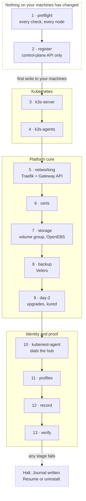

import { Callout, Steps } from 'nextra/components'

# Install the platform


The KubeNest Platform is a pinned, tested bundle of everything a Kubernetes cluster needs above
Kubernetes itself — ingress, certificates, storage, backup, upgrade orchestration and OS patching —
installed together as one versioned unit onto Ubuntu hosts you supply.

This page covers installing that bundle onto machines that have no Kubernetes on them yet — and the
control plane that manages the fleet. Every cluster registers to a control plane through the same
API path. The first install creates the control plane inside the cluster it is installing and leaves
the CLI logged in to it; every cluster after that registers to the same control plane.

<Callout type="info">
**All-in-one or two-tier.** Putting the control plane inside the cluster that also runs your
applications is right for trying KubeNest and for a small fleet: one host to keep. For production,
run a dedicated management cluster and add workload clusters to it. Running applications on the
management cluster means one application's memory pressure can take the console down for the whole
fleet, and upgrading that cluster upgrades the thing that manages everything else.
</Callout>

## What "one click" means here

The claim is deliberately narrow, because a claim we can test is worth more than a claim that
sounds bigger:

> From a single machine with SSH access to your target nodes, one command installs the complete
> core bundle in under fifteen minutes, with no further human steps.

What that does **not** mean:

- It does not provision machines. You supply the hosts, the network and the disks.
- It does not configure your DNS, your load balancer or your firewall.
- It does not mean nothing can fail. It means a failure names the component, the stage and the
  remedy — see [When it fails](#when-it-fails).

## Before you start

### Supported hosts

**Ubuntu 24.04 LTS only.** That is the release the bundle is tested on. The installer refuses
to run on any other release or any other distribution, rather than half-installing one.

Locking the operating system is what makes the bundle testable: a known kernel and a
deterministic LVM layout are preconditions for the storage and OS-patching components, and for
replicated storage later.

### Host sizing

Preflight checks every node against these before anything is installed.

| | vCPU | RAM | Disk | Buy a machine advertised as |
|---|---|---|---|---|
| Server node — hard floor | 2 | 3.7 GiB | 36 GiB | 4 GB / 40 GB |
| Server node — recommended | 4 | 7.4 GiB | 92 GiB | 8 GB / 100 GB |
| Agent node — hard floor | 2 | 3.7 GiB | 36 GiB | 4 GB / 40 GB |
| Agent node — recommended | 4 | 7.4 GiB | 92 GiB | 8 GB / 100 GB |

Preflight **fails** below the hard floor and **warns** below the recommendation. The floor is
k3s's own documented minimum plus headroom for the rest of core. The recommendation is what to buy
if the cluster is going to carry real workloads.

The thresholds themselves live in the bundle manifest under `limits.resources`, so they are
versioned with the release rather than compiled into the installer.

<Callout type="warning">
**The two columns are the same machine.** The last column is what a vendor advertises; the
others are what the kernel reports once you own it. A host sold as 8 GB gives `/proc/meminfo`
7.57 GiB; sold as 80 GB it leaves roughly 74.8 GiB on the root filesystem. Measured on a real
cloud host, not rounded on paper.

Preflight compares against the **GiB** columns. Comparing a `4 GB` floor against `MemTotal` as
though it were GiB refuses a machine that meets the specification — and because the floor fails
rather than warns, the customer is told to buy a bigger box for a box that was already correct.
</Callout>

### Disks and storage

The bundle uses OpenEBS Local PV LVM for persistent volumes. Replicated block storage is a
profile, not core — it is itself a source of operational dread, and durability in the default
configuration comes from verified backups plus application-level replication instead.

Local PV LVM provisions volumes out of an LVM volume group that must exist on each node that will
host persistent data. There are two supported ways to get one, and you pick per install.

**Option 1 — you create the volume group (default).** Create a volume group named `kubenest-vg`
on each data-bearing node before running the installer. Preflight verifies it exists and has free
extents. The installer never touches your block devices.

This asks nothing extra of you in packaging terms: `lvm2` ships on the stock Ubuntu 24.04 cloud
image, so `pvcreate` and `vgcreate` are already present on a fresh host.

**Option 2 — the installer creates it.** Name a blank device explicitly:

```bash
--storage-device /dev/nvme1n1
```

The installer creates `kubenest-vg` on that device. Preflight refuses if the device holds a
partition table, a filesystem or an existing volume group, so this cannot silently overwrite data.
The flag is required — there is no device auto-detection, because guessing which disk is
disposable on someone else's infrastructure is not a risk worth taking.

Creating a volume group from free space on the root disk is not supported.

Which option you used is recorded against the cluster, because it determines what
[uninstall](#uninstall) is allowed to remove.

### Backup

Velero is installed as part of core. The install does not configure a backup target; where backups
are written is yours to choose and configure after the cluster is up. See
[Backup and restore](/backup-restore).

<Callout type="info">
Velero itself is not optional and is not a profile. Core is a fixed set — variation comes from
profiles only, or the tested-configuration count stops being N+2.
</Callout>

### Network

Between cluster nodes:

| Port | Protocol | Direction | Purpose |
|---|---|---|---|
| 6443 | TCP | agents → server | Kubernetes API |
| 8472 | UDP | all ↔ all | Flannel VXLAN overlay |
| 10250 | TCP | all ↔ all | Kubelet metrics |
| 2379–2380 | TCP | server ↔ server | etcd peer replication — **3-node `ha` tier only** |

Outbound from the cluster and from the machine running the installer:

- HTTPS to container registries and Helm repositories, for the duration of the install;
- TCP 443 to the management cluster, from the machine running the CLI, for the control plane API and
  console; and
- TCP 443 to the management cluster, from each cluster that is being added, because its agent opens
  the hub connection outbound as `wss` on that port.

The agent opens that connection outbound and holds it open, so it survives NAT and an egress-only
firewall.

<Callout type="info">
**Air-gapped installs are not covered here.** The installer retrieves the bundle components over
normal egress, and each added cluster needs the route to the management host described above. Plan a
registry mirror and that route before treating an air-gapped estate as supported.
</Callout>

### Access

The machine you run the installer from needs SSH to every target node, with **passwordless sudo**
on each.

The installer uses your existing SSH setup: `~/.ssh/config`, `ssh-agent`, or a key file named
with `--ssh-key`. Key material stays on your machine and is never written to the installer's logs.

Preflight runs `sudo -n true` on each node and fails with the exact remediation if it does not
succeed. The default `ubuntu` user on official Ubuntu cloud images already has passwordless sudo
configured by cloud-init, so on a stock AWS Ubuntu host this needs nothing from you.

### An existing cluster on these hosts

**Not supported.** The installer builds new clusters only. Preflight refuses to run on any host
where k3s, RKE2, kubelet or containerd is already present, and says so plainly.

Adopting a cluster that already exists means inheriting whatever ingress, CSI and cert manager
are already installed on it — which is the untested component combination the bundle exists to
eliminate. It is a different product and it is out of scope.

## Choose your tiers before you run

Two choices are made at install time and recorded permanently against the cluster.

### HA tier

<Callout type="warning">
There is no supported path from `single-server` to `ha` after install. Both tiers run embedded
etcd, so the obstacle is not the datastore — growing to `ha` is joining two more servers to an
existing etcd cluster. The installer performs that join at install time; no command performs it
against a cluster that already exists. Treat the tier as an install-time choice and pick
deliberately.
</Callout>

**`single-server`** — one control-plane node running single-node embedded etcd, plus verified
snapshots. Simpler, cheaper, fewer
moving parts. The honest promise is *"we restore, and the restore is drilled"*, never *"highly
available"*. Restore duration depends on your data volume, so the drill reports your own measured
figure rather than quoting one.

Be clear on what a single-server control-plane failure actually does: running pods keep running,
because the kubelet does not need the API server. But nothing new schedules, nothing self-heals,
no deploy or scale succeeds, and any pod or node that dies is never replaced. Ingress keeps
serving its last known configuration. The cluster is **frozen, not down** — until the second
failure, which cascades with no recovery path.

**`ha`** — three control-plane nodes with etcd replicated across them. Survives the loss of one
node. Triples
control-plane cost and introduces etcd quorum operations.

### Profiles

Core is always installed. Profiles are chosen at install and are the only supported way to vary
what a cluster runs — free-form component toggles would mean 2<sup>N</sup> test configurations
instead of N+2.

| Profile | Contents |
|---|---|
| `observability` | VictoriaMetrics, Grafana, Loki |
| `secrets` | sealed-secrets |
| `ha` | 3-node embedded etcd control plane |

Profiles, what changing one later does, and what it does not do, are covered on the Profiles page.

## The install command

The installer is the `kubenest` CLI, run from your own workstation or bastion. Your SSH keys stay
on your machine.

### The first cluster

On the first cluster, `--control-plane` installs the platform bundle and the KubeNest control plane
— console, API, hub, Postgres and Redis — into that cluster, registers the cluster to that control
plane, and leaves the CLI logged in:

```bash filename="terminal"
kubenest platform install \
  --control-plane \
  --bundle 1.1 \
  --name mgmt \
  --ha single-server \
  --server 10.0.1.10 \
  --ssh-user ubuntu \
  --ssh-key ~/.ssh/id_ed25519 \
  --storage-device /dev/nvme1n1
```

`--domain` is optional and defaults to `<first --server address>.sslip.io`. The console is served at
`https://app.<domain>` and the API at `https://api.<domain>`. The certificate for those hostnames is
issued by the cluster's own platform CA, so a browser shows a certificate warning until you import
that CA or configure your own issuer; the CLI stores the CA automatically. `--admin-email` is
optional and defaults to `admin@<domain>`. The installer prints the generated admin password **once**
— save it.

### Every cluster after that

With the CLI logged in, drop `--control-plane` and install the platform on the next cluster:

```bash filename="terminal"
kubenest platform install \
  --bundle 1.1 \
  --name client-a \
  --ha single-server \
  --server 10.0.2.10 \
  --ssh-user ubuntu \
  --storage-device /dev/nvme1n1
```

The new cluster's agent connects **out** to the management cluster's hub over `wss` on 443, so the
management host must accept 443 from the new cluster and from the machine running the CLI. On a
machine that has not logged in, run
`kubenest login --control-plane https://api.<domain> --token-stdin --ca-file <platform CA>` first.

The management cluster is registered through the API like every other cluster, and the control plane
it runs is the one the whole fleet registers to.

`--bundle` selects the platform version. Every component version is pinned by that number — the
bundle is the unit of test, of support and of upgrade, and a cluster is always at exactly one
bundle version plus a recorded profile set. **Install Platform 1.1.** It is Platform 1.0 with one
change: the agent chart moves to 2.6.17, pinning operator image `d8475a8`, which fixes the operator
rewriting each workload Argo CD Application about 20 times a second. Platform 1.0 stays installable
while it is in support. The catalog also carries Platform 0.9, the predecessor the upgrade path
moves from — but the installer refuses it, because its agent chart (2.2.0) cannot create a
cluster's workload Applications, and 2.6.5 is the first agent chart that can. A version the CLI does
not carry is refused by preflight. What each version contains is on the Bundle contents page.

Re-running the same command against the same cluster is safe. The installer converges: it does
not duplicate resources and it does not fail because something is already present.

Re-running is a journal replay rather than a second install. `preflight`, `register` and `verify`
always run; every stage the journal records as completed is skipped.

### Provisioning the machines

`kubenest platform install` expects hosts to exist. It does not create them.

**You bring the machines.** Provision them however you already provision servers — your cloud
console, your Terraform, your hardware. The installer takes it from there.

Machine provisioning through kubenest is not part of this release. If it arrives, it will be a
separate command rather than a flag on `install`: provisioning and installing fail in different
ways and are re-run under different circumstances, and a failed install must never re-run
`terraform apply`. GCP and Azure are not planned.

### The console and the fleet view

Every cluster registered to the control plane appears in the console's fleet view with its bundle
version, HA tier and health, so a cluster that is behind or unhealthy is visible rather than silent.
See [Console](/console).

## What the installer does, in order

Every install prints progress at the terminal, and every stage names itself in any failure.

The order is not arbitrary — every stage depends on the ones above it.

### A registered install — thirteen stages

With the CLI logged in and no `--control-plane` flag, the install runs these thirteen stages:

| # | Stage | What happens |
|---|---|---|
| 1 | `preflight` | Every check in the table below, against every node; the requested bundle comes from the CLI |
| 2 | `register` | The cluster is registered to the control plane through the API, and its agent credential is minted |
| 3 | `k3s-server` | k3s at the pinned version on the control-plane node, or all three for the `ha` tier |
| 4 | `k3s-agents` | Agents join the server |
| 5 | `platform-networking` | Traefik with the Gateway API provider, and the Gateway API CRDs |
| 6 | `platform-certs` | cert-manager |
| 7 | `platform-storage` | The volume group is verified or created, then OpenEBS Local PV LVM and the default StorageClass |
| 8 | `platform-backup` | Velero |
| 9 | `platform-day2` | `system-upgrade-controller` and `kured` |
| 10 | `kubenest-agent` | The KubeNest agent, installed with the credential minted at stage 2; it connects to the control plane's hub |
| 11 | `profiles` | Each selected profile, in the order listed above. No component profile is built yet, so this stage refuses one rather than installing core and calling it done |
| 12 | `record` | The bundle version, profile set, HA tier and volume-group ownership are recorded, so a later upgrade starts from them |
| 13 | `verify` | The acceptance checks below are run and reported |

Stage 1 writes nothing anywhere. Stage 2 writes only to the control plane. The first change to any
of your machines happens at `k3s-server`.

### A `--control-plane` install — fourteen stages

The first cluster adds the `control-plane` stage and moves `register` after it, because registering
needs the control plane that stage has just installed. `kubenest-agent` follows `register` because
it needs the credential `register` mints.

| # | Stage | What happens |
|---|---|---|
| 1 | `preflight` | As above |
| 2 | `k3s-server` | As above |
| 3 | `k3s-agents` | As above |
| 4 | `platform-networking` | As above |
| 5 | `platform-certs` | As above |
| 6 | `platform-storage` | As above |
| 7 | `platform-backup` | As above |
| 8 | `platform-day2` | As above |
| 9 | `control-plane` | The control-plane chart — console, API, hub, Postgres and Redis — is installed into this cluster, and the CLI is signed in to it. It runs after `platform-day2` because it uses the Gateway, the platform CA issuer and the storage class those stages installed |
| 10 | `register` | The cluster is registered to that control plane through the API, and its agent credential is minted |
| 11 | `kubenest-agent` | The KubeNest agent, installed with that credential; it connects to the hub of the control plane in this same cluster |
| 12 | `profiles` | Each selected profile |
| 13 | `record` | The bundle version, profile set, HA tier and volume-group ownership are recorded |
| 14 | `verify` | The acceptance checks below are run and reported |



The diagram numbers the registered order. In a `--control-plane` install a `control-plane` stage
runs between `platform-day2` and `register`, as the table above shows.

Everything above the labelled edge is recoverable by walking away. That is the property the
ordering exists to give you: the expensive checks happen while abandoning the install costs
nothing.

The documented time budget is fifteen minutes. It is a budget for one single-server core shape, not
a claim about a three-node or profiled install.

<Callout type="info">
**The budget and the timeout are different numbers, deliberately.** Fifteen minutes is the
*target*, and failing it is a defect in the installer. `limits.timeouts.install-total`
(default 30m) is the *deadline*, after which the install aborts and reports which stage was
still running.

Collapsing the two would mean either a target so loose it asserts nothing, or an install that
aborts on a slow image pull. A run that takes twenty minutes has failed its budget and succeeded
at its job — those deserve different outcomes.
</Callout>

<Callout type="info">
**Traefik with Gateway API, not ingress-nginx.** `kubernetes/ingress-nginx` reached end of life
on 24 March 2026. The repository is read-only: no features, no fixes and **no CVE patches** —
after four HIGH-severity CVEs disclosed together in February 2026 and the IngressNightmare
unauthenticated RCE before them. Traefik is already the k3s default, so this is the lighter
choice as well as the safe one.

Converting existing Ingress resources to Gateway API with `ingress2gateway` is **not** part of the
install flow. It is a separate migration.
</Callout>

### Preflight checks

Preflight is the whole reason a failed install is cheap. Everything here is checked on every node
before the first byte is written anywhere, and any failure aborts before a machine is touched.

| Check | Fails when |
|---|---|
| Bundle carried by the CLI | The CLI does not carry the requested bundle version |
| SSH reachability | A node cannot be reached, or the key is rejected |
| Operating system | The node is not running Ubuntu 24.04 LTS |
| Privilege | `sudo -n true` fails |
| Existing Kubernetes | k3s, RKE2, kubelet or containerd is already present |
| Volume group | `kubenest-vg` is missing, or `--storage-device` names a device that is not blank — the check is that `blkid` on the device returns nothing. A device carrying a partition table, a filesystem or an existing LVM PV reports a `TYPE`, and that is a refusal |
| Node-to-node ports | Any port in the table above is blocked between nodes |
| Outbound egress | Registries or Helm repositories are unreachable |
| Host resources | Reported CPU, `MemTotal` or filesystem free space is below `limits.resources.floor`, **compared in binary units** |
| Node count | Fewer than three control-plane nodes for `--ha ha` |
| Bundle availability | The requested bundle version does not exist, or does not offer the requested tier |

## Verifying the install

The `verify` stage runs these automatically and reports the result. They are also the checks to run
by hand when something looks wrong, and they are the acceptance criteria the release tests assert
against a real cluster.

<Callout type="warning">
**These are convergence checks, not snapshots.** Every one of them waits for a condition to hold
within a window and reports the *last* state it saw. None of them samples once and judges.

This is not a refinement. A clean k3s install puts `helm-install-traefik` into `Error` before it
retries and completes — observed on a real host. A check that sampled at that moment would fail
a healthy install, and the operator would be debugging the installer rather than using the
cluster.

Each check has a deadline from `limits.timeouts` in the bundle manifest, and each reports one of
three outcomes, never two:

| Outcome | Meaning |
|---|---|
| `pass` | The condition held within its window |
| `converging` | Not there yet, deadline not reached. Progress is printed, not silence |
| `fail` | The deadline passed. Reports the last observed state and which object was stuck |

`converging` is the outcome that stops false failures, and printing progress while it lasts is
what stops the operator killing an install that was going to succeed.
</Callout>

<Steps>

### Every node is Ready

```bash filename="terminal"
kubectl get nodes
```

Every node reaches `Ready` within `limits.timeouts.node-ready` (default 5m).

### Every core component is Running

```bash filename="terminal"
kubectl get pods -A
```

Traefik, cert-manager, OpenEBS, Velero, `system-upgrade-controller`, `kured` and the KubeNest
agent all reach Ready within `limits.timeouts.component-ready` (default 10m per release).

**`CrashLoopBackOff` and `Pending` are not immediate failures.** Both are legitimate transient
states during an install — images pull, dependencies order themselves, a Helm hook retries. They
fail the check only if they are still present at the deadline. What the check reports on failure
is the pod, its state, and its last event, because *"traefik is Pending, no node matches its
node selector"* is a fix and *"install failed"* is not.

### Storage provisions a volume for real

A test PersistentVolumeClaim against the default StorageClass binds, rather than the
StorageClass merely existing. A StorageClass that cannot actually provision is the most common
way a storage install looks successful and is not.

### The agent reconciles

Instead of accepting a Ready pod as proof, the `verify` stage creates a verification `Project` and
waits for the agent to reconcile it to `Ready` through its hub connection to the control plane.

### The recorded manifest matches reality

Every core pin in the bundle is compared against what is actually on the cluster — the kubelet
version on each node, and the chart version of each component k3s reconciles — and against the
record the install wrote.

</Steps>

## When it fails

A failed install that says `error` is worse than no installer. Every failure reports three things:
**which stage**, **which component**, and **what to do next**.

**There is no automatic rollback.** A failed stage stops the install and leaves completed stages
in place. Automatic teardown would destroy the evidence needed to diagnose the failure, can itself
fail and leave a worse state, and is more expensive than resuming.

What makes that safe is that a half-installed cluster is never an unexplained state:

- **The installer keeps a journal.** Each completed stage is recorded locally. Resume is
  deterministic — it reads the journal rather than relying on every component happening to be
  idempotent.
- **Failure remains local and legible.** The terminal names the failing stage and the completed
  work stays available for diagnosis.
- **There are exactly two supported exits**, and the failure message prints both.

To recover, either:

```bash filename="terminal"
# Resume: fix what the error names, then re-run the identical command.
kubenest platform install ...   # skips completed stages, resumes at the failure
```

```bash filename="terminal"
# Or start over: return the hosts to a known state.
kubenest platform uninstall --confirm
```

**If preflight failed**, nothing was written to any node and no cluster record exists. Fix the
reported condition and re-run. This is the common case, and it is why preflight is thorough.

## Uninstall

Enterprise buyers ask about the exit before they commit to the entry, so the exit is documented
and tested rather than improvised.

```bash filename="terminal"
kubenest platform uninstall --confirm
```

This removes k3s and every component the installer placed, and leaves the machines in a known
state.

**Uninstall never destroys data by default.** Persistent volumes and their contents survive.

To remove them, pass `--destroy-data` as well. Even then, uninstall only removes the
`kubenest-vg` volume group if the installer created it — recorded at install time. A volume group
you created yourself is never removed, on either path.
