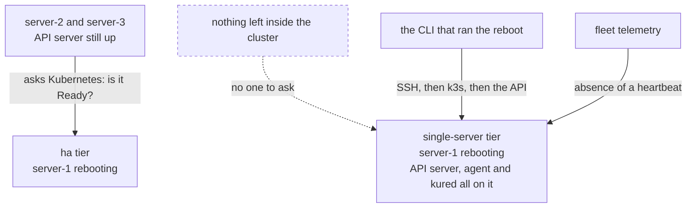

import { Callout } from 'nextra/components'

# OS patching and reboots


Kubernetes upgrades get the attention. **Unpatched hosts are what actually gets people owned.**

An unpatched kernel is not a Kubernetes problem, which is exactly why it gets left. It sits below
everything the cluster tooling looks at, it has no dashboard, and nothing fails until something
does. It is squarely inside what you are paying for.

## What gets patched

Ubuntu security updates are applied automatically on every node via `unattended-upgrades`, under
a policy the installer writes rather than one the machine image happened to have.

**Security updates only.** Feature and version updates are not applied automatically — an
unexpected package upgrade on a node running production workloads is its own kind of dread, and it
is not one we are asked to solve.

**The platform's own packages are held.** k3s and the container runtime are pinned by the bundle,
and an APT upgrade that moved either of them would make the manifest's central claim false: the
recorded version would no longer be the running version, and the next upgrade would be planned
against a cluster that is not the one you have. Nothing outside the bundle changes what the bundle
pins.

**Reboots are never APT's decision.** `unattended-upgrades` is configured not to reboot, because
the reboot coordinator below owns that entirely.

Writing the policy rather than inheriting one is the difference between a patching behaviour we
chose, versioned and can vary per release, and whatever a given machine image does. Two customers
on two images would otherwise get two answers, and neither would be ours.

Because the operating system is locked to Ubuntu LTS, this is a single, deterministic policy
rather than a per-distribution matrix. That is one of the things locking the OS buys. The lock
itself is real and enforced: pre-flight refuses to install on anything outside the bundle's
supported OS list.

## Patches that need a reboot

Many security patches apply without interruption. Kernel patches do not — they need a reboot, and
a reboot means the node's workloads move.

So the two halves are separated:

1. **Patches are applied immediately**, as they are published.
2. **Reboots are held** until a coordinator decides it is safe, and are then taken one node at a
   time.

A node that has applied a patch requiring a reboot reports as **pending reboot** and keeps running
normally until its turn.

The hold is a file. Ubuntu marks a node that needs a reboot at `/var/run/reboot-required`, and
`kured` is configured to ignore it and watch `/var/run/kubenest-reboot-approved` instead — a
sentinel only the platform creates, and only once the checks below have passed. So a patch never
reboots a node on the package manager's say-so. The decision is the platform's, and holding it is
the default state rather than something the policy has to remember to do.

**That redirection is shipped.** kured is installed pointing at the KubeNest sentinel, not
Ubuntu's, on every cluster today.

**If your hosts have kernel livepatching, it is respected.** A node whose kernel was patched live
and therefore no longer needs a reboot does not get rebooted for that patch: the reboot decision
reads the node's actual patch state, not merely whether some file exists. We do not sell, require
or configure livepatching — enrolling your hosts would mean a commercial subscription and a
credential in the install flow, and that is your relationship to have, not ours to broker. But
where you already have it, the platform must not undo the benefit by rebooting anyway.

## How reboots are coordinated

`kured` handles this — the standard tool for the job, adopted rather than rebuilt. It is part of
core, installed at the bundle's pin (`kured` 6.1.0) as stage 9 of the install, and the install
genuinely fails if it does not come up: acceptance check 2 of 5 waits on kured's DaemonSet by
name, rather than on the namespace it shares with CoreDNS.

For each node that needs one, in turn:

| | Step |
|---|---|
| 1 | Check the reboot window is open |
| 2 | Check no other node is currently rebooting — a cluster-wide lock, one holder at a time |
| 3 | Check the cluster can lose this node: quorum holds, no unsatisfiable disruption budget |
| 4 | Cordon and drain, within `limits.timeouts.node-drain` |
| 5 | Reboot |
| 6 | Wait for the node to return Ready, within `limits.timeouts.node-reboot` |
| 7 | Uncordon, and only then consider the next node |

**One node at a time, always.** Quorum is never lost on the `ha` tier, and a stuck node halts the
sequence rather than letting a second node go down behind it.

A node that does not come back inside `node-reboot` (default 20m) leaves the sequence halted with
that node cordoned and drained. No further node is touched. This is the correct outcome: a machine
that did not survive a reboot is a hardware or boot problem, and rebooting a second node while the
first is missing turns one absent node into two.

### Who is watching, and from where

Step 6 has a problem the other steps do not, and it is worth being explicit because the naive
implementation cannot work.

**On the `ha` tier**, `kured` runs in the cluster and the API server stays up throughout, so
"wait for the node to return Ready" means what it says: another node's control plane observes the
rebooting node and reports when it comes back.

**On the `single-server` tier, if the node being rebooted is the control-plane node, there is no
API server to ask.** The observer went down with the observed. Anything waiting inside the cluster
for a `Ready` condition is waiting on a component that does not exist for the duration.

So on that path the wait is external, and belongs to whoever issued the reboot:

| Observer | Waits on | Reports |
|---|---|---|
| The CLI that ran `kubenest node reboot` | SSH reachable, then k3s active, then the node's own API answering | Progress, then Ready or the `node-reboot` deadline |
| Fleet telemetry | The agent's heartbeat resuming | The cluster as **unreachable** while it is down, recovered when the heartbeat returns |

A cluster that misses its configured number of reports goes critical as `CLUSTER_SILENT`, and every
other check it was reporting turns to `unknown` rather than staying green. The cluster showing as
unreachable during an announced reboot is correct and expected, not an incident — and it is the
only signal available once the operator's terminal is closed.



The `ha` tier can ask Kubernetes a question. The `single-server` tier can only be *waited for*,
from outside, by two observers who each see part of the picture.

<Callout type="warning">
**A `single-server` control-plane reboot that never returns is not detectable from inside the
cluster, by construction.** There is no quorum to notice, and the agent that would report is on
the machine that is gone. It surfaces as an absent heartbeat and nothing more. Whatever alerting
sits on that absence is the entire safety net for the tier.
</Callout>

### Reboot windows

```bash filename="terminal"
kubenest cluster set-reboot-window --cluster prod-1 \
  --days sat,sun --start 02:00 --end 06:00 --timezone Asia/Kolkata
```

No node reboots outside its window. A patch applied on Tuesday waits until Saturday, reporting as
pending reboot for the whole interval — visible, not forgotten.

## The single-server caveat

**On a `single-server` cluster, rebooting the control-plane node is a full control-plane outage,
and it will not happen automatically.**

While that node is down: your workloads on other nodes keep running, because the kubelet does not
need the API server. But nothing schedules, nothing self-heals, no deploy succeeds, and a pod that
dies is not replaced. If the control-plane node also runs workloads, those stop until it returns.

KubeNest does not taint the control-plane node or otherwise reserve it for system components, so
application workloads can land there by default. Unless you have constrained scheduling and
verified placement, plan for some workloads to stop during this reboot. On a one-node cluster,
every workload is on that node and the reboot is a full application outage.

That is an announced, deliberate action, not something a daemon does at 3am. So the node reports
pending reboot and **waits for an explicit decision**:

```bash filename="terminal"
kubenest node reboot --cluster prod-1 --node server-1 --confirm
```

Agent nodes on a single-server cluster reboot automatically within the window as normal. It is
only the last healthy control-plane node that requires a human.

<Callout type="warning">
This is a real, recurring operational task that the `single-server` tier hands you and the `ha`
tier does not. On the `ha` tier, control-plane nodes reboot automatically one at a time while
quorum holds and the API stays up. Worth weighing when choosing a tier — see
[HA tiers](/ha).
</Callout>

## Seeing patch state

Every node reports through fleet telemetry:

- Which security patches are applied
- Which nodes are pending reboot, and for how long
- When each node last rebooted
- Whether any node has fallen behind

This is in core, not a profile. Not knowing which of your hosts is unpatched is precisely the
situation the product is sold to prevent.

Patch state is one of the health groups the fleet report is built from, alongside the ones for
backup, nodes and the control plane. When it is populated, it distinguishes three cases:
security updates available and unapplied, nodes applied but awaiting a reboot, and hosts current.

**A pending reboot warns after seven days and goes critical after fourteen** — the same
warning-then-critical shape the bundle already uses for expiring certificates, and both numbers
live in the manifest so a release can retune them without shipping a backend. Seven days is a
missed window; fourteen is a pattern.

**A reboot required by a critical kernel vulnerability does not wait for that clock.** It
escalates when it arrives and is scheduled for the next window rather than the one after the
threshold expires. A routine library update and an unauthenticated kernel RCE are not the same
event, and an alert that cannot tell you which one you have is not doing the job.

Alerting immediately on any pending reboot was the alternative, and it is the wrong one: a stock
Ubuntu image accrues pending reboots as a matter of routine, and an alerting system that cries
wolf gets muted — which is the same end state as having none.

