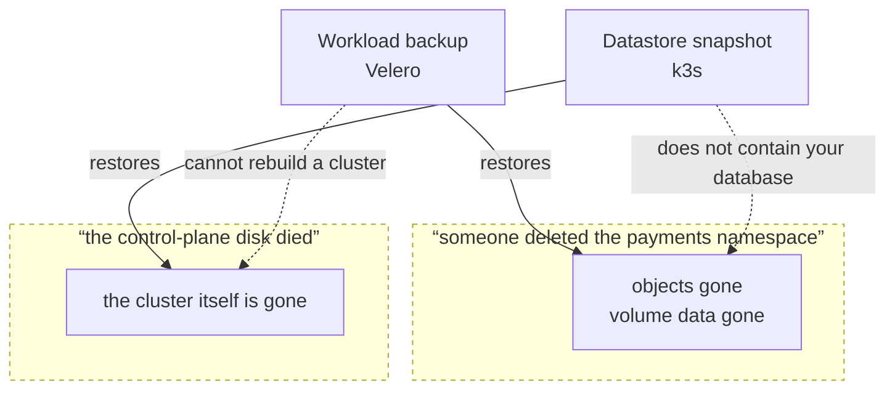

import { Callout, Steps } from 'nextra/components'

# Backup and restore

<BuildStatus path="/platform/backup-restore" />

**A backup that has never been restored is not a backup.** It is a file, and an assumption.

Everyone ships backup. Almost nobody ships evidence that restore works. The scheduled restore
drill on this page is the part that matters — a cluster that says *last restore drill: passed, 3
days ago* is telling you something a backup schedule never can.

## Two separate things

They are backed up differently, restored differently, and needed in different disasters. Confusing
them is how people discover they only had half a backup.

| | **Workload backup** | **Datastore snapshot** |
|---|---|---|
| What it holds | Kubernetes objects and persistent volume data | The cluster's own state — every workload definition, secret, and config |
| Tool | Velero | k3s etcd snapshot |
| Answers | "The `payments` namespace was deleted" | "The control-plane node's disk died" |
| Schedule | Configurable, default daily | Configurable, default more frequent |
| Target | Your S3-compatible bucket | Your S3-compatible bucket |

You need both. A workload backup does not rebuild a cluster. A datastore snapshot does not contain
your database.



The dotted edges are the half-backup people discover during the disaster: each tool is useless for
the other's failure, and neither is a superset of the other.

<Callout type="warning">
**The single-server datastore is the one people forget.** A single-server cluster keeps its entire
state in a single-node embedded etcd on the control-plane node. If that disk dies and there is no
snapshot, **every workload definition in the cluster is gone** — not the running containers'
data, the definitions themselves. There is nothing to restore from and nothing to rebuild from
except your Git repository and your memory.

This is why datastore snapshots are in core and not optional, and why the
[HA tiers page](/platform/ha) treats snapshots as the thing that makes the single-server tier
honest rather than negligent.
</Callout>

## Configuring a target

Both use S3-compatible object storage that you supply and control.

```bash filename="terminal"
kubenest backup set-target --cluster prod-1 \
  --endpoint s3.ap-south-1.amazonaws.com \
  --bucket kubenest-backups-prod-1 \
  --region ap-south-1
```

Configuring a target at install is optional. Until you do, Velero is installed but unconfigured,
and the cluster reports `backup: unconfigured` in **every** telemetry heartbeat, showing as a
warning against the cluster in the console until it is resolved. An unconfigured backup is loud,
not silent.

<Callout type="warning">
**If you use the `secrets` profile, your sealing key is in the backup set.** It has to be: lose
the sealed-secrets sealing key and every `SealedSecret` in your Git repository becomes permanently
undecryptable, with no recovery path at all.

That makes your backup bucket as sensitive as the secrets themselves. Treat its access policy
accordingly.
</Callout>

## The restore drill

This is the centre of the page.

On a schedule, and without anyone asking, the cluster:

1. Takes the most recent backup
2. Restores it into a scratch namespace
3. Asserts the restored objects match what was backed up
4. Asserts the restored **volume data** matches
5. Tears the scratch namespace down
6. Records pass or fail, with a timestamp

The result goes into fleet telemetry and is visible against the cluster. **A failed drill is an
alert, not a log line.** It is also a gate: the [upgrade](/platform/upgrades) pre-flight refuses to
run when the last drill did not pass, because rollback depends on restore working.

The whole drill runs inside `limits.timeouts.restore-drill` (default 2h). Exceeding it is recorded
as a **failure with reason `timeout`**, distinct from a restore that completed and mismatched —
the first says the pipeline is too slow or wedged, the second says the data came back wrong, and
they need different responses.

<Callout type="warning">
**Step 5 runs even when steps 3 or 4 fail.** A drill that leaves its scratch namespace behind on
failure will, on a nightly schedule, fill the cluster with the debris of every failed drill —
and the most likely reason a drill fails is that the cluster is already short of resources.

The teardown is unconditional, and what the failure preserves is the *result record* naming the
stage, the objects, and the mismatch. Evidence lives in the record, not in abandoned state.
</Callout>

### Reading a drill result

```
Restore drill — prod-1
  Status      PASSED
  Ran         2026-08-13 02:14 IST
  Backup      daily-20260813-0200 (4.2 GiB)
  Objects     318 restored, 318 matched
  Volumes     3 restored, 3 matched
  Duration    4m 11s
```

The two lines to read are **Objects** and **Volumes**. Restored and matched should be equal. A
restore that completes with fewer matched than restored is a *failure*, even though nothing
errored — it means the data came back different, which is exactly the outcome a drill exists to
catch.

**Duration** is worth watching over time. A drill that is slowly getting longer is telling you
your restore time is growing, and restore time is what the single-server tier's promise is made
of.

### When a drill fails

A failed drill means **you currently have no proven backup.** Treat it as an incident, not a
warning to look at next week.

<Steps>

### Read which stage failed

The result names it: backup unreadable, restore errored, objects mismatched, or volume data
mismatched. These have different causes and different fixes.

**Backup unreadable** — usually the target. Credentials rotated, bucket policy changed, bucket
deleted, or the endpoint is unreachable from the cluster.

**Restore errored** — the backup exists but will not apply. Often a CRD present when the backup
was taken and absent now, or the reverse.

**Objects mismatched** — the restore completed but produced different objects. The report names
which.

**Volume data mismatched** — the most serious. Object storage has the volume but its contents do
not match. Suspect the volume snapshot path rather than Velero itself.

### Re-run it by hand

```bash filename="terminal"
kubenest backup drill --cluster prod-1 --verbose
```

A drill that passes on a manual re-run points at something transient — a network blip to the
bucket, or contention with another operation. Still worth understanding; not an emergency.

### Take a fresh backup and drill that

```bash filename="terminal"
kubenest backup now --cluster prod-1
kubenest backup drill --cluster prod-1 --latest
```

If a fresh backup drills clean, the problem was that specific backup. If it fails too, the problem
is the pipeline, and you have no working backup right now.

### Do not upgrade until it passes

The upgrade pre-flight already blocks this, but it is worth stating: with no proven restore, an
upgrade has no way back.

</Steps>

## Restoring for real

### A namespace or a workload

```bash filename="terminal"
kubenest backup restore --cluster prod-1 \
  --from daily-20260813-0200 \
  --namespace payments
```

Restores into the live cluster. It reports what it will change before doing it.

### A whole cluster, from a datastore snapshot

The disaster case: the control-plane node is gone. You are rebuilding the cluster itself.

<Steps>

### Install the platform on replacement hardware

Same bundle version, same profile set, same HA tier as the cluster you are replacing. All three
are on the cluster record, so you do not have to remember them.

### Restore the datastore snapshot

```bash filename="terminal"
kubenest platform restore --cluster prod-1 \
  --snapshot datastore-20260813-0400
```

The cluster comes back with every workload definition, secret and config it had at snapshot time.

### Restore volume data

Datastore snapshots do not contain your persistent volumes. Restore the most recent workload
backup on top.

### Verify

Run the [install verification checks](/platform/install#verifying-the-install), then confirm your
own applications.

</Steps>
