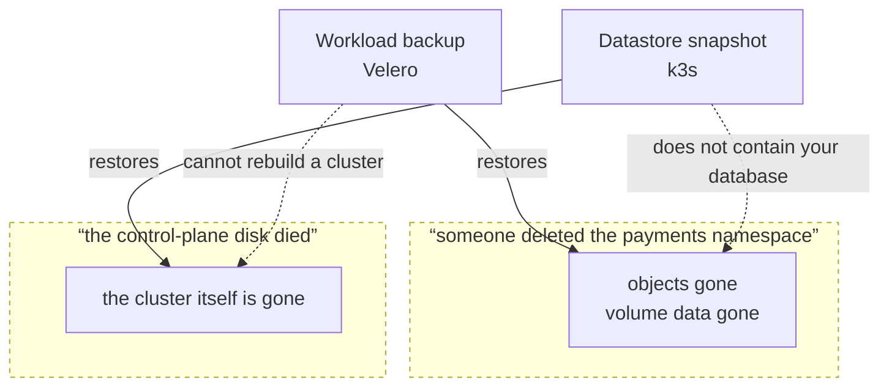

import { Callout, Steps } from 'nextra/components'

# Backup and restore

<BuildStatus path="/platform/backup-restore" />

**A backup that has never been restored is not a backup.** It is a file, and an assumption.

Everyone ships backup. Almost nobody ships evidence that restore works. The scheduled restore
drill on this page is the part that matters — a cluster that says *last restore drill: passed, 3
days ago* is telling you something a backup schedule never can.

## Two separate things

They are backed up differently, restored differently, and needed in different disasters. Confusing
them is how people discover they only had half a backup.

| | **Workload backup** | **Datastore snapshot** |
|---|---|---|
| What it holds | Kubernetes objects and persistent volume data | The cluster's own state — every workload definition, secret, and config |
| Tool | Velero | k3s etcd snapshot |
| Answers | "The `payments` namespace was deleted" | "The control-plane node's disk died" |
| Schedule | Daily, 14 kept | Hourly, 24 kept |
| Target | Your S3-compatible bucket | Your S3-compatible bucket |

You need both. A workload backup does not rebuild a cluster. A datastore snapshot does not contain
your database.



The dotted edges are the half-backup people discover during the disaster: each tool is useless for
the other's failure, and neither is a superset of the other.

<Callout type="warning">
**The single-server datastore is the one people forget.** A single-server cluster keeps its entire
state in a single-node embedded etcd on the control-plane node. If that disk dies and there is no
snapshot, **every workload definition in the cluster is gone** — not the running containers'
data, the definitions themselves. There is nothing to restore from and nothing to rebuild from
except your Git repository and your memory.

This is why datastore snapshots are in core and not optional, and why the
[HA tiers page](/platform/ha) treats snapshots as the thing that makes the single-server tier
honest rather than negligent.
</Callout>

## Configuring a target

Both use S3-compatible object storage that you supply and control.

Credentials come from the environment — `KUBENEST_BACKUP_ACCESS_KEY_ID` and
`KUBENEST_BACKUP_SECRET_ACCESS_KEY`, falling back to the `AWS_` pair — and never from a flag, so
they cannot land in shell history or in an install transcript pasted into a support ticket.

```bash filename="terminal"
KUBENEST_BACKUP_ACCESS_KEY_ID=… KUBENEST_BACKUP_SECRET_ACCESS_KEY=… \
kubenest backup set-target --cluster prod-1 \
  --endpoint s3.ap-south-1.amazonaws.com \
  --bucket kubenest-backups-prod-1 \
  --region ap-south-1 \
  --server 10.0.1.10 --ssh-user ubuntu \
  --bundle-manifest bundles/platform-1.0.yaml
```

For the three-server tier, repeat `--server` for all three control-plane nodes. `set-target`
restarts only servers whose k3s configuration changed, one at a time, waits for each to return
Ready, and refuses success until an on-demand datastore snapshot has reached S3.

Until the cluster record resolves a cluster name to an address, every `kubenest backup` command
also takes `--server` and `--bundle-manifest`: schedules, retention and deadlines come from the
bundle manifest, never from defaults inside the binary.

**The target is proven twice, not assumed.** `set-target` waits until Velero has reached the bucket
with those credentials and marked the storage location `Available`, writes the daily workload
schedule, configures hourly embedded-etcd snapshots with 24 retained, and uploads a proof datastore
snapshot. A target that does not work fails here, rather than the first time you need it.

k3s reads the rotating target credentials from a Kubernetes Secret for normal snapshots. Only the
non-secret schedule and Secret reference are written to its config directory. This matters during
a disaster restore: the API server is unavailable then, so the restore command supplies the same
target through a temporary root-only file and removes it before k3s starts normally.

One target does not mean one object-store directory. KubeNest treats `--prefix` as the cluster
root and writes workload backups under `<prefix>/workload/` and datastore snapshots under
`<prefix>/datastore/`. They share the bucket, endpoint and credentials, but Velero never sees k3s
snapshot objects inside its repository root. Without that separation Velero correctly rejects the
location as containing an unknown top-level directory.

You can supply the same target during the install itself, with `kubenest platform install
--backup-target s3://<bucket>/<prefix>?endpoint=<host>&region=<region>`.

Configuring a target at install is optional. Until you do, Velero is installed but unconfigured.

The cluster reports the newest terminal backup and the exact persisted restore-drill result in
fleet telemetry. The console distinguishes a drill that has never run, one that failed, and a
previous pass that has become stale; failure is an alert, while an unconfigured target remains a
visible warning rather than blocking the rest of the install.

One part of that is not yet watched. The operator cannot read etcd membership or snapshot times
from inside a pod, so the datastore group of the health report carries a collection error and the
bundle manifest's three-hour snapshot-age threshold is fed by nothing. It shows as unknown rather
than green — the report does not claim a snapshot it cannot see — but a single-server cluster whose
hourly snapshots quietly stopped would not raise an alert. Until that lands, check the bucket.

Daily workload backups include customer namespaces and the restore-proof namespace. They exclude
the platform control namespaces (`velero`, `kubenest-system`, `kube-system`, `kube-public` and
`kube-node-lease`): backing up a backup controller's own transient jobs does not protect customer
data and can make an otherwise sound backup terminally partial.

<Callout type="warning">
**If you use the `secrets` profile, your sealing key is in the backup set.** It has to be: lose
the sealed-secrets sealing key and every `SealedSecret` in your Git repository becomes permanently
undecryptable, with no recovery path at all.

That makes your backup bucket as sensitive as the secrets themselves. Treat its access policy
accordingly.
</Callout>

## The restore drill

This is the centre of the page.

Weekly, and without anyone asking, the cluster:

1. Selects the most recent completed Velero backup
2. Requires that backup to contain a completed file-system backup of the platform proof PVC
3. Restores the fully labelled proof set into a uniquely named scratch namespace
4. Compares all three proof objects and reads the restored PVC file byte-for-byte
5. Requires every PodVolumeRestore for that set to be `Completed`
6. Tears the Restore and scratch namespace down
7. Records pass or fail, with the exact backup name, timestamp and end-to-end duration

The proof set is a real long-running Pod, ConfigMap and dynamically provisioned PVC. It is kept in
`kubenest-restore-drill-source` so every normal backup exercises the same node-agent/Kopia path as
customer PVCs. The restored Pod cannot seed its scratch PVC: outside the source namespace it only
reads, and its readiness probe fails unless the bytes already restored from object storage equal
the independently restored ConfigMap value. This is deliberately a data assertion, not a check
that PVC metadata exists.

### What a drill covers

The proof set proves the mechanism. **It does not prove your data**, and a drill that only ever
restores the same synthetic Pod is answering an easier question than the one you are paying it to
answer.

So the weekly drill also restores a **rotating sample of your own volumes**, and the result names
exactly which ones it verified. Coverage accumulates: a different slice each week rather than the
same proof every week, so over a month the drill has restored real data from most of the cluster
instead of proving the same thing four times. A full-cluster drill — every volume, on demand — is
a command to run before a migration or a risky upgrade, not a weekly default.

Every volume, every week, was the alternative. On a cluster with terabytes of PVCs it stops being
weekly and becomes continuous, and the most likely reason a drill fails is that the cluster is
already short of resources — which restoring everything every week makes considerably more likely.

Whichever it verified, **the result says so**. "The restore path works" and "your `invoices`
namespace restored on the 14th, 41 GiB, byte-verified" are different claims, and a drill result
that does not distinguish them lets the weaker one be read as the stronger.

The result goes into fleet telemetry and is visible against the cluster. **A failed drill is an
alert, not a log line.** It is also a gate: the [upgrade](/platform/upgrades) pre-flight refuses to
run when the last drill did not pass, because rollback depends on restore working.

<Callout type="info">
**This path is exercised against real storage — the proof set only, so far.** The rotating sample
of customer volumes described above is decided and not yet built; today's drill restores the
platform proof set and nothing else. The Platform 1.0 release gate created a Velero file-system
backup, restored the proof objects and PVC bytes in 33 seconds, then replaced the
backup's load-bearing `.tar.gz` archive with corrupt bytes. The next drill failed in 39 seconds as
`backup-unreadable` / `BACKUP_CONTENT_UNREADABLE`; it did not trust the still-`Completed` Backup
object, wait out a generic timeout, or leave its scratch namespace behind.
</Callout>

The whole drill runs inside `limits.timeouts.restore-drill` (default 2h). Exceeding it is recorded
as a **failure with reason `timeout`**, distinct from a restore that completed and mismatched —
the first says the pipeline is too slow or wedged, the second says the data came back wrong, and
they need different responses.

<Callout type="warning">
**Step 6 runs even when steps 4 or 5 fail.** A drill that leaves its scratch namespace behind on
failure will, on a weekly schedule, accumulate the debris of every failed drill —
and the most likely reason a drill fails is that the cluster is already short of resources.

The teardown is unconditional, and what the failure preserves is the *result record* naming the
stage, reason code, verification counts and user-safe detail. Evidence lives in the record, not in
abandoned state.
</Callout>

### Reading a drill result

```
Restore drill — prod-1
  Status      PASSED
  Ran         2026-08-13 02:14 IST
  Backup      daily-20260813-0200
  Objects     3 restored, 3 matched
  PVC data    1 restored, 1 matched
  Duration    4m 11s
```

The two lines to read are **Objects** and **PVC data**. Restored and matched should be equal. A
restore that completes with fewer matched than restored is a *failure*, even though nothing
errored — it means the data came back different, which is exactly the outcome a drill exists to
catch.

**Duration** is worth watching over time. A drill that is slowly getting longer is telling you
your restore time is growing, and restore time is what the single-server tier's promise is made
of.

### When a drill fails

A failed drill means **you currently have no proven backup.** Treat it as an incident, not a
warning to look at next week.

<Steps>

### Read which stage failed

The result names it: backup unreadable, restore errored, objects mismatched, or volume data
mismatched. These have different causes and different fixes.

**Backup unreadable** — the selected backup cannot be read. Credentials may have rotated, the
bucket policy or endpoint may have changed, or the archive itself may be missing or corrupt. A
green Velero Backup object does not overrule this result: its status describes the earlier write,
while the drill proves the bytes can still be read now.

**Restore errored** — the backup exists but will not apply. Often a CRD present when the backup
was taken and absent now, or the reverse.

**Objects mismatched** — the restore completed but one of the proof Pod, ConfigMap or PVC differed
or did not return. The result records how many restored and matched; operator logs carry the
underlying object for diagnosis.

**Volume data mismatched** — the most serious. Object storage has the volume but its contents do
not match. Suspect the node-agent/Kopia data path rather than PVC metadata or the API restore.

### Re-run it by hand

```bash filename="terminal"
kubenest backup drill --cluster prod-1 \
  --server 10.0.1.10 --ssh-user ubuntu \
  --bundle-manifest bundles/platform-1.0.yaml
```

A drill that passes on a manual re-run points at something transient — a network blip to the
bucket, or contention with another operation. Still worth understanding; not an emergency.

### Take a fresh backup and drill that

```bash filename="terminal"
kubenest backup now --cluster prod-1 \
  --server 10.0.1.10 --ssh-user ubuntu \
  --bundle-manifest bundles/platform-1.0.yaml
kubenest backup drill --cluster prod-1 \
  --server 10.0.1.10 --ssh-user ubuntu \
  --bundle-manifest bundles/platform-1.0.yaml
```

If a fresh backup drills clean, the problem was that specific backup. If it fails too, the problem
is the pipeline, and you have no working backup right now.

### Do not upgrade until it passes

The upgrade pre-flight already blocks this, but it is worth stating: with no proven restore, an
upgrade has no way back.

</Steps>

## Restoring for real

### A namespace or a workload

```bash filename="terminal"
kubenest backup restore --cluster prod-1 \
  --from daily-20260813-0200 \
  --namespace payments
```

Restores into the live cluster. It reports what it will change before doing it.

<Callout type="warning">
The workload-restore command is still a guarded CLI stub. Use Velero directly for a live workload
restore until that command lands; the scheduled drill and the datastore disaster restore below are
implemented independently and do not pretend this surface is ready.
</Callout>

### A whole cluster, from a datastore snapshot

The disaster case: the control-plane node is gone. You are rebuilding the cluster itself.

<Steps>

### Identify the exact S3 snapshot

Use the bucket inventory or, while a server is still available, `sudo k3s etcd-snapshot list`.
The S3 target is already enabled in the k3s configuration written by `set-target`; repeating
`--s3` here makes k3s reject the command as two forms of the same flag.
Record the exact snapshot name, bundle version, profile set and HA tier before replacing anything.

### Install the platform on replacement hardware

Same bundle version, same profile set, same HA tier as the cluster you are replacing. All three
are on the cluster record, so you do not have to remember them.

### Restore the datastore snapshot

```bash filename="terminal"
KUBENEST_BACKUP_ACCESS_KEY_ID=… KUBENEST_BACKUP_SECRET_ACCESS_KEY=… \
kubenest platform restore --cluster prod-1 --confirm \
  --snapshot on-demand-prod-1-1787299200 \
  --endpoint s3.ap-south-1.amazonaws.com \
  --bucket kubenest-backups-prod-1 \
  --region ap-south-1 \
  --server 10.0.1.10 --ssh-user ubuntu \
  --bundle-manifest bundles/platform-1.0.yaml
```

Repeat `--server` for every control-plane server in the three-server tier, with the server to
restore first. The command stops them all, runs k3s cluster-reset against the S3 snapshot on the
first, removes the temporary credential file, and waits for it to become Ready. Each peer's stale
database is moved to
`/var/lib/rancher/k3s/server/db.kubenest-before-restore-<timestamp>` before that peer starts and
rejoins; it is preserved for recovery until you finish the verification step.

If cluster-reset fails, k3s stays stopped. Do not repeatedly start and reset it. Read the command's
named failing step, correct the target or snapshot, and rerun the same command. Credentials never
appear in flags or the remote process command: they travel on SSH stdin and live only in the
root-readable temporary drop-in.

The cluster comes back with every workload definition, secret and config it had at snapshot time.

The Platform 1.0 release gate ran this exact flow against external S3: it saved a sentinel in
embedded etcd, deleted the node-local copy, confirmed only the `s3://` inventory entry remained,
changed the live value, stopped k3s, downloaded the named snapshot, and recovered the pre-change
value in 17 seconds. That is the tested disaster path; checking that a snapshot object merely
exists is not accepted as restore evidence.

### Restore volume data

Datastore snapshots do not contain your persistent volumes. Restore the most recent workload
backup on top.

### Verify

Run the [install verification checks](/platform/install#verifying-the-install), confirm all etcd
members and your own applications, then remove the preserved peer database directories only after
you are satisfied the restored quorum is durable.

</Steps>
