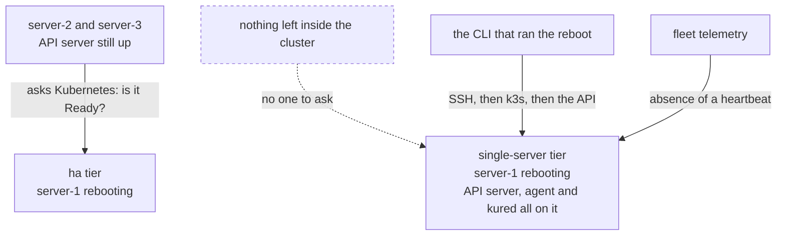

import { Callout } from 'nextra/components'

# OS patching and reboots

<BuildStatus path="/platform/os-patching" />

Kubernetes upgrades get the attention. **Unpatched hosts are what actually gets people owned.**

An unpatched kernel is not a Kubernetes problem, which is exactly why it gets left. It sits below
everything the cluster tooling looks at, it has no dashboard, and nothing fails until something
does. It is squarely inside what you are paying for.

## What gets patched

Ubuntu security updates are applied automatically on every node via `unattended-upgrades`.

**Security updates only.** Feature and version updates are not applied automatically — an
unexpected package upgrade on a node running production workloads is its own kind of dread, and it
is not one we are asked to solve.

Because the operating system is locked to Ubuntu LTS, this is a single, deterministic policy
rather than a per-distribution matrix. That is one of the things locking the OS buys. The lock
itself is real and enforced: pre-flight refuses to install on anything outside the bundle's
supported OS list.

<Callout type="warning">
**KubeNest does not configure `unattended-upgrades` today — it inherits Ubuntu's.** The install
writes no APT policy, so what you get is whatever the machine image already does. On a stock
Ubuntu 24.04 cloud image that is unattended security upgrades enabled by default, which is close
to the policy above but is not one we set, version in the bundle manifest, or can vary per
cluster. Which origins are included, which packages are held, and what happens when a patch fails
to apply are all the image's answers, not ours.
</Callout>

## Patches that need a reboot

Many security patches apply without interruption. Kernel patches do not — they need a reboot, and
a reboot means the node's workloads move.

So the two halves are separated:

1. **Patches are applied immediately**, as they are published.
2. **Reboots are held** until a coordinator decides it is safe, and are then taken one node at a
   time.

A node that has applied a patch requiring a reboot reports as **pending reboot** and keeps running
normally until its turn.

The hold is a file. Ubuntu marks a node that needs a reboot at `/var/run/reboot-required`, and
`kured` is configured to ignore it and watch `/var/run/kubenest-reboot-approved` instead — a
sentinel only the platform creates, and only once the checks below have passed. So a patch never
reboots a node on the package manager's say-so. The decision is the platform's, and holding it is
the default state rather than something the policy has to remember to do.

**That redirection is shipped.** kured is installed pointing at the KubeNest sentinel, not
Ubuntu's, on every cluster today.

<Callout type="warning">
**Nothing creates the sentinel yet, so the hold is currently permanent.** No node has ever been
rebooted by the platform, on any tier. Everything from here to [reboot
windows](#reboot-windows) describes the policy that will decide when the file appears; the
component that acts on it is in place and waiting.

This is the safe end to be unfinished at. The default is "never reboot", not "reboot on the
package manager's say-so" — which is what a stock kured watching Ubuntu's own sentinel would have
done, including to the only control-plane node of a `single-server` cluster. Until the policy
lands, kernel patches accumulate unapplied on every node: they are installed, but the kernel in
memory is the old one until someone reboots the machine themselves.
</Callout>

## How reboots are coordinated

`kured` handles this — the standard tool for the job, adopted rather than rebuilt. It is part of
core, installed at the bundle's pin (`kured` 6.1.0) as stage 9 of the install, and the install
genuinely fails if it does not come up: acceptance check 2 of 5 waits on kured's DaemonSet by
name, rather than on the namespace it shares with CoreDNS.

For each node that needs one, in turn:

| | Step | Built |
|---|---|---|
| 1 | Check the reboot window is open | **No.** kured is installed with the sentinel path set and nothing else, so it has no window to check |
| 2 | Check no other node is currently rebooting | Yes — kured's own cluster-wide lock, one holder at a time |
| 3 | Check the cluster can lose this node — quorum holds, no unsatisfiable disruption budget | Partly. The drain in step 4 respects disruption budgets. Nothing checks etcd quorum |
| 4 | Cordon and drain, within `limits.timeouts.node-drain` | Yes — kured |
| 5 | Reboot | Yes — kured |
| 6 | Wait for the node to return Ready, within `limits.timeouts.node-reboot` | Yes — kured, with the caveat below |
| 7 | Uncordon, and only then consider the next node | Yes — kured |

**One node at a time, always.** That much is kured's own default and needs nothing from us:
quorum is never lost on the `ha` tier, and a stuck node halts the sequence rather than letting a
second node go down behind it.

The steps marked unbuilt are the platform's half, not kured's. They are the reason the sentinel is
never written today — placing a component that reboots nodes was worth doing early; letting it
reboot them before the policy exists was not.

A node that does not come back inside `node-reboot` (default 20m) leaves the sequence halted with
that node cordoned and drained. No further node is touched. This is the correct outcome: a machine
that did not survive a reboot is a hardware or boot problem, and rebooting a second node while the
first is missing turns one absent node into two.

### Who is watching, and from where

Step 6 has a problem the other steps do not, and it is worth being explicit because the naive
implementation cannot work.

**On the `ha` tier**, `kured` runs in the cluster and the API server stays up throughout, so
"wait for the node to return Ready" means what it says: another node's control plane observes the
rebooting node and reports when it comes back.

**On the `single-server` tier, if the node being rebooted is the control-plane node, there is no
API server to ask.** The observer went down with the observed. Anything waiting inside the cluster
for a `Ready` condition is waiting on a component that does not exist for the duration.

So on that path the wait is external, and belongs to whoever issued the reboot:

| Observer | Waits on | Reports | Built |
|---|---|---|---|
| The CLI that ran `kubenest node reboot` | SSH reachable, then k3s active, then the node's own API answering | Progress, then Ready or the `node-reboot` deadline | **No.** `kubenest node reboot` is not a command |
| Fleet telemetry | The agent's heartbeat resuming | The cluster as **unreachable** while it is down, and recovered when the heartbeat returns | Yes. A cluster that misses its configured number of reports goes critical as `CLUSTER_SILENT`, and every other check it was reporting turns to `unknown` rather than staying green |

The second observer is real and behaves as described. The cluster showing as unreachable during an
announced reboot is correct and expected, not an incident — and it is the only signal available if
the operator's terminal is closed.

<Callout type="warning">
**Telemetry cannot yet tell a planned reboot from a dead machine.** The design calls for the
reboot to be recorded against the cluster before the node goes down, so the silence that follows
reads as expected. Nothing records it, and fleet health has no concept of a planned outage: a
`single-server` control-plane reboot would raise the same critical alert as a machine that never
came back. Announce it by hand until the reboot policy ships.
</Callout>



The `ha` tier can ask Kubernetes a question. The `single-server` tier can only be *waited for*,
from outside, by two observers who each see part of the picture.

<Callout type="warning">
**A `single-server` control-plane reboot that never returns is not detectable from inside the
cluster, by construction.** There is no quorum to notice, and the agent that would report is on
the machine that is gone. It surfaces as an absent heartbeat and nothing more. Whatever alerting
sits on that absence is the entire safety net for the tier.
</Callout>

### Reboot windows

```bash filename="terminal"
kubenest cluster set-reboot-window --cluster prod-1 \
  --days sat,sun --start 02:00 --end 06:00 --timezone Asia/Kolkata
```

No node reboots outside its window. A patch applied on Tuesday waits until Saturday, reporting as
pending reboot for the whole interval — visible, not forgotten.

<Callout type="warning">
**`kubenest cluster set-reboot-window` is not a command, and no window exists to store it in.**
kured is installed with one setting — the sentinel path — and no window flags, so it would reboot
whenever the sentinel appeared. Nothing creates the sentinel, which is why that is not currently a
hazard.

The same gap sits on the upgrade side: `kubenest cluster set-window` exists but writes to a
control-plane route that does not exist, and the upgrade never reads a window back, so its
pre-flight window gate passes every cluster as unconfigured. Both halves of this window are the
same missing piece, and land together — see [upgrades](/platform/upgrades).
</Callout>

<Callout type="info">
**Reboot windows and upgrade maintenance windows are configured separately but should usually
match.** Both take the cluster through drain-and-return cycles, and running them concurrently
means two things moving your workloads at once.

The platform will not start a bundle upgrade while a reboot is in progress, or reboot a node
mid-upgrade. **Neither interlock is built.** Nothing pauses kured for the duration of an upgrade
and no pre-flight gate asks whether a reboot is in flight — so once the sentinel starts being
written, a node could be drained by kured and by the upgrade's Kubernetes stage at the same time.
Today the sentinel is never written, which is the only reason the two cannot collide.
</Callout>

## The single-server caveat

**On a `single-server` cluster, rebooting the control-plane node is a full control-plane outage,
and it will not happen automatically.**

While that node is down: your workloads on other nodes keep running, because the kubelet does not
need the API server. But nothing schedules, nothing self-heals, no deploy succeeds, and a pod that
dies is not replaced. If the control-plane node also runs workloads, those stop until it returns.

That is an announced, deliberate action, not something a daemon does at 3am. So the node reports
pending reboot and **waits for an explicit decision**:

```bash filename="terminal"
kubenest node reboot --cluster prod-1 --node server-1 --confirm
```

Agent nodes on a single-server cluster reboot automatically within the window as normal. It is
only the last healthy control-plane node that requires a human.

<Callout type="warning">
**`kubenest node reboot` is not a command yet, and nothing distinguishes the last control-plane
node from any other.** The safeguard this section describes is not implemented as a rule — it is
currently a consequence of nothing being able to reboot anything. When the reboot policy ships,
this is the single most important thing in it to get right, because the failure mode is an
unattended control-plane outage on a tier that has no second control plane to notice.

Until then, reboot a `single-server` control-plane node the ordinary way: drain it, reboot the
machine yourself, and wait for it to come back before doing anything else to the cluster.
</Callout>

<Callout type="warning">
This is a real, recurring operational task that the `single-server` tier hands you and the `ha`
tier does not. On the `ha` tier, control-plane nodes reboot automatically one at a time while
quorum holds and the API stays up. Worth weighing when choosing a tier — see
[HA tiers](/platform/ha).
</Callout>

## Seeing patch state

Every node reports through fleet telemetry:

- Which security patches are applied
- Which nodes are pending reboot, and for how long
- When each node last rebooted
- Whether any node has fallen behind

This is in core, not a profile. Not knowing which of your hosts is unpatched is precisely the
situation the product is sold to prevent.

Patch state is one of the health groups the fleet report is built from, alongside the ones for
backup, nodes and the control plane. When it is populated, it distinguishes three cases:
security updates available and unapplied, nodes applied but awaiting a reboot, and hosts current.

<Callout type="warning">
**Nothing populates it yet, so every cluster reports its patch state as unknown.** The receiving
half is built — the thresholds, the three verdicts, and the alerting that hangs off them — but the
agent does not collect the group, and a missing group is deliberately reported as `unknown`
naming the bead that will bring it rather than as a fault or a pass. That is the right default:
"we do not know whether your hosts are patched" is a true and useful thing for a console to say,
and it is what you will currently see.
</Callout>
