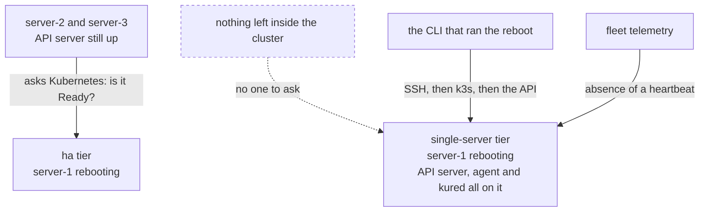

import { Callout } from 'nextra/components'

<Callout type="error">
**DRAFT — SPECIFICATION, NOT SHIPPED SOFTWARE.**

Build specification for `kn-nqj`, written before it exists. Do not rely on it and do not quote it
to a customer.

Promoted to published only when `kn-ze1` has verified it against a real cluster.
Open questions are marked <strong>OQ-PATCH-*</strong> and collected at the
[bottom](#open-design-questions).
</Callout>

# OS patching and reboots

Kubernetes upgrades get the attention. **Unpatched hosts are what actually gets people owned.**

An unpatched kernel is not a Kubernetes problem, which is exactly why it gets left. It sits below
everything the cluster tooling looks at, it has no dashboard, and nothing fails until something
does. It is squarely inside what you are paying for.

## What gets patched

Ubuntu security updates are applied automatically on every node via `unattended-upgrades`.

**Security updates only.** Feature and version updates are not applied automatically — an
unexpected package upgrade on a node running production workloads is its own kind of dread, and it
is not one we are asked to solve.

Because the operating system is locked to Ubuntu LTS, this is a single, deterministic policy
rather than a per-distribution matrix. That is one of the things locking the OS buys.

## Patches that need a reboot

Many security patches apply without interruption. Kernel patches do not — they need a reboot, and
a reboot means the node's workloads move.

So the two halves are separated:

1. **Patches are applied immediately**, as they are published.
2. **Reboots are held** until a coordinator decides it is safe, and are then taken one node at a
   time.

A node that has applied a patch requiring a reboot reports as **pending reboot** and keeps running
normally until its turn.

## How reboots are coordinated

`kured` handles this — the standard tool for the job, adopted rather than rebuilt.

For each node that needs one, in turn:

1. Check the reboot window is open
2. Check no other node is currently rebooting
3. Check the cluster can lose this node — quorum holds, no unsatisfiable disruption budget
4. Cordon and drain, within `limits.timeouts.node-drain`
5. Reboot
6. Wait for the node to return Ready, within `limits.timeouts.node-reboot`
7. Uncordon, and only then consider the next node

**One node at a time, always.** Quorum is never lost on the `ha` tier, and a stuck node halts the
sequence rather than letting a second node go down behind it.

A node that does not come back inside `node-reboot` (default 20m) leaves the sequence halted with
that node cordoned and drained. No further node is touched. This is the correct outcome: a machine
that did not survive a reboot is a hardware or boot problem, and rebooting a second node while the
first is missing turns one absent node into two.

### Who is watching, and from where

Step 6 has a problem the other steps do not, and it is worth being explicit because the naive
implementation cannot work.

**On the `ha` tier**, `kured` runs in the cluster and the API server stays up throughout, so
"wait for the node to return Ready" means what it says: another node's control plane observes the
rebooting node and reports when it comes back.

**On the `single-server` tier, if the node being rebooted is the control-plane node, there is no
API server to ask.** The observer went down with the observed. Anything waiting inside the cluster
for a `Ready` condition is waiting on a component that does not exist for the duration.

So on that path the wait is external, and belongs to whoever issued the reboot:

| Observer | Waits on | Reports |
|---|---|---|
| The CLI that ran `kubenest node reboot` | SSH reachable, then k3s active, then the node's own API answering | Progress, then Ready or the `node-reboot` deadline |
| Fleet telemetry | The agent's heartbeat resuming | The cluster as **unreachable** while it is down, and recovered when the heartbeat returns |

The cluster showing as unreachable during an announced reboot is correct and expected, not an
incident. It is also the only signal available if the operator's terminal is closed — which is why
the reboot is recorded against the cluster before the node goes down, so telemetry can tell a
planned outage from a dead machine.



The `ha` tier can ask Kubernetes a question. The `single-server` tier can only be *waited for*,
from outside, by two observers who each see part of the picture.

<Callout type="warning">
**A `single-server` control-plane reboot that never returns is not detectable from inside the
cluster, by construction.** There is no quorum to notice, and the agent that would report is on
the machine that is gone. It surfaces as an absent heartbeat and nothing more. Whatever alerting
sits on that absence is the entire safety net for the tier.
</Callout>

### Reboot windows

```bash filename="terminal"
kubenest cluster set-reboot-window --cluster crest-client-a \
  --days sat,sun --start 02:00 --end 06:00 --timezone Asia/Kolkata
```

No node reboots outside its window. A patch applied on Tuesday waits until Saturday, reporting as
pending reboot for the whole interval — visible, not forgotten.

<Callout type="info">
**Reboot windows and upgrade maintenance windows are configured separately but should usually
match.** Both take the cluster through drain-and-return cycles, and running them concurrently
means two things moving your workloads at once.

The platform will not start a bundle upgrade while a reboot is in progress, or reboot a node
mid-upgrade.
</Callout>

## The single-server caveat

**On a `single-server` cluster, rebooting the control-plane node is a full control-plane outage,
and it will not happen automatically.**

While that node is down: your workloads on other nodes keep running, because the kubelet does not
need the API server. But nothing schedules, nothing self-heals, no deploy succeeds, and a pod that
dies is not replaced. If the control-plane node also runs workloads, those stop until it returns.

That is an announced, deliberate action, not something a daemon does at 3am. So the node reports
pending reboot and **waits for an explicit decision**:

```bash filename="terminal"
kubenest node reboot --cluster crest-client-a --node server-1 --confirm
```

Agent nodes on a single-server cluster reboot automatically within the window as normal. It is
only the last healthy control-plane node that requires a human.

<Callout type="warning">
This is a real, recurring operational task that the `single-server` tier hands you and the `ha`
tier does not. On the `ha` tier, control-plane nodes reboot automatically one at a time while
quorum holds and the API stays up. Worth weighing when choosing a tier — see
[HA tiers](/platform/ha).
</Callout>

<Callout type="warning">
**OQ-PATCH-1 — how long may a node sit pending reboot before it is an alert?** A node that has
been waiting three weeks for a window has an unpatched kernel and a false sense of safety around
it, and on the single-server tier — where the reboot needs a human — that is the likely default
outcome rather than the exception.

Needs a threshold that escalates, and a stated policy for what happens when a *critical* kernel
CVE lands and the next window is five days away. Recommend: pending-reboot age is reported in
telemetry from day one, escalates to an alert at a stated threshold, and a critical-severity patch
raises the alert immediately rather than waiting.
</Callout>

<Callout type="warning">
**OQ-PATCH-2 — kernel livepatching would remove most of this problem.** Canonical's livepatch
service applies kernel security fixes without rebooting. On the `single-server` tier, where every
control-plane reboot is an outage requiring a human, that is not a small convenience.

It requires Ubuntu Pro, which is a per-machine cost on infrastructure the customer owns, so it
cannot simply be switched on. But it is a genuine answer to the single-server reboot problem and
it should be a documented, supported option rather than something a customer discovers themselves.

Decide: supported and documented, detected-and-respected if the customer already has it, or
explicitly out of scope.
</Callout>

<Callout type="warning">
**OQ-PATCH-3 — the exact `unattended-upgrades` policy is not written.** "Security patches
automatic" needs to become a specific configuration: which origins, whether `-updates` is included
alongside `-security`, whether any package is held back, and what happens when a patch fails to
apply.

Whatever it is, it must be identical on every node of every cluster, and it belongs in the
[bundle manifest](/platform/bundle) so it is versioned and testable rather than a one-time
install-script decision.
</Callout>

## Seeing patch state

Every node reports through fleet telemetry:

- Which security patches are applied
- Which nodes are pending reboot, and for how long
- When each node last rebooted
- Whether any node has fallen behind

This is in core, not a profile. Not knowing which of your hosts is unpatched is precisely the
situation the product is sold to prevent.

## Open design questions

| ID | Question | Blocks |
|---|---|---|
| OQ-PATCH-1 | Pending-reboot alert threshold, and handling of critical CVEs | `kn-nqj`, telemetry alerting |
| OQ-PATCH-2 | Is kernel livepatching supported, respected, or out of scope? | The single-server reboot burden |
| OQ-PATCH-3 | The exact `unattended-upgrades` policy | `kn-nqj`, manifest contents |
