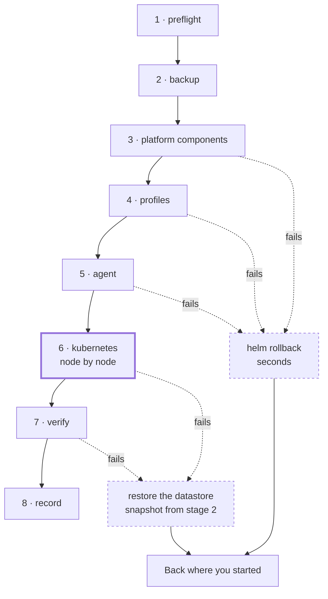

import { Callout, Steps } from 'nextra/components'

<Callout type="error">
**DRAFT — SPECIFICATION, NOT SHIPPED SOFTWARE.**

This page is the build specification for `kn-fuo` (upgrade orchestration), written before it
exists. Commands, gate names, stage names and output describe intended behaviour. Do not run this
against a real cluster and do not quote it to a customer.

Promoted to published only when `kn-ze1` has verified every claim on it against a real cluster,
including a forced mid-upgrade failure and a tested rollback.
Open questions are marked <strong>OQ-UPGRADE-*</strong> and collected at the
[bottom](#open-design-questions).
</Callout>

# Upgrades

Upgrading is one operation: **`Platform N → N+1`, for your cluster's exact recorded profile set.**

Not eight component upgrades you sequence yourself and hope about. One transition, tested against
your profile set before it reached you, with gates in front of it and a way back.

This page is long because this is the operation people are afraid of, and because you should be
able to run it, understand it, and recover from it without talking to us.

## What an upgrade actually changes

The bundle version determines every component version. Moving from Platform N to N+1 may change
any of them, including the Kubernetes version itself. What changes between two specific bundles is
in the [bundle manifest](/platform/bundle), and you can see the diff before you start:

```bash filename="terminal"
kubenest platform diff --from 1.0 --to 1.1
```

Your profile set does not change during an upgrade. Adding or removing a profile is a separate
operation.

## Pre-flight gates

Every gate runs before anything is touched. Any gate that fails stops the upgrade with nothing
changed.

These are not ceremony. Each one exists because skipping it produces a specific, known bad
outcome.

| Gate | Passes when | Why it exists |
|---|---|---|
| **Deprecated API scan** | No running workload uses an API removed in the target Kubernetes version | See [below](#the-deprecated-api-scan). This is the one that matters most |
| **Restore drill** | The most recent verified restore drill passed | Rollback partly depends on restore. An untested restore is not a rollback plan |
| **Backup** | A fresh backup completes immediately before the upgrade starts | The state you may need to return to must be from *now*, not from last night |
| **Node readiness** | Every node reports Ready, and has done for `limits.timeouts.node-ready` | Upgrading onto an already-degraded cluster turns one problem into two. A node that is flapping in and out of Ready fails this gate, which a single sample would miss |
| **Disk headroom** | Every node has at least `limits.resources.upgrade-headroom.disk` free (default 10 GiB) on the filesystem holding `/var/lib/rancher` | Running out of disk mid-upgrade is a hard failure at the worst moment. The new images land beside the old ones, so the requirement is free space, not total size |
| **Pod disruption budgets** | No PDB would block a drain for longer than `limits.timeouts.node-drain` | A PDB that permits zero disruption stalls the upgrade forever, holding the cluster mid-transition. The gate is *"would this drain finish in the window"*, which is answerable in advance, not *"is this PDB reasonable"*, which is not |
| **Maintenance window** | Now is inside the cluster's configured window | See [maintenance windows](#maintenance-windows) |
| **Bundle path** | N+1 is a supported transition from N for this profile set | Untested transitions are not offered |

## The deprecated API scan

This is the gate that separates an upgrade product from a cron job, and it is the one worth
understanding.

Kubernetes removes APIs. When a minor version drops an API group your workloads use, the upgrade
succeeds, the cluster comes up healthy, every platform component reports Ready — **and your
application stops working**, because the manifests it deploys from now reference an API that no
longer exists.

An upgrade that cleanly upgrades the cluster and takes down your product has actively harmed you.
It is worse than no upgrade at all.

So before anything else, KubeNest scans your live workloads for API versions removed or deprecated
in the target Kubernetes version. **If it finds any, the upgrade is blocked** and the report names
the resource, its namespace, the API version it uses, and the version it should move to.

```
BLOCKED: 3 resources use APIs removed in the target version.

  namespace/payments   Ingress api-gateway
      networking.k8s.io/v1beta1  →  networking.k8s.io/v1

  namespace/payments   HorizontalPodAutoscaler worker
      autoscaling/v2beta2        →  autoscaling/v2

  namespace/internal   CronJob nightly-report
      batch/v1beta1              →  batch/v1

Fix these, then re-run. Nothing has been changed.
```

Fixing them is your work, in your manifests — we cannot rewrite your application for you. Once
they are fixed and redeployed, re-run the upgrade.

<Callout type="warning">
**OQ-UPGRADE-1 — the scan must also cover what is in Git, not only what is running.** A workload
that is scaled to zero, a CronJob that has not fired, or a manifest committed but not yet synced
will not appear in a live-cluster scan. It will break on the next deploy after the upgrade, which
is worse — the failure arrives detached from its cause, days later.

Since the GitOps repository is already known to the platform, scanning it is possible. Whether a
Git finding **blocks** or only **warns** is the real question: blocking on an unsynced manifest
could stop an upgrade over a file nobody deploys any more.

Recommend: scan both, block on live findings, warn loudly on Git-only findings.
</Callout>

<Callout type="warning">
**OQ-UPGRADE-2 — what feeds the deprecation list, and can the scan be overridden?**

Two parts. First, adopt rather than rebuild: `pluto` and `kubent` both do this and track the
Kubernetes deprecation guide. Pick one, pin it, and treat its dataset as part of the bundle so the
scan cannot silently go stale.

Second, and harder: is there an override? A blocked upgrade with no escape is untenable if the
scanner false-positives on a CRD it misreads. An override that lets a customer skip the check is
how they take their own product down and then call us — the exact support pattern we cannot
absorb.

Recommend an override that requires naming each resource individually to acknowledge it, rather
than a blanket `--force`. Per-resource acknowledgement is tedious enough to prevent reflexive use
and specific enough to be auditable.
</Callout>

## Maintenance windows

An upgrade never begins outside its cluster's configured window.

```bash filename="terminal"
kubenest cluster set-window --cluster crest-client-a \
  --days sat,sun --start 02:00 --end 06:00 --timezone Asia/Kolkata
```

**The rule when a window closes mid-upgrade: no new stage starts, but the stage in progress
finishes.** Abandoning a half-completed stage to respect a clock leaves the cluster in a worse
state than the overrun does. If the window closes with stages remaining, the upgrade pauses and
resumes at the next window, and the cluster reports that it is mid-upgrade the whole time.

<Callout type="warning">
**OQ-UPGRADE-3 — a window can be too small to ever finish.** A four-hour window and a ten-node
cluster may never complete, pausing and resuming indefinitely while the cluster sits in a
part-upgraded state across days.

Pre-flight should estimate the duration from the node count and refuse to start when the window
cannot plausibly hold it. That requires a per-node time budget, which requires
**OQ-UPGRADE-6**.
</Callout>

## The order of operations

Components first. Kubernetes last.

This ordering is deliberate and it is the most important design decision on this page:
**everything before the k3s stage is cheaply reversible, and the k3s stage is the point of no
return.** Platform components roll back with a Helm rollback in seconds. Kubernetes does not roll
back at all — see [what actually rolls back](#what-actually-rolls-back). Putting the irreversible
step last means the great majority of failures happen while retreating is still cheap.

| # | Stage | Notes |
|---|---|---|
| 1 | `preflight` | All gates above. Nothing is changed |
| 2 | `backup` | Fresh backup taken. The last moment before anything changes |
| 3 | `platform-components` | cert-manager, Traefik, OpenEBS, Velero, `kured`, in dependency order |
| 4 | `profiles` | Components of each enabled profile |
| 5 | `agent` | The KubeNest agent |
| 6 | **`kubernetes`** | **Point of no return.** k3s on each node in turn, via `system-upgrade-controller` |
| 7 | `verify` | Full post-upgrade verification |
| 8 | `record` | The cluster's bundle version is updated |



The diagram is the argument for the ordering. Every stage before 6 exits through the cheap path on
the left; only 6 and 7 exit through a datastore restore. Five of the seven ways an upgrade can
fail cost you seconds, and that is a consequence of *sequencing*, not of any recovery machinery.

**Health checks run between every stage**, and a failed check halts the sequence rather than
continuing. Continuing past a failed check is how one broken component becomes a broken cluster.

Stage 6 upgrades nodes one at a time. Each node is cordoned, drained, upgraded, and must return to
Ready and pass its health check before the next node is touched.

### Every wait in that sequence has a deadline

Each step below takes its limit from `limits.timeouts` in the bundle manifest, and reports
`converging` with visible progress until the deadline rather than sitting silent:

| Step | Limit | On expiry |
|---|---|---|
| Drain a node | `node-drain` (15m) | Halt. Report which pods would not evict and which PDB held them. Never force-delete — an operator decides that, not the upgrade |
| Node returns Ready | `node-ready` (5m) | Halt with the node uncordoned-pending. The cluster is mid-upgrade and says so |
| A component reaches Ready | `component-ready` (10m) | Halt. Report the release, its pods, and their last events |
| One node, end to end | `upgrade-per-node` (30m) | Halt regardless of which sub-step is outstanding, so a slow loop cannot run indefinitely |

**Halting is not rolling back.** An expired deadline stops the sequence and leaves the cluster
where it is, exactly as a failed check does — see [when a stage fails](#when-a-stage-fails).
Timing out is evidence that something is wrong, and destroying that evidence automatically is how
a stall becomes an outage.

<Callout type="warning">
**A transient failure is not a failure.** Components pass through `Error`, `CrashLoopBackOff` and
`Pending` during a normal upgrade — images pull, hooks retry, pods reschedule behind a drain. A
check that samples once and judges will halt a healthy upgrade partway through, which is a
strictly worse position than either finishing or not starting.

So every check waits for its condition to hold within the window and only then decides. This was
observed for real on a clean install, where `helm-install-traefik` entered `Error` before
retrying and completing.
</Callout>

<Callout type="info">
The node upgrade mechanism itself is Rancher's `system-upgrade-controller` — the same tool RKE2
users call a killer feature. We did not rebuild it. What KubeNest adds is the bundle-level
transition around it, the gates in front of it, and the rollback behind it.
</Callout>

## What your workloads experience

Honest expectations, by tier and by workload shape:

| | Multi-replica workload | Single-replica workload |
|---|---|---|
| **`ha` tier** | No downtime. Replicas reschedule ahead of each drain | Restarts once, when its node drains |
| **`single-server` tier** | No downtime for the workload itself | Restarts once, when its node drains |

Two things are true regardless of tier:

- **Draining a node restarts the pods on it.** A single-replica workload will restart. There is no
  way around that, and no upgrade tool can avoid it.
- **On the `single-server` tier, the Kubernetes API is unavailable while the control-plane node
  upgrades.** Running pods keep running — the kubelet does not need the API server — but during
  that window nothing schedules, nothing self-heals, no deploy succeeds, and a pod that dies is
  not replaced. Your applications keep serving. The cluster is frozen, briefly and deliberately.

On the `ha` tier the API stays available throughout, because servers upgrade one at a time and
quorum is maintained.

## What actually rolls back

"Rollback" means two different things depending on which stage failed, and conflating them is how
people end up surprised.

### Platform components — genuine rollback

Stages 3, 4 and 5 roll back cleanly. Each component is a Helm release, and a failed upgrade
reverts to the previous revision in seconds. Nothing is lost.

### Kubernetes — no such thing as a downgrade

**Kubernetes does not support downgrading.** Neither does k3s. Once the API server has upgraded
and the datastore has written data in the new schema, going back means restoring the datastore
snapshot taken at stage 2.

The mechanism differs by tier: embedded etcd on the `ha` tier, the local database on
`single-server`. Both are covered by the same stage-2 snapshot and the same command — see
[backup and restore](/platform/backup-restore) — but note that on `single-server` the restore is
also a control-plane outage, because there is only one control plane.

That is a genuine restore, not a rollback: the cluster returns to its state at the moment the
snapshot was taken, and there is a service interruption while it happens.

<Callout type="warning">
**Restoring the platform does not restore your application data**, and that is deliberate.

A datastore restore rolls back *cluster state* — the Kubernetes objects. Your persistent volumes are
not touched, so database contents, uploaded files and anything else written to a PV survive
unchanged.

This is almost always what you want. Rolling application data back to the start of the upgrade
window would discard every transaction since, which is usually far worse than the failed upgrade.

But it does mean a restored cluster can hold objects that are slightly older than the data they
point at. In practice this is harmless — Kubernetes objects are declarative and converge. It
matters in one case: a PersistentVolumeClaim created *during* the upgrade window will not exist in
the restored cluster, while its underlying volume still exists on disk. That volume is orphaned
until reclaimed. The post-rollback report names any it finds.
</Callout>

### The rollback command

```bash filename="terminal"
kubenest platform rollback --cluster crest-client-a
```

It reports which mechanism it will use before doing anything, and asks for confirmation when the
mechanism is a datastore restore.

<Callout type="warning">
**OQ-UPGRADE-4 — is rollback automatic on failure, or always operator-initiated?**

The install path settled the equivalent question with no automatic rollback (OQ-INSTALL-13), and
the same reasoning mostly holds: automatic teardown destroys diagnostic evidence and can itself
fail. But an upgrade differs from an install in one way that matters — a failed upgrade leaves a
*running production cluster* in a mixed-version state, not a bare machine.

Recommend: automatic rollback for component-stage failures only, where it is a fast Helm revert
with no data implications, and never automatic for the Kubernetes stage, where it means a
datastore restore and a service interruption that nobody should trigger without a human deciding.
</Callout>

## When a stage fails

Every failure names the stage, the component, and what to do next. There is no state this can
leave you in that is not covered below.

**Failure during `preflight`.** Nothing was changed. Fix what the report names and re-run.

**Failure during `backup`.** Nothing was changed. This gate failing is important information in
its own right — investigate before upgrading, because it means your backups were not working.

**Failure during `platform-components`, `profiles` or `agent`.** The cluster is on Kubernetes
version N with some components at N+1. Two supported exits, and the failure message prints both:

- **Roll back** to N with `kubenest platform rollback`. Fast, no data implications.
- **Fix and resume** by re-running the upgrade. It reads the stage journal and continues from the
  failed stage rather than repeating completed ones.

**Failure during `kubernetes`.** The most serious case, and the one to read before you start.

Nodes upgrade one at a time, so a failure here means some nodes are on the new version and some
are on the old. **A mixed-version cluster is a supported state** — Kubernetes tolerates a version
skew between control plane and nodes — so this is not an emergency. The sequence halts, the
cluster keeps serving, and you choose:

- **Resume** once the failing node's problem is fixed. This is the normal path and usually the
  right one.
- **Restore** to N from the stage-2 datastore snapshot, accepting the service interruption.

**Failure during `verify`.** The upgrade completed but a post-upgrade check failed. The cluster is
on N+1. The report names the failing check; the cluster is *not* recorded as successfully upgraded
until they pass.

**The upgrade was interrupted entirely** — your machine died, the network dropped. The cluster
records that it is mid-upgrade, and re-running the command resumes from the journal. An
interrupted upgrade never leaves the cluster in an unknown state, because the journal is written
before each stage rather than after.

## Verifying an upgrade

Stage 7 runs these automatically. They are also what to check by hand.

These are **convergence checks with deadlines**, on the same three-outcome rule as the install
checks — `pass`, `converging`, or `fail` with the last observed state. A post-upgrade cluster is
in more motion than a freshly installed one, because every drained pod is rescheduling at once, so
sampling once here is even less defensible than it is at install.

<Steps>

### Every node is Ready and on the expected version

```bash filename="terminal"
kubectl get nodes -o wide
```

Within `limits.timeouts.node-ready` of that node's upgrade completing.

### Every core and profile component is Running at its new version

Component versions match the target manifest, and every release reaches Ready within
`limits.timeouts.component-ready`.

`CrashLoopBackOff` and `Pending` fail this check only if they persist to the deadline. Immediately
after a drain they are the expected state, not a fault.

### Storage still provisions

A test PVC binds. Upgrades touch the CSI driver, so this is verified rather than assumed.

### Ingress still serves and certificates are still valid

A request reaches a workload through Traefik over TLS, and cert-manager still holds a valid
certificate. These are the failures customers notice first.

### Your workloads are running

Replica counts match their specs and nothing is stuck rescheduling.

### The recorded bundle version matches reality

The cluster record says N+1 and every installed component agrees, profile set unchanged.

</Steps>

## Skipping versions

<Callout type="warning">
**OQ-UPGRADE-5 — can a cluster go `1.0 → 1.3` directly?** Depends on **OQ-BUNDLE-4**, which is
still open.

Stepping through every release is one tested transition per bundle and a slower experience for
customers who fall behind. Direct jumps mean a combinatorial number of tested transitions.

The likely answer is stepping through, executed as one command that performs each transition in
sequence with the full gate set at every step — so it is one operation for the customer and one
tested path for us. If so, the deprecated API scan must run against **each** intermediate version,
not only the final one, because an API removed in 1.1 and irrelevant by 1.3 still breaks you at
1.1.
</Callout>

<Callout type="warning">
**OQ-UPGRADE-6 — how long should an upgrade take?** Unmeasured, and needed for
**OQ-UPGRADE-3**'s window estimate.

Unlike install, this does not have one number: it scales with node count, because nodes upgrade
serially. State it as a fixed overhead plus a per-node cost, measure both, and have pre-flight
project the total and compare it against the maintenance window before starting.
</Callout>

<Callout type="warning">
**OQ-UPGRADE-7 — who triggers an upgrade?** Operator-initiated is assumed throughout this page.
Whether we ever offer opt-in automatic upgrades within a maintenance window is undecided.

The argument for: the customers most exposed by falling behind are the ones least likely to
initiate. The argument against: an unattended upgrade of someone else's production, on a tier
where the control plane briefly freezes, is precisely the promise that generates the calls we
cannot absorb.

Note the interaction with D16 — a customer who bought no support must be able to upgrade
themselves, so the manual path has to be good regardless of what is decided here.
</Callout>

## Open design questions

| ID | Question | Blocks |
|---|---|---|
| OQ-UPGRADE-1 | Does the deprecation scan cover Git as well as live workloads, and does a Git finding block? | Scanner scope |
| OQ-UPGRADE-2 | Deprecation dataset source, and whether the block can be overridden | `kn-fuo`, support load |
| OQ-UPGRADE-3 | Refusing to start when the maintenance window is too small | Needs OQ-UPGRADE-6 |
| OQ-UPGRADE-4 | Is rollback automatic on failure, or always operator-initiated? | Failure handling |
| OQ-UPGRADE-5 | Can upgrades skip bundle versions? | Depends on OQ-BUNDLE-4 |
| OQ-UPGRADE-6 | Upgrade duration: fixed overhead plus per-node cost | `kn-ze1`, window estimation |
| OQ-UPGRADE-7 | Operator-initiated only, or opt-in automatic? | Product scope, support exposure |
