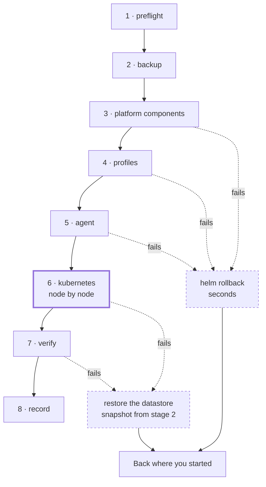

import { Callout, Steps } from 'nextra/components'

# Upgrades

<BuildStatus path="/platform/upgrades" />

<Callout type="info">
The workflow below runs. `kubenest platform upgrade` has taken a real two-node cluster from bundle
0.9 to 1.0 in 3m11s, through all eight stages, with a two-replica workload reachable on every one
of 146 one-second probes. Two things on this page are not yet proven on hardware: the
datastore-restore rollback — the path for a failure *after* the point of no return — has only ever
run in unit tests, and no upgrade has run on the three-node `ha` tier.
</Callout>

Upgrading is one operation: **`Platform N → N+1`, for your cluster's exact recorded profile set.**

Not eight component upgrades you sequence yourself and hope about. One transition, tested against
your profile set before it reached you, with gates in front of it and a way back.

This page is long because this is the operation people are afraid of, and because you should be
able to run it, understand it, and recover from it without talking to us.

## What an upgrade actually changes

The bundle version determines every component version. Moving from Platform N to N+1 may change
any of them, including the Kubernetes version itself. What changes between two specific bundles is
in the [bundle manifest](/platform/bundle), and you can see the diff before you start:

```bash filename="terminal"
kubenest platform diff --from 0.9 --to 1.0
```

Your profile set does not change during an upgrade. Adding or removing a profile is a separate
operation.

## Pre-flight gates

Seven gates run before anything is touched. Any gate that fails stops the upgrade with nothing
changed.

These are not ceremony. Each one exists because skipping it produces a specific, known bad
outcome. All seven run even after one has failed: being told to fix one thing, re-running and
hitting the next is the tool failing you rather than your cluster.

| Gate | Passes when | Why it exists |
|---|---|---|
| **Deprecated API scan** | No running workload uses an API removed in the target Kubernetes version | See [below](#the-deprecated-api-scan). This is the one that matters most |
| **Restore drill** | The most recent verified restore drill passed, and passed recently enough for `health.backup.max-restore-drill-age` | Rollback partly depends on restore. An untested restore is not a rollback plan, and a drill that passed in March is not evidence about a cluster in August |
| **Node readiness** | Every node reports Ready, and has done for `limits.timeouts.node-ready` | Upgrading onto an already-degraded cluster turns one problem into two. A node that is flapping in and out of Ready fails this gate, which a single sample would miss |
| **Disk headroom** | Every node has at least `limits.resources.upgrade-headroom.disk` free (default 10 GiB) on the filesystem holding `/var/lib/rancher` | Running out of disk mid-upgrade is a hard failure at the worst moment. The new images land beside the old ones, so the requirement is free space, not total size |
| **Pod disruption budgets** | No PDB would block a drain for longer than `limits.timeouts.node-drain` | A PDB that permits zero disruption stalls the upgrade forever, holding the cluster mid-transition. The gate is *"would this drain finish in the window"*, which is answerable in advance, not *"is this PDB reasonable"*, which is not |
| **Maintenance window** | Now is inside the cluster's configured window | See [maintenance windows](#maintenance-windows), including what this gate does *not* do today |
| **Bundle path** | The target is the next bundle after the one you are running, and offers this cluster's HA tier and every profile it has installed | Kubernetes does not downgrade, so a backward move is refused here rather than discovered at the point of no return — that was found on a real cluster. A profile set does not change during an upgrade, so a bundle that drops one cannot be a target. And a target more than one bundle ahead skips a scan, not just a release — see [skipping versions](#skipping-versions) |

The fresh backup most people expect to find in that table is not a gate: it is stage 2, the first
thing that runs once the gates pass. A failure there still leaves nothing changed, and it is still
important information in its own right — see [when a stage fails](#when-a-stage-fails).

## The deprecated API scan

This is the gate that separates an upgrade product from a cron job, and it is the one worth
understanding.

Kubernetes removes APIs. When a minor version drops an API group your workloads use, the upgrade
succeeds, the cluster comes up healthy, every platform component reports Ready — **and your
application stops working**, because the manifests it deploys from now reference an API that no
longer exists.

An upgrade that cleanly upgrades the cluster and takes down your product has actively harmed you.
It is worse than no upgrade at all.

So before anything else, KubeNest scans your live workloads for API versions removed or deprecated
in the target Kubernetes version. **If it finds any, the upgrade is blocked** and the report names
the resource, its namespace, the API version it uses, and the version it should move to.

**The scan covers your Git desired state as well as the live cluster, and the two are treated
differently.** A live object using a removed API breaks during the upgrade, so it blocks. A
manifest in Git that is not applied yet breaks at the next ArgoCD sync — soon, but not during the
upgrade — so it warns, loudly, naming the file and the ref. The distinction is deliberate: a live
finding is our upgrade breaking your product, while a Git finding is your repository about to. If
Git findings blocked, a stale branch nobody has touched in a year could hold up a security patch
in a repository your platform team may not even own.

Scanning only the live cluster would leave the hole where the upgrade succeeds, ArgoCD syncs
minutes later, the removed API comes back from Git, and the customer blames the upgrade —
correctly, because we said we had checked.

```
BLOCKED: 3 resource(s) use APIs removed in Kubernetes v1.36.0.

  namespace/payments   Ingress api-gateway
      networking.k8s.io/v1beta1  →  networking.k8s.io/v1

  namespace/payments   HorizontalPodAutoscaler worker
      autoscaling/v2beta2        →  autoscaling/v2

  namespace/internal   CronJob nightly-report
      batch/v1beta1              →  batch/v1

Fix these, then re-run. Nothing has been changed.

If a resource is genuinely safe — it is inert, or you are removing it in the same
window — accept it by name and only by name:
  --acknowledge payments/Ingress/api-gateway
  --acknowledge payments/HorizontalPodAutoscaler/worker
  --acknowledge internal/CronJob/nightly-report
```

Fixing them is your work, in your manifests — we cannot rewrite your application for you. Once
they are fixed and redeployed, re-run the upgrade.

**There is no `--force`.** A blanket override is how a customer takes their own product down and
then calls us. A finding you have judged safe is accepted one resource at a time, by
`namespace/Kind/name`, which is tedious enough to prevent reflexive use and specific enough to
audit afterwards:

```bash filename="terminal"
kubenest platform upgrade --cluster prod-1 --to 1.0 \
  --acknowledge payments/Ingress/legacy-gateway
```

An API that is deprecated but *not yet removed* in the target version does not block. It is
printed as a warning, because an upgrade that refused every deprecation would refuse most real
clusters.

Two properties of the scanner matter more than the scan itself:

- **The scanner and its dataset are both pinned in the bundle manifest** (`pluto`, under
  `upgrade.deprecation-scanner`). A scanner whose deprecation data has drifted reports you clean
  against removals it has never heard of, and you believe it. That is confidence it has not
  earned.
- **It fails closed.** If pluto cannot be fetched, cannot run, or emits output the parser does not
  recognise, the gate *fails*. It never reports "no deprecations found" — a scan that silently
  degrades into a pass is indistinguishable from a clean cluster at the moment it matters most.

One limit to know: the scan reads what is **in the cluster** — its live objects and its Helm
releases. A manifest that exists only in your GitOps repository, unsynced, is not scanned and will
not block. It will break you on the deploy after the upgrade instead, which is the same failure
detached from its cause.

## Maintenance windows

An upgrade never begins outside its cluster's configured window.

```bash filename="terminal"
kubenest cluster set-window --cluster prod-1 \
  --days sat,sun --start 02:00 --end 06:00 --timezone Asia/Kolkata
```

The timezone is an IANA name, never an offset: offsets move twice a year, and a window that
silently shifts by an hour is worse than no window at all. An end time earlier than the start
means the window crosses midnight.

**The rule when a window closes mid-upgrade: no new stage starts, but the stage in progress
finishes.** Abandoning a half-completed stage to respect a clock leaves the cluster in a worse
state than the overrun does. If the window closes with stages remaining, the upgrade pauses and
resumes at the next window, and the cluster reports that it is mid-upgrade the whole time.

**Pre-flight also compares the estimated duration against the time left in the window** — fixed
overhead plus a per-node cost, both from the manifest — and tells you when the upgrade is unlikely
to finish inside it. Today that is a warning rather than a refusal, and deliberately so: the
per-node figure in the manifest is still marked provisional, and one real transition finished in
3m11s against a 30m per-node allowance. Refusing a good upgrade on a number nobody has measured is
worse than letting it overrun a window whose overrun rule is already defined. The gate becomes a
refusal in the bundle where that figure is replaced by a measurement.

Four stages are exempt from that pause. `preflight` is where the window is checked in the first
place, so pausing before it would be circular. `backup` takes the snapshot a rollback depends on,
which is not skipped for a clock. `verify` and `record` must not be separated from the transition
they describe — pausing there would leave a cluster upgraded and unverified until the next window.
Everything expensive sits between `backup` and `verify`, and none of it is exempt.

<Callout type="warning">
**None of this is in force yet.** `kubenest cluster set-window` validates what you give it and
then stores it through a control-plane route that does not exist, so the command fails. The
upgrade, for its part, never asks the control plane what the window is: the gate treats every
cluster as having none configured, and passes. Until that route ships, an upgrade you start runs
whenever you start it, and the mid-upgrade pause never fires. The window is shared with the reboot
coordinator, and lands with it — see [OS patching](/platform/os-patching).
</Callout>

## The order of operations

Components first. Kubernetes last.

This ordering is deliberate and it is the most important design decision on this page:
**everything before the k3s stage is cheaply reversible, and the k3s stage is the point of no
return.** Platform components roll back with a Helm rollback in seconds. Kubernetes does not roll
back at all — see [what actually rolls back](#what-actually-rolls-back). Putting the irreversible
step last means the great majority of failures happen while retreating is still cheap.

| # | Stage | Notes |
|---|---|---|
| 1 | `preflight` | All gates above. Nothing is changed |
| 2 | `backup` | Fresh backup taken. The last moment before anything changes |
| 3 | `platform-components` | The seven core components, in dependency order: Gateway API, Traefik, cert-manager, OpenEBS, Velero, `system-upgrade-controller`, `kured` |
| 4 | `profiles` | Components of each enabled profile |
| 5 | `agent` | The KubeNest agent |
| 6 | **`kubernetes`** | **Point of no return.** k3s on each node in turn, via `system-upgrade-controller` |
| 7 | `verify` | Full post-upgrade verification |
| 8 | `record` | The cluster's bundle version is updated |



The diagram is the argument for the ordering. Every stage before 6 exits through the cheap path on
the left; only 6 and 7 exit through a datastore restore. Five of the seven ways an upgrade can
fail cost you seconds, and that is a consequence of *sequencing*, not of any recovery machinery.

**Every stage converges on its own health check before the next one starts**, and a check that
fails halts the sequence rather than continuing. Continuing past a failed check is how one broken
component becomes a broken cluster.

A component stage is not satisfied by "the pods are Ready", because the *previous* version's pods
are Ready too — a chart pin that cannot resolve leaves the old release running and everything
green. It requires that the release reports the pinned version **and** that the job applying it
succeeded. That distinction was found by a real cluster, where a deliberately poisoned pin
otherwise sailed through.

Stage 6 upgrades nodes one at a time. Each node is cordoned, drained, upgraded, and must return to
Ready and pass its health check before the next node is touched. Servers complete before any agent
starts: an agent joining a control plane it is newer than is the one version skew Kubernetes does
not promise to tolerate.

### Every wait in that sequence has a deadline

Each step below takes its limit from `limits.timeouts` in the bundle manifest, and reports
`converging` with visible progress until the deadline rather than sitting silent:

| Step | Limit | On expiry |
|---|---|---|
| Drain a node | `node-drain` (15m) | Halt. Report which pods would not evict and which PDB held them. Never force-delete — an operator decides that, not the upgrade |
| Node returns Ready | `node-ready` (5m) | Halt with the node uncordoned-pending. The cluster is mid-upgrade and says so |
| A component reaches Ready | `component-ready` (10m) | Halt. Report the release, its pods, and their last events |
| One node, end to end | `upgrade-per-node` (30m) | Halt regardless of which sub-step is outstanding, so a slow loop cannot run indefinitely |

**Halting is not rolling back.** An expired deadline stops the sequence and leaves the cluster
where it is, exactly as a failed check does — see [when a stage fails](#when-a-stage-fails).
Timing out is evidence that something is wrong, and destroying that evidence automatically is how
a stall becomes an outage.

<Callout type="warning">
**A transient failure is not a failure.** Components pass through `Error`, `CrashLoopBackOff` and
`Pending` during a normal upgrade — images pull, hooks retry, pods reschedule behind a drain. A
check that samples once and judges will halt a healthy upgrade partway through, which is a
strictly worse position than either finishing or not starting.

So every check waits for its condition to hold within the window and only then decides. This was
observed for real on a clean install, where `helm-install-traefik` entered `Error` before
retrying and completing.
</Callout>

<Callout type="info">
The node upgrade mechanism itself is Rancher's `system-upgrade-controller` — the same tool RKE2
users call a killer feature. We did not rebuild it. What KubeNest adds is the bundle-level
transition around it, the gates in front of it, and the rollback behind it.
</Callout>

## What your workloads experience

Honest expectations, by tier and by workload shape. Replica count alone is not an availability
guarantee on the `single-server` tier. During the control-plane outage, a workload stays available
only if enough Ready replicas to serve it are already on agent nodes that remain up:

| | Multi-replica workload | Single-replica workload |
|---|---|---|
| **`ha` tier** | No downtime. Replicas reschedule ahead of each drain | Restarts once, when its node drains |
| **`single-server`, enough Ready replicas already on agent nodes** | No downtime for the workload itself while those replicas remain healthy. A two-node 0.9 → 1.0 upgrade kept a two-replica workload reachable on all 146 one-second probes; that result does not remove the placement condition | Restarts once, when its node drains |
| **`single-server`, service depends on a control-plane-node replica** | The workload is down if the replicas already on agent nodes cannot serve it alone. A drained replica moves only when an agent has capacity and its scheduling rules allow it. A one-node cluster has no surviving agent, so every workload is down while the node upgrades | Restarts; on a one-node cluster it is down while the node upgrades |

KubeNest does not taint the control-plane node or restrict application workloads to agents. Unless
you have added scheduling constraints and verified the resulting placement, assume the last row
applies to you.

Two things are true regardless of tier:

- **Draining a node restarts the pods on it.** A single-replica workload will restart. There is no
  way around that, and no upgrade tool can avoid it.
- **On the `single-server` tier, the Kubernetes API is unavailable while the control-plane node
  upgrades.** Running pods on other nodes keep running — the kubelet does not need the API
  server — but during that window nothing schedules, nothing self-heals, no deploy succeeds, and a
  pod that dies is not replaced. Workloads that were on the control-plane node were already
  evicted by its drain; any that found no agent node to land on are down until the node returns.
  The cluster is frozen, briefly and deliberately.

On the `ha` tier the API stays available throughout, because servers upgrade one at a time and
quorum is maintained. That row is reasoning, not measurement: no cluster has yet been installed or
upgraded on three machines — see [high availability](/platform/ha).

## What actually rolls back

"Rollback" means two different things depending on which stage failed, and conflating them is how
people end up surprised.

**One of them happens on its own and the other waits for you.** A failure before the point of no
return reverts automatically: it is a Helm-level revert, it takes seconds, it is proven, and there
is nothing for a human to weigh. A failure after it does not. Recovering from there is a datastore
restore, which rolls *all* cluster state back to the pre-upgrade snapshot and discards anything
else that happened on the cluster in between — that is a judgement about your cluster, not a retry
policy, so the upgrade stops, names the stage, and waits for you to run the rollback command.

### Platform components — genuine rollback

A failure before the k3s stage takes the seven core components back to the bundle they came from.
Each is a Helm release, so reverting is rewriting its resource at the previous pinned version and
letting the cluster's own helm-controller take it back: seconds, nothing lost.

This is the path a forced failure took on a real cluster. Traefik was pinned to a version that
does not exist; the upgrade failed at `platform-components` naming Traefik, chose the component
revert rather than a datastore restore, put every component back, and the two-replica workload
kept both replicas throughout.

Two limits are worth knowing. Stage 4 never needs reverting because it cannot run — a cluster with
any component profile installed is refused there rather than upgraded partially, see
[profiles](/platform/profiles). And the agent moved at stage 5 is not part of the component
revert; it is left at the version the upgrade installed.

### Kubernetes — no such thing as a downgrade

**Kubernetes does not support downgrading.** Neither does k3s. Once the API server has upgraded
and the datastore has written data in the new schema, going back means restoring the datastore
snapshot taken at stage 2.

The mechanism is the same on both tiers: an etcd snapshot. `single-server` runs a single-node
embedded etcd and `ha` runs it replicated across three, but the snapshot, the restore and the
command do not differ. Both are covered by the same stage-2 snapshot — see
[backup and restore](/platform/backup-restore) — but note that on `single-server` the restore is
also a control-plane outage, because there is only one control plane.

That is a genuine restore, not a rollback: the cluster returns to its state at the moment the
snapshot was taken, and there is a service interruption while it happens.

<Callout type="warning">
**This is the one path on this page that has never been run on real hardware.**

The cheap half has: a forced failure before the point of no return reverted a real cluster's
components while its workload stayed up. This half is implemented and unit-tested, and the same
`k3s --cluster-reset` mechanism it uses has been exercised on a fresh host by the
[restore drills](/platform/backup-restore) — but restoring a snapshot onto an already-upgraded k3s
binary, which is what a rollback from stage 6 actually asks for, has not been done.

Read it as the reason the irreversible stage is last, not as a proven escape hatch. If you are
weighing whether to upgrade, the argument for doing so is that five of the seven ways this can
fail never reach here.
</Callout>

<Callout type="warning">
**Restoring the platform does not restore your application data**, and that is deliberate.

A datastore restore rolls back *cluster state* — the Kubernetes objects. Your persistent volumes are
not touched, so database contents, uploaded files and anything else written to a PV survive
unchanged.

This is almost always what you want. Rolling application data back to the start of the upgrade
window would discard every transaction since, which is usually far worse than the failed upgrade.

But it does mean a restored cluster can hold objects that are slightly older than the data they
point at. In practice this is harmless — Kubernetes objects are declarative and converge. It
matters in one case: a PersistentVolumeClaim created *during* the upgrade window will not exist in
the restored cluster, while its underlying volume still exists on disk. That volume is orphaned
until reclaimed. The post-rollback report names any it finds.
</Callout>

### The rollback command

```bash filename="terminal"
kubenest platform rollback --cluster prod-1
```

It prints which mechanism it will use — and, for a restore, which snapshot and when it was taken —
before touching anything. The cheap mechanism then proceeds. The expensive one stops and requires
`--confirm`, rather than prompting: a datastore restore is a service interruption and should not
be one keystroke away.

```bash filename="terminal"
kubenest platform rollback --cluster prod-1 --confirm
```

## When a stage fails

Every failure names the stage, the component, and what to do next. There is no state this can
leave you in that is not covered below.

**Failure during `preflight`.** Nothing was changed. Fix what the report names and re-run.

**Failure during `backup`.** Nothing was changed. This stage failing is important information in
its own right — investigate before upgrading, because it means your backups were not working.

**Failure during `profiles`.** Today this is not a failure so much as a refusal: a cluster with
any component profile installed stops here rather than being upgraded partially, with core already
moved. Roll back, or wait for the profile upgrades to ship.

**Failure during `platform-components` or `agent`.** The cluster is on Kubernetes
version N with some components at N+1. Two supported exits, and the failure message prints both:

- **Roll back** to N with `kubenest platform rollback`. Fast, no data implications.
- **Fix and resume** by re-running the upgrade. It reads the stage journal and continues from the
  failed stage rather than repeating completed ones.

**Failure during `kubernetes`.** The most serious case, and the one to read before you start.

Nodes upgrade one at a time, so a failure here means some nodes are on the new version and some
are on the old. **A mixed-version cluster is a supported state** — Kubernetes tolerates a version
skew between control plane and nodes — so this is not an emergency. The sequence halts, the
cluster keeps serving, and you choose:

- **Resume** once the failing node's problem is fixed. This is the normal path and usually the
  right one.
- **Restore** to N from the stage-2 datastore snapshot, accepting the service interruption.

**Failure during `verify`.** The upgrade completed but a post-upgrade check failed. The cluster is
on N+1. The report names the failing check; the cluster is *not* recorded as successfully upgraded
until they pass.

**The upgrade was interrupted entirely** — your machine died, the network dropped. The cluster
records that it is mid-upgrade, and re-running the command resumes from the journal. An
interrupted upgrade never leaves the cluster in an unknown state, because the journal is written
before each stage rather than after.

## Verifying an upgrade

Stage 7 runs the first five automatically, in this order, and names the one that failed. The sixth
is yours to check.

These are **convergence checks with deadlines**, on the same three-outcome rule as the install
checks — `pass`, `converging`, or `fail` with the last observed state. A post-upgrade cluster is
in more motion than a freshly installed one, because every drained pod is rescheduling at once, so
sampling once here is even less defensible than it is at install.

<Steps>

### Every node is Ready and on the expected version

```bash filename="terminal"
kubectl get nodes -o wide
```

Within `limits.timeouts.node-ready` of that node's upgrade completing. The check also requires
that no node was left cordoned: a node that upgraded and was never uncordoned is a cluster quietly
short of capacity, which nobody notices until the next incident.

### Every core component is Running

Every workload in the platform's own namespaces reaches Ready within
`limits.timeouts.component-ready`.

`CrashLoopBackOff` and `Pending` fail this check only if they persist to the deadline. Immediately
after a drain they are the expected state, not a fault.

### Storage still provisions

A test PVC binds. Upgrades touch the CSI driver, so this is verified rather than assumed.

### Ingress still serves and certificates are still valid

The Traefik Gateway still reports `Programmed` and the platform's default certificate still
reports `Ready`. These are the failures customers notice first. The check reads those conditions;
it does not send a request through them, so an end-to-end probe of your own hostname is still
worth running.

### The recorded bundle version matches reality

Every pin in the target manifest is compared against what is installed — kubelet version per node,
chart version per component. Nothing else in the day-2 story is trustworthy if the record drifts,
and an upgrade is exactly when it would.

### Your workloads are running

Replica counts match their specs and nothing is stuck rescheduling. **This one stage 7 does not
do.** It checks the platform, not your applications, so this is the check to run yourself.

</Steps>

Stage 8 records the new bundle version against the cluster only after all five pass. An upgrade
that completed but failed verification leaves the cluster on N+1 and the record on N, which is the
honest state and the one you want to see.

## Who starts an upgrade

You do. Every upgrade is started by a person running a command, on every tier, for as long as
Platform 1.x is current.

Fleet health tells you when a cluster has fallen behind, and the console shows how far — but
nothing applies a bundle to your cluster on its own. Automatic upgrades are a promise the
compatibility matrix has to earn before we make it, and that matrix has not run yet. Applying a
Kubernetes minor to somebody else's production while nobody is watching, on the strength of
testing we have not done, is not a feature.

The direction, once the matrix is real, is narrower than "automatic upgrades": security releases
apply themselves inside your maintenance window, and everything else still waits for a person. A
release that exists only to carry a patched component is the case where waiting is the bigger
risk, and it is also the case where the change is smallest. That is not built, and this page will
say so until it is.

## Skipping versions

**Step through one bundle at a time. The gate refuses a longer hop.**

A target more than one bundle ahead of what you run is refused at pre-flight, naming the bundle to
step through first. Two bundles are supported at any time — the current one and the one before it
— so falling one release behind is normal and supported, and falling two means one extra hop
rather than an unsupported cluster.

A security release does not count against that window. If a bundle exists only because a component
needed patching, the release before it stays supported: you did not choose to skip it, we chose to
issue it, and the support promise should not shrink because we shipped a fix.

The reason to step at all is the deprecated-API scan. It runs against the Kubernetes version
pinned by the bundle you name, and only that one. An API removed in 1.1 and irrelevant again by
1.3 still breaks your workloads at 1.1, and a 1.0 → 1.3 jump would never scan for it. Skipping a
bundle is skipping the check that makes the upgrade safe, which is why the answer is a gate rather
than advice.

<Callout type="warning">
**The adjacency rule is decided but not enforced yet.** The bundle-path gate today checks that the
target is newer than what you run and that it offers your tier and your profiles — not that the
hop is one step. Only two bundles exist, so there is nothing to skip yet and nothing is currently
at risk. The gate gains the rule before a third bundle is published.
</Callout>
